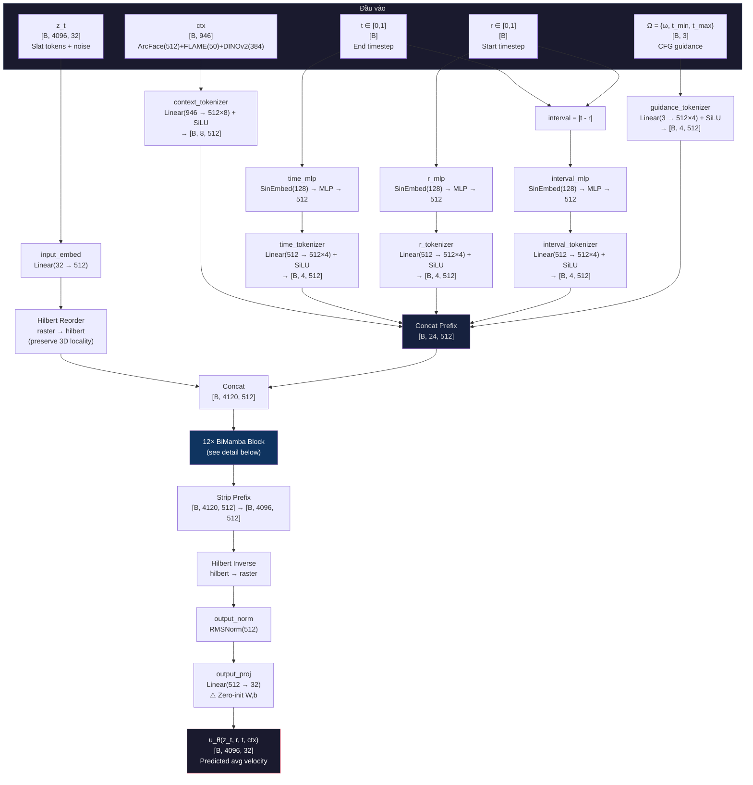
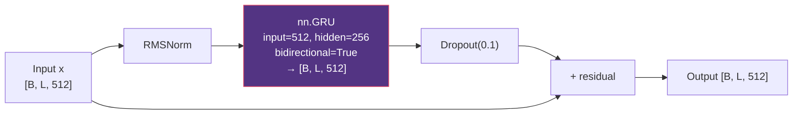
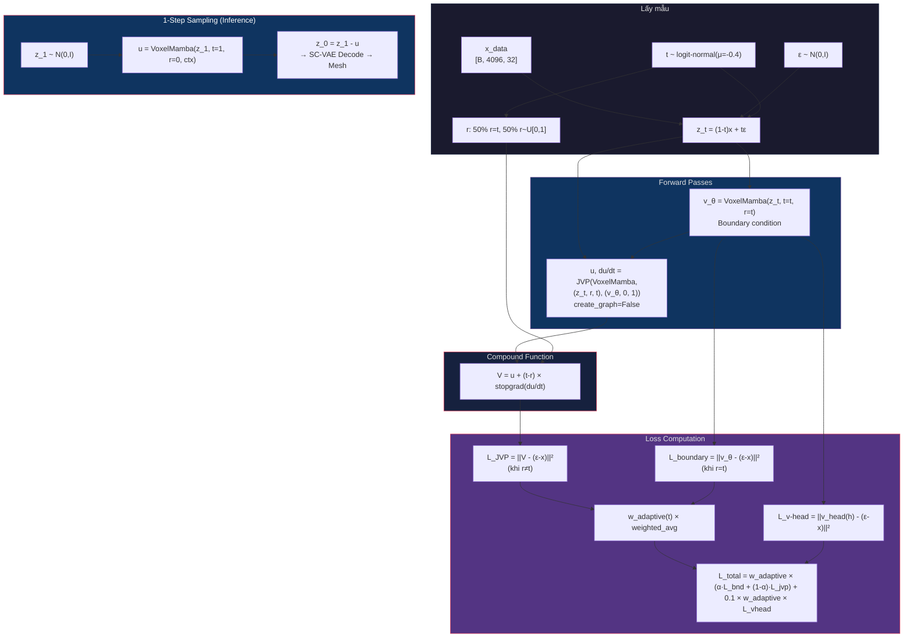

# Báo cáo Nghiên cứu Chuyên sâu: FaceDiff — Hệ thống Tạo sinh Khuôn mặt 3D Một Bước trên Đơn GPU

**Ngày cập nhật:** 17/05/2026 (revision 16 — Identity-collapse fix + 2-stage training strategy)  
**Tác giả:** Nhóm nghiên cứu FaceDiff  
**Cấu hình Mục tiêu:** Đơn GPU RTX 4090 (24GB VRAM)  
**Bộ dữ liệu:** FaceVerse_3D (2,100 — high detail) & FaceScape (18,298 — registered)  
**Trạng thái checkpoint:** SC-VAE epoch 500 done (recon=0.0213, KL=14.58). Stage 2 iMF VoxelMamba **đang train** với per-channel slat normalization fix (loss 1.64 → 0.41 ở epoch 9). Kế hoạch: joint pretrain → FaceVerse finetune (xem Section 9).

---

## Mục lục

1. [Giới thiệu Đề tài](#1-giới-thiệu-đề-tài)
2. [Mục tiêu và Đóng góp](#2-mục-tiêu-và-đóng-góp)
3. [Nền tảng Toán học](#3-nền-tảng-toán-học)
4. [Phương pháp Đề xuất](#4-phương-pháp-đề-xuất)
5. [Bộ dữ liệu: FaceScape & FaceVerse](#5-bộ-dữ-liệu-facescape--faceverse)
6. [Thực nghiệm](#6-thực-nghiệm)
7. [Phân tích và Lịch sử Bug Fix](#7-phân-tích-và-giải-thích-kết-quả)
8. [Kế hoạch Tiếp theo](#8-kế-hoạch-tiếp-theo)
9. [Trạng thái Hiện tại — Identity-Collapse Fix + 2-Stage Strategy (17/05/2026)](#9-trạng-thái-hiện-tại--identity-collapse-fix--chiến-lược-2-stage-training-17052026)
10. [Tài liệu Tham khảo](#tài-liệu-tham-khảo)

---

## 1. Giới thiệu Đề tài

### 1.1. Bối cảnh và Động lực Nghiên cứu

Tạo sinh khuôn mặt 3D (3D Face Generation) là bài toán trọng tâm của thị giác máy tính, có ứng dụng trong game, phim hoạt hình, VR/AR, và y tế thẩm mỹ. Mục tiêu: từ điều kiện đầu vào (ảnh khuôn mặt, biểu cảm, danh tính), hệ thống sinh lưới đa giác 3D (Polygon Mesh) chất lượng cao.

Thách thức chính của các phương pháp hiện tại:

- **Độ phức tạp tính toán bậc ba:** Biểu diễn thể tích $256^3$ tạo hàng triệu điểm, vượt khả năng xử lý Transformer với Attention $O(N^2)$
- **Tốc độ sinh chậm:** Diffusion thông thường cần 20–50 bước ODE/SDE
- **Phần cứng đắt đỏ:** TRELLIS.2 đòi hỏi 8×A100 (320GB VRAM)

### 1.2. Các Công trình Liên quan

| Phương pháp | Biểu diễn | Ưu | Nhược |
|-------------|-----------|-----|-------|
| Point-E, PointFlow | Point Cloud | Đơn giản | Thiếu topology |
| DreamFusion, Magic3D | NeRF + SDS | Chất lượng cao | 30–60 phút/đối tượng, Janus effect |
| GaussianHead, HeadGAP | 3D Gaussian | Render đẹp | Khó trích Mesh |
| MeshGPT, MeshAnything | Mesh trực tiếp | Topology rõ | Giới hạn vài nghìn mặt |
| **TRELLIS.2** | **O-Voxel + Sparse VAE** | **Mesh chi tiết 200K+** | **8×A100, 50 bước DDPM** |

### 1.3. Vấn đề cần Giải quyết

1. **Chi phí phần cứng** — Không có giải pháp 3D chất lượng cao trên 1 GPU tiêu dùng
2. **Tốc độ sinh** — 20–50 bước khuếch tán không tương tác
3. **Kiểm soát ngữ nghĩa** — Nhiều hệ thống không kiểm soát danh tính + biểu cảm đồng thời
4. **Khoảng cách biểu diễn** — NeRF/Gaussian khó tích hợp pipeline sản xuất

---

## 2. Mục tiêu và Đóng góp

### 2.1. Mục tiêu

| # | Mục tiêu | Chỉ tiêu |
|---|----------|----------|
| 1 | Mesh 3D chất lượng cao | > 200K đỉnh, 10-kênh |
| 2 | Sinh 1 bước | < 2 giây/mẫu trên RTX 4090 |
| 3 | Kiểm soát danh tính + biểu cảm | Hybrid Context 946-dim |
| 4 | Đơn GPU | VRAM peak < 22GB |

### 2.2. Đóng góp

1. **SC-VAE tiết kiệm VRAM** với SparseResMLPBlock (giảm 45% VRAM so với ConvNeXt 3D) + Generative Pruning (Rho Loss)
2. **VoxelMamba** — backbone SSM $O(N)$ thay Transformer $O(N^2)$, Hilbert curve ordering. *Thiết kế lai (hybrid): BiMamba generation lấy cảm hứng từ DiM-3D [14], Hilbert ordering từ VoxelMamba [4], kết hợp in-context conditioning tự thiết kế cho iMF.*
3. **iMF (Improved Mean Flow)** — sinh 1 bước bằng JVP correction
4. **Hybrid Context 946-dim** = ArcFace(512) + FLAME(50) + DINOv2(384)
5. **Tối ưu đơn GPU**: INT4 quantization, BFloat16, gradient checkpointing, LMDB caching

---

## 3. Nền tảng Toán học

### 3.1. Mô hình Không gian Trạng thái (State Space Model — SSM)

#### 3.1.1. SSM Liên tục

Mô hình không gian trạng thái (SSM) liên tục mô tả hệ động lực tuyến tính ánh xạ đầu vào $u(t) \in \mathbb{R}$ sang đầu ra $y(t) \in \mathbb{R}$ thông qua trạng thái ẩn $h(t) \in \mathbb{R}^N$:

$$\frac{dh}{dt} = \mathbf{A} h(t) + \mathbf{B} u(t), \quad y(t) = \mathbf{C} h(t) + D u(t) \tag{SSM-1}$$

Trong đó:
- $\mathbf{A} \in \mathbb{R}^{N \times N}$ — ma trận chuyển trạng thái (state transition matrix)
- $\mathbf{B} \in \mathbb{R}^{N \times 1}$ — ma trận đầu vào (input matrix)
- $\mathbf{C} \in \mathbb{R}^{1 \times N}$ — ma trận đầu ra (output matrix)
- $D \in \mathbb{R}$ — bỏ qua (skip connection), thường $D = 0$

#### 3.1.2. Rời rạc hóa (Zero-Order Hold — ZOH)

Để áp dụng cho dữ liệu rời rạc (chuỗi tokens), SSM được rời rạc hóa bằng phương pháp Zero-Order Hold (ZOH) với bước thời gian $\Delta$:

$$\bar{\mathbf{A}} = \exp(\Delta \mathbf{A}), \quad \bar{\mathbf{B}} = (\Delta \mathbf{A})^{-1}(\bar{\mathbf{A}} - \mathbf{I}) \cdot \Delta \mathbf{B} \tag{SSM-2}$$

Phương trình rời rạc tương ứng:

$$h_k = \bar{\mathbf{A}} h_{k-1} + \bar{\mathbf{B}} x_k, \quad y_k = \mathbf{C} h_k \tag{SSM-3}$$

Phép toán (SSM-3) là hồi quy tuyến tính — có thể triển khai song song qua **Parallel Associative Scan** với độ phức tạp $O(N \log N)$ trên GPU, hoặc tuần tự $O(N)$.

#### 3.1.3. Selective SSM (Mamba)

**Đóng góp cốt lõi của Mamba** (Gu & Dao, 2024): Biến $\mathbf{B}$, $\mathbf{C}$, $\Delta$ thành **hàm phụ thuộc đầu vào** (input-dependent), cho phép mô hình "chọn lọc" (selective) thông tin:

$$\mathbf{B}_k = \text{Linear}_B(x_k), \quad \mathbf{C}_k = \text{Linear}_C(x_k), \quad \Delta_k = \text{Softplus}(\text{Linear}_\Delta(x_k)) \tag{SSM-4}$$

Với $\text{Softplus}(\cdot) = \log(1 + e^{(\cdot)})$ đảm bảo $\Delta_k > 0$.

**Khởi tạo HiPPO cho A:** Ma trận $\mathbf{A}$ được khởi tạo dạng đường chéo: $A_n = -(n+1)$ cho $n = 0, ..., N-1$. Khởi tạo này xuất phát từ lý thuyết High-order Polynomial Projection Operators (HiPPO), đảm bảo trạng thái ẩn tối ưu cho việc nén lịch sử chuỗi.

**Kiến trúc một block Mamba:**

```
Input x [B, L, D]
  │
  ├──→ Linear_expand → Conv1D(k=4) → SiLU → SSM(A, B(x), C(x), Δ(x)) ──┐
  │                                                                        │
  └──→ Linear_gate → SiLU ────────────────────────────────── × (hadamard) ─┘
                                                                    │
                                                             Linear_proj → Output
```

**So sánh độ phức tạp:**

| Mô hình | Complexity/token | Memory | Xử lý chuỗi 4096 |
|---------|-----------------|--------|-------------------|
| Transformer (Self-Attention) | $O(N^2 \cdot d)$ | $O(N^2)$ attention maps | ~16.7M entries/layer |
| Mamba (Selective SSM) | $O(N \cdot d \cdot n)$ | $O(N \cdot n)$ states | ~65K entries/layer |
| Tỷ lệ | — | — | **256× ít hơn** |

Trong đó $n$ = SSM state dim (16 trong FaceDiff), $d$ = model dim (512).

#### 3.1.4. Mamba Hai chiều (Bidirectional Mamba)

SSM có tính nhân quả (causal): $h_k$ chỉ tích lũy thông tin từ $x_0, ..., x_{k-1}$. Để mỗi voxel nhận thông tin từ mọi hướng trong không gian 3D:

**Quét xuôi (Forward):** Chuỗi $X = [x_1, ..., x_L]$ qua Mamba forward:
$$h_k^{\text{fwd}} = \bar{\mathbf{A}}_k h_{k-1}^{\text{fwd}} + \bar{\mathbf{B}}_k x_k, \quad y_k^{\text{fwd}} = \mathbf{C}_k h_k^{\text{fwd}} \tag{BiM-1}$$

**Quét ngược (Backward):** Chuỗi đảo $\tilde{X} = [x_L, ..., x_1]$ qua Mamba backward:
$$h_k^{\text{bwd}} = \bar{\mathbf{A}}_k h_{k-1}^{\text{bwd}} + \bar{\mathbf{B}}_k \tilde{x}_k, \quad y_k^{\text{bwd}} = \mathbf{C}_k h_k^{\text{bwd}} \tag{BiM-2}$$

**Tổng hợp với residual:**
$$\text{Output}_k = y_k^{\text{fwd}} + y_k^{\text{bwd}} + x_k \tag{BiM-3}$$

Mỗi block Bidirectional Mamba có 2 instance Mamba riêng biệt (không chia sẻ trọng số), cộng RMSNorm trước và Dropout sau.

### 3.2. Đường cong Hilbert (Hilbert Space-Filling Curve)

#### 3.2.1. Định nghĩa

Đường cong Hilbert là đường cong liên tục đi qua mọi điểm trong lưới $2^p \times 2^p \times 2^p$ đúng một lần, mà **không tự cắt chính nó**. Tính chất quan trọng nhất:

> **Spatial Locality:** Hai điểm gần nhau trong không gian 3D sẽ có vị trí gần nhau trên đường cong 1D.

#### 3.2.2. Xây dựng đệ quy

Đường cong Hilbert 3D bậc $p$ được xây dựng đệ quy từ bậc $p-1$:

1. Chia cube $2^p$ thành 8 octant $2^{p-1}$
2. Xoay và phản chiếu đường cong bậc $p-1$ trong mỗi octant để đầu-cuối nối liền
3. Thứ tự 8 octant tuân theo **Gray code** 3-bit

**Ánh xạ toạ độ → chỉ số Hilbert:**
$$\pi_H: (i, j, k) \in \{0,...,2^p-1\}^3 \mapsto n \in \{0,...,2^{3p}-1\} \tag{HC-1}$$

**Trong FaceDiff:** $p = 4$ (vì $16^3 = 4096$ Slat tokens). Hàm `get_hilbert_permutation_tensors()` tính 2 tensor:
- `perm` $\in \mathbb{Z}^{4096}$: ánh xạ thuận (3D → 1D)
- `inv_perm` $\in \mathbb{Z}^{4096}$: ánh xạ nghịch (1D → 3D)

Chi phí bộ nhớ: $2 \times 4096 \times 8\text{B} = 64\text{KB}$ — trivial.

#### 3.2.3. So sánh với các phương pháp sắp xếp khác

| Phương pháp | Spatial Locality | Complexity | Ghi chú |
|-------------|-----------------|------------|---------|
| Raster scan (row-major) | Kém — nhảy hàng xa | $O(1)$ | Hai voxel cạnh nhau trục Y cách $N$ trong chuỗi |
| Morton (Z-order) | Trung bình | $O(1)$ | Interleave bits, đơn giản nhưng có "nhảy" |
| **Hilbert** | **Tốt nhất** | $O(p)$ | Bảo toàn locality tối ưu, dùng trong FaceDiff |

### 3.3. Flow Matching (Khớp Luồng)

#### 3.3.1. Bài toán Tạo sinh

Cho phân phối dữ liệu $p_0(x)$ (Slat tokens sạch) và phân phối nhiễu $p_1(z) = \mathcal{N}(0, \mathbf{I})$. Mục tiêu: học ánh xạ $T: z_1 \sim p_1 \mapsto z_0 \sim p_0$.

#### 3.3.2. Đường nội suy (Interpolation Path)

Xác định đường dẫn xác suất $p_t$ nối $p_0$ và $p_1$ bằng nội suy tuyến tính:

$$z_t = (1 - t) x_0 + t \varepsilon, \quad \varepsilon \sim \mathcal{N}(0, \mathbf{I}), \quad t \in [0, 1] \tag{FM-1}$$

**Quy ước:** $t = 0$ là dữ liệu sạch, $t = 1$ là nhiễu thuần.

#### 3.3.3. Trường vận tốc (Velocity Field)

Vận tốc tức thời dọc theo đường nội suy:

$$v_t(z_t | x_0) = \frac{dz_t}{dt} = \varepsilon - x_0 \tag{FM-2}$$

**Conditional Flow Matching (CFM) Loss** (Lipman et al., 2023):

$$\mathcal{L}_{\text{CFM}} = \mathbb{E}_{t \sim U[0,1],\, x_0 \sim p_0,\, \varepsilon \sim \mathcal{N}(0,I)} \left[ \| v_\theta(z_t, t) - (\varepsilon - x_0) \|^2 \right] \tag{FM-3}$$

#### 3.3.4. Sinh mẫu bằng ODE

Từ $z_1 \sim \mathcal{N}(0, I)$, giải ODE ngược:

$$\frac{dz_t}{dt} = v_\theta(z_t, t), \quad z_1 \sim \mathcal{N}(0, I) \tag{FM-4}$$

Cần $K$ bước Euler/Heun (thường $K = 20$–$50$). **Đây là nhược điểm mà iMF giải quyết.**

### 3.4. Improved Mean Flow (iMF)

#### 3.4.1. Vận tốc Trung bình (Average Velocity)

Thay vì vận tốc tức thời $v(z, t)$, iMF (Geng et al., 2025, arXiv:2512.02012v1) định nghĩa **vận tốc trung bình** trên đoạn $[r, t]$:

$$u(z, r, t) = \frac{1}{t - r} \int_r^t v(z_s, s)\, ds \tag{iMF-1}$$

Trong đó $z_s$ là quỹ đạo ODE bắt đầu từ $z_r = z$ tại thời điểm $r$.

**Ý nghĩa vật lý:** $u$ là "vận tốc bình quân" mà nếu đi thẳng từ $z_r$ đến $z_t$ trong $(t - r)$ đơn vị thời gian, ta sẽ đến đúng đích. Khi $t - r \to 0$: $u \to v$ (suy biến thành vận tốc tức thời).

#### 3.4.2. Đồng nhất thức MeanFlow

Quan hệ giữa $u$ và $v$:

$$v(z, t) = u(z, r, t) + (t - r) \frac{\partial u}{\partial t}(z, r, t) \tag{iMF-2}$$

Chứng minh: Đạo hàm (iMF-1) theo $t$ bằng quy tắc Leibniz.

#### 3.4.3. Hàm hợp V (Compound Function)

Mạng $u_\theta$ dự đoán vận tốc trung bình. Để huấn luyện, xây dựng **hàm hợp V** xấp xỉ vận tốc tức thời:

$$V_\theta(z_t, r, t) = u_\theta(z_t, r, t) + (t - r) \cdot \text{sg}\!\left(\frac{\partial u_\theta}{\partial t}\right) \tag{iMF-3}$$

Trong đó $\text{sg}(\cdot)$ = stop-gradient (`.detach()` trong PyTorch). **Tại sao stop-gradient?** Nếu không, gradient sẽ cuộn ngược qua đạo hàm cấp hai $\partial^2 u / \partial t^2$, gây bùng nổ gradient và bất ổn số học.

#### 3.4.4. Tính $\partial u / \partial t$ bằng JVP

Đạo hàm $\frac{\partial u}{\partial t}$ được tính bằng **Jacobian-Vector Product (JVP)** — hiệu quả hơn Hessian đầy đủ:

$$\frac{\partial u}{\partial t} \approx \text{JVP}\left(u_\theta,\; (z_t, t),\; (v_{\text{tangent}}, 1)\right) \tag{iMF-4}$$

Trong đó vector tiếp tuyến (tangent) là:
- $\frac{dz_t}{dt} = v_{\text{tangent}}$ — xấp xỉ bởi v-head phụ trợ hoặc $u_\theta(z_t, t, t)$
- $\frac{dt}{dt} = 1$
- $\frac{dr}{dt} = 0$ (r giữ cố định)

**Triển khai PyTorch:**
```python
_, dudt = torch.autograd.functional.jvp(
    lambda z, t: model(z, t, ctx, r=r),
    (z_t, t),
    (v_tangent, torch.ones_like(t)),
    create_graph=False,  # stop-gradient
)
```

**Fallback sai phân hữu hạn** (khi JVP không khả dụng):
$$\frac{\partial u}{\partial t} \approx \frac{u_\theta(z_{t+\delta}, t+\delta, r) - u_\theta(z_t, t, r)}{\delta}, \quad \delta = 10^{-3} \tag{iMF-5}$$

#### 3.4.5. Hàm Mất mát iMF

**Lấy mẫu (t, r):** Với xác suất $\alpha = 0.5$:
- $r = t$ (điều kiện biên) → $u(z, t, t) = v(z, t)$, loss suy biến thành CFM
- $r \neq t$ (JVP branch) → sử dụng hàm hợp V

**Loss tổng hợp:**

$$\mathcal{L}_{\text{iMF}} = \alpha \cdot \underbrace{\| u_\theta(z_t, t, t) - (\varepsilon - x) \|^2}_{\text{Boundary loss}} + (1 - \alpha) \cdot \underbrace{\| V_\theta(z_t, r, t) - (\varepsilon - x) \|^2}_{\text{JVP loss}} \tag{iMF-6}$$

> **Lưu ý triển khai:** Paper gốc sử dụng unified compound function $V$ duy nhất — khi $r=t$ thì $(t-r)=0$ nên $V \equiv u(z,t,t)$ tự suy biến thành FM loss. Cách tách thành 2 nhánh boundary/JVP ở trên là *implementation optimization* của FaceDiff (tránh tính JVP khi $r=t$), kết quả toán học tương đương.

**V-Head phụ trợ** (Appendix A của paper):
$$\mathcal{L}_{\text{v-head}} = 0.1 \cdot \| v_{\text{head}}(h_{\text{hidden}}) - (\varepsilon - x) \|^2 \tag{iMF-7}$$

Trong đó $h_{\text{hidden}}$ là trạng thái ẩn của VoxelMamba, và mục tiêu luôn là $(\varepsilon - x)$ thô (raw FM target, không qua CFG augmentation).

#### 3.4.6. Phân phối Lấy mẫu Thời gian

**Logit-Normal Distribution:**

$$t = \sigma\left(\frac{u - \mu}{\text{scale}}\right), \quad u \sim \mathcal{N}(0, 1) \tag{iMF-8}$$

Với $\sigma(\cdot)$ là sigmoid, $\mu = -0.4$, $\text{scale} = 1.0$. Phân phối này tập trung mật độ vào vùng $t \in [0.2, 0.7]$ — pha giữa quỹ đạo nơi model cần học nhiều nhất.

**Curriculum Learning** *(đóng góp riêng của FaceDiff, không có trong paper iMF gốc):*
- **Giai đoạn 1** ($\text{progress} < 0.6$): 100% logit-normal → học cấu trúc thô nhanh
- **Giai đoạn 2** ($\text{progress} \geq 0.6$): 80% uniform + 20% logit-normal → bao phủ biên $t \to 0, 1$

#### 3.4.7. Classifier-Free Guidance (CFG)

**Batch Doubling (1-pass CFG):**

$$z_{\text{double}} = [z_t, z_t], \quad \text{ctx}_{\text{double}} = [\text{ctx}, \mathbf{0}] \tag{CFG-1}$$

Forward 1 lần: $[v_{\text{cond}}, v_{\text{uncond}}] = u_\theta(z_{\text{double}}, t, \text{ctx}_{\text{double}}, r)$

**Mục tiêu có CFG:**

$$v_{\text{target}} = (\varepsilon - x) + \left(1 - \frac{1}{\omega}\right) (v_{\text{cond}} - v_{\text{uncond}}).\text{detach()} \tag{CFG-2}$$

Trong đó $\omega$ là guidance scale, lấy mẫu từ $p(\omega) \propto \omega^{-\beta}$ trên $[\omega_{\min}, \omega_{\max}]$ (FaceDiff: $\omega \in [1, 8], \beta = 1$).

**Interval Conditioning:** CFG chỉ active khi $t \in [t_{\min}, t_{\max}]$:
$$\omega_{\text{eff}} = \begin{cases} \omega & \text{nếu } t_{\min} \leq t \leq t_{\max} \\ 1 & \text{ngược lại} \end{cases} \tag{CFG-3}$$

#### 3.4.8. Sinh mẫu 1 Bước (One-Step Sampling)

Nhờ quỹ đạo được JVP nắn thẳng, chỉ cần:

$$z_0 = z_1 - u_\theta(z_1, r{=}0, t{=}1, \text{ctx}) \tag{iMF-9}$$

**Không cần scheduler** (Euler/DDIM/DPM). Tiết kiệm 98% thời gian so với 50-step DDPM.

### 3.5. Quadratic Error Function (QEF) và Dual Contouring

#### 3.5.1. Bài toán Dual Contouring

Cho lưới voxel $256^3$ với bề mặt mesh cắt qua. Mục tiêu: tìm **Dual Vertex (DV)** — một đỉnh đại diện duy nhất trong mỗi voxel — sao cho khi nối các DV lại, mesh được tái tạo chính xác.

#### 3.5.2. QEF (Quadratic Error Function)

Bề mặt mesh cắt qua cạnh voxel tạo ra **Hermite data**: tập hợp các cặp $(p_i, n_i)$ — điểm giao cắt $p_i$ và pháp tuyến $n_i$ tại đó.

DV tối ưu là nghiệm bài toán bình phương tối thiểu:

$$\text{DV}^* = \arg\min_v \sum_i \left[ n_i \cdot (v - p_i) \right]^2 + \lambda_{\text{reg}} \| v - \bar{p} \|^2 \tag{QEF-1}$$

Trong đó:
- $p_i$ = điểm giao cắt cạnh voxel
- $n_i$ = pháp tuyến bề mặt tại $p_i$  
- $\bar{p} = \frac{1}{|I|} \sum_i p_i$ = trọng tâm các điểm giao
- $\lambda_{\text{reg}}$ = hệ số regularization (FaceDiff: $10^{-2}$) — kéo DV về trọng tâm, tránh suy biến

**Mở rộng thành hệ tuyến tính:**

$$\mathbf{A}^T \mathbf{A}\, v = \mathbf{A}^T b, \quad \text{với } \mathbf{A} = \begin{bmatrix} n_1^T \\ \vdots \\ n_k^T \\ \sqrt{\lambda_{\text{reg}}} \mathbf{I} \end{bmatrix}, \quad b = \begin{bmatrix} n_1 \cdot p_1 \\ \vdots \\ n_k \cdot p_k \\ \sqrt{\lambda_{\text{reg}}} \bar{p} \end{bmatrix} \tag{QEF-2}$$

Giải bằng Cholesky/SVD trên ma trận $3 \times 3$ (rất nhanh).

#### 3.5.3. TRELLIS.2 QEF mở rộng

TRELLIS.2 mở rộng QEF với 3 thành phần trọng số:

$$E(v) = w_{\text{face}} \sum_{\text{face}} [n_i \cdot (v - p_i)]^2 + w_{\text{boundary}} \sum_{\text{boundary}} [n_j \cdot (v - p_j)]^2 + w_{\text{reg}} \|v - \bar{p}\|^2 \tag{QEF-3}$$

Mặc định: $w_{\text{face}} = 1.0$, $w_{\text{boundary}} = 1.0$, $w_{\text{reg}} = 0.1$.

### 3.6. Variational Autoencoder (VAE)

#### 3.6.1. Bài toán

VAE nén dữ liệu $x$ (O-Voxel features, $\sim 300\text{K}$ điểm) thành biểu diễn tiềm ẩn $z$ (4096 Slat tokens, 32-dim), sao cho:
1. $z$ có thể tái tạo $x$ (reconstruction quality)
2. $z$ tuân theo phân phối Gaussian chuẩn $\mathcal{N}(0, I)$ (cho phép sinh mẫu)

#### 3.6.2. ELBO (Evidence Lower Bound)

$$\log p(x) \geq \underbrace{\mathbb{E}_{q(z|x)}[\log p(x|z)]}_{\text{Reconstruction}} - \underbrace{D_{\text{KL}}(q(z|x) \| p(z))}_{\text{KL Divergence}} \tag{VAE-1}$$

**Encoder:** $q(z|x) = \mathcal{N}(\mu(x), \sigma^2(x))$ — mạng nơ-ron dự đoán $\mu$ và $\log \sigma^2$

**Reparameterization trick:** $z = \mu + \sigma \cdot \epsilon, \quad \epsilon \sim \mathcal{N}(0, I)$

**KL Divergence giải tích:**

$$D_{\text{KL}} = -\frac{1}{2} \sum_{i=1}^{d} \left( 1 + \log \sigma_i^2 - \mu_i^2 - \sigma_i^2 \right) \tag{VAE-2}$$

**Chuẩn hóa:** Chia cho $N \cdot d_{\text{lat}}$ = `mu.numel()` (tổng số phần tử của tensor $\mu$). Đây là cách chuẩn hóa được TRELLIS.2 dùng và cũng là công thức được triển khai trong `src/models/sc_vae_loss.py` từ revision này; trước đó FaceDiff lỡ chia cho `target_x.shape[0]` (chỉ là số voxel, thiếu hệ số $d_{\text{lat}} = 32$), khiến KL hiển thị bị thổi phồng đúng 32 lần. Vì $w_{\text{KL}} = 10^{-6}$ rất nhỏ nên đóng góp vào tổng loss vẫn ổn định, nhưng đối chiếu giữa các log cũ và mới cần nhân/chia 32 cho đúng.

---

## 4. Phương pháp Đề xuất

### 4.1. Tổng quan Kiến trúc

FaceDiff là hệ thống 3 giai đoạn:

```
Stage 1: SC-VAE        Stage 2: VoxelMamba + iMF       Stage 3: Decoder
─────────────────      ──────────────────────────      ─────────────────
Mesh (.obj)            Noise z₁ ~ N(0,I)               Slat Tokens
    ↓                       ↓                               ↓
O-Voxel (256³)         VoxelMamba(z₁, t=1, r=0,       SC-VAE Decoder
[N, 10] features            context)                        ↓
    ↓                       ↓                          O-Voxel → Mesh
SC-VAE Encoder         ẑ₀ = z₁ - u_θ(z₁,1,0,ctx)     (Dual Contouring)
    ↓
Slat [4096, 32]
```

### 4.2. Biểu diễn Dữ liệu: O-Voxel 10-Kênh

#### 4.2.1. Pipeline Chuyển đổi Mesh → O-Voxel

**Bước 1 — Chuẩn hóa PBR:** Ép vật liệu thành Metallic=0, Roughness=1 (triệt nhiễu phản quang). Chỉ giữ Albedo gốc.

**Bước 2 — Chuẩn hóa Không gian:**

$$x' = \frac{x - \text{center}(\text{AABB})}{\max(\text{AABB}_{\max} - \text{AABB}_{\min})} \times 0.95 \tag{OV-1}$$

Mesh nằm trong $[-0.5, 0.5]^3$.

**Bước 3 — Voxel hóa Hình học (C++ kernel):**

Hàm `mesh_to_flexible_dual_grid` (Microsoft O-Voxel library):
1. Chia không gian thành lưới $256^3$
2. Tìm giao cắt mesh-voxel edge → tính Hermite data $(p_i, n_i)$
3. Giải QEF (3.5.2) → DV cho mỗi voxel chiếm dụng
4. Xuất: `coords` $[N, 3]$, `dual_vertices` $[N, 3]$, `intersected_flag` $[N, 3]$

**Bước 4 — Voxel hóa Vật liệu (Ray-casting):**

Hàm `textured_mesh_to_volumetric_attr`: Phóng tia từ tâm voxel → tìm giao cắt UV → trích xuất RGB Albedo.

**Bước 5 — Morton Z-Order Alignment:**

Hai mảng hình học/vật liệu (sinh song song, thứ tự khác nhau) đồng bộ bằng mã Morton:

$$M(x, y, z) = \text{interleave\_bits}(x, y, z) \tag{OV-2}$$

Sắp xếp + intersect1d gộp dữ liệu — tránh hoàn toàn vòng lặp `for`.

**Bước 6 — Đóng gói 10-Kênh:**

$$\mathbf{F} = [\underbrace{dv_{\text{local}}}_3, \underbrace{\delta}_3, \underbrace{\gamma}_1, \underbrace{\text{RGB}}_3] \in \mathbb{R}^{N \times 10} \tag{OV-3}$$

| Kênh | Ký hiệu | Phạm vi | Ý nghĩa Hình học | Activation |
|------|---------|---------|-------------------|------------|
| 0–2 | $dv_{\text{local}}$ | $[0, 1]^3$ | Độ dời DV từ góc voxel: $dv = (\text{DV} \times \text{res} - \text{coords}).\text{clamp}(0,1)$ | Clamp |
| 3–5 | $\delta$ | $\{0, 1\}^3$ | Cờ giao cắt 3 trục (X, Y, Z): $\delta_i = 1$ nếu bề mặt cắt qua cạnh trục $i$ | Sigmoid |
| 6 | $\gamma$ | $(0, 1]$ | Hệ số chia tứ giác (split weight): $\gamma = (1 - \text{Var}(dv_{\text{local}})).\text{clamp}(0,1)$ | Softplus |
| 7–9 | RGB | $[0, 1]^3$ | Màu Albedo khuếch tán | Clamp |

**Vị trí thế giới thực (World Position) từ O-Voxel:**

$$\mathbf{p}_{\text{world}} = (\text{coords} + dv_{\text{local}}) \times \text{voxel\_size} + \text{AABB}_{\min} \tag{OV-4}$$

Trong đó $\text{voxel\_size} = (\text{AABB}_{\max} - \text{AABB}_{\min}) / 256$.

#### 4.2.2. Dual Contouring: O-Voxel → Mesh

Thuật toán `flexible_dual_grid_to_mesh` chuyển O-Voxel thành mesh tam giác qua 5 bước:

**Bước 1 — Tính Vị trí Đỉnh:**

$$v_i = (\text{coords}_i + dv_i) \times \text{voxel\_size} + \text{AABB}_{\min} \tag{DC-1}$$

**Bước 2 — Tìm Cạnh Giao cắt:**

Với mỗi voxel $i$ và mỗi trục $a \in \{x, y, z\}$ mà $\delta_{i,a} = 1$, cạnh trục $a$ tại voxel $i$ là cạnh giao cắt.

**Bước 3 — Tìm 4 Voxel Lân cận:**

Mỗi cạnh giao cắt chia sẻ bởi 4 voxel lân cận. Offset được tra bảng:

| Trục | 4 voxel lân cận (offset từ voxel gốc) |
|------|----------------------------------------|
| X | $(0,0,0), (0,0,1), (0,1,1), (0,1,0)$ |
| Y | $(0,0,0), (1,0,0), (1,0,1), (0,0,1)$ |
| Z | $(0,0,0), (0,1,0), (1,1,0), (1,0,0)$ |

**Bước 4 — Hashmap Lookup:**

Dùng GPU hashmap để tìm index 4 DV → tạo quad (tứ giác).

**Bước 5 — Chia Quad thành 2 Tam giác:**

Mỗi quad cần chia thành 2 tam giác. Hai cách chia:

- **Split 1:** $(0,1,2), (0,2,3)$ — đường chéo 0-2
- **Split 2:** $(0,1,3), (3,1,2)$ — đường chéo 1-3

**Khi không có $\gamma$ (split_weight = None):**

Chọn cách chia có normal alignment tốt hơn:

$$\text{align}_k = |(\mathbf{n}_0 \times \mathbf{n}_1)|, \quad k \in \{1, 2\} \tag{DC-2}$$

Chọn split có $\text{align}$ lớn hơn (hai tam giác đồng phẳng hơn).

**Khi có $\gamma$ (split_weight):**

$$\text{score}_{02} = \gamma_0 \cdot \gamma_2, \quad \text{score}_{13} = \gamma_1 \cdot \gamma_3 \tag{DC-3}$$

$$\text{Chọn } \begin{cases} \text{Split 1 (đường chéo 0-2)} & \text{nếu } \text{score}_{02} > \text{score}_{13} \\ \text{Split 2 (đường chéo 1-3)} & \text{ngược lại} \end{cases} \tag{DC-4}$$

**Chế độ Training (differentiable):**

Tạo đỉnh trung tâm bằng trung bình có trọng số:

$$v_{\text{mid}} = \frac{\text{score}_{02} \cdot \frac{v_0 + v_2}{2} + \text{score}_{13} \cdot \frac{v_1 + v_3}{2}}{\text{score}_{02} + \text{score}_{13}} \tag{DC-5}$$

Chia quad thành 4 tam giác qua $v_{\text{mid}}$: $(0,1,\text{mid}), (1,2,\text{mid}), (2,3,\text{mid}), (3,0,\text{mid})$. Phương pháp này khả vi (differentiable) đối với $\gamma$.

#### 4.2.3. LMDB Caching I/O

- Tensor 10-kênh serialize → LMDB B-Tree nhị phân
- **Sequential Sort Key:** Sắp xếp tuyến tính theo ID → HDD đọc tuần tự, throughput $5 \to 150$ MB/s
- **Fallback chain:** LMDB → Disk Cache (.pt) → Fresh Conversion

### 4.3. Giai đoạn 1: SC-VAE (Sparse Convolution VAE)

Nén $\sim 300\text{K}$ điểm O-Voxel thành 4096 Slat tokens ($\mathbb{R}^{32}$).

#### 4.3.1. SparseResMLPBlock

Thay thế ConvNeXt 3D Block của TRELLIS.2:

```
Input x [N, C] (Sparse Tensor)
  │
  ├── SubMConv3d(C, C, kernel=3³, padding=1)  ← Sparse 3D conv
  │       │
  │   LayerNorm32 (FP32 cast để triệt NaN)
  │       │
  │   Linear(C → 4C) → SiLU → Linear(4C → C)  ← Point-wise MLP
  │       │
  │   Zero-init final linear (_zero_module)
  │
  └── + (Residual connection)
```

**Ưu điểm:** Zero-init → gradient ổn định ngay đầu, $-45\%$ VRAM so với ConvNeXt.

#### 4.3.2. Encoder (Pyramid 4 cấp)

$$\text{Resolution:} \quad 256^3 \xrightarrow{\text{stride-2}} 128^3 \xrightarrow{\text{stride-2}} 64^3 \xrightarrow{\text{stride-2}} 32^3 \xrightarrow{\text{stride-2}} 16^3$$

$$\text{Channels:} \quad 10 \rightarrow 64 \rightarrow 128 \rightarrow 256 \rightarrow 512$$

Mỗi cấp `SparseEncoderBlock` được tổ chức theo thứ tự **chiếu kênh → MLP residual → strided sparse conv → non-parametric S2C-shortcut**:

1. `proj = spconv.SubMConv3d(in_c, out_c, k=1)` — chuyển kênh ở cùng độ phân giải.
2. `num_res_blocks × SparseResMLPBlock` — trích xuất đặc trưng (ConvNeXt-style: SubMConv3d 3³ → LayerNorm32 → Linear↑4× → SiLU → Linear↓ với zero-init lớp cuối, residual cộng vào features đầu vào).
3. `down = spconv.SparseConv3d(out_c, out_c, k=2, stride=2)` — strided sparse downsampling.
4. **Non-parametric S2C-shortcut** (`_build_sparse_down_shortcut`): với mỗi voxel cha ở độ phân giải sau down, lấy 8 voxel con tương ứng (lookup theo 64-bit hashed indices), nối features (`reshape(N, 8·C_in)`) rồi `avg_groups_channels(...)` về `out_c` kênh. Kết quả cộng vào features của `x_down` như một skip nối tắt.

So với spec gốc của TRELLIS.2 (`SparseResBlockS2C3d` dùng `sp.SparseSpatial2Channel(2)` đúng phương trình S2C bên dưới), triển khai trong FaceDiff dùng strided `SparseConv3d` cho nhánh chính (vì spconv 2.x ổn định hơn) và chỉ giữ S2C ở dạng *non-parametric shortcut*. Hai cách tương đương về mặt biểu diễn (cùng giảm spatial 2× và đưa context 8 con vào voxel cha), nhưng nhánh chính của FaceDiff có thêm $C_{\text{out}}^2 \cdot 2^3$ tham số do dùng strided conv. Đây cũng là lý do số param của `SC_VAE` đo được là **35.13 M** (so với ~50 M nếu copy chính xác `SparseResBlockS2C3d`).

**SparseSpatial2Channel** chính thống của TRELLIS.2 (Paper Eq. 4):

$$\text{S2C: } f_{\text{cha}}[k] = f_{\text{con}}[\lfloor \mathbf{p}/2 \rfloor, \, (\mathbf{p} \bmod 2) \cdot C + k], \quad k \in \{0, \ldots, C-1\} \tag{S2C}$$

Kết quả: $N_{\text{fine}}$ voxel với $C$ kênh → $N_{\text{coarse}}$ voxel với $8C$ kênh.

**LayerNorm32 (FP32 cast)** — TRELLIS.2 cast sang FP32 trước khi LayerNorm và đổi dtype lại sau, để chống NaN dưới `torch.amp` FP16. FaceDiff cũng dùng cùng class (`src/modules/norm.py`), do shape param `weight/bias` giữ nguyên nên checkpoint cũ không cần migrate.

**Non-affine LayerNorm trước to_mu/to_logvar** (TRELLIS.2 `SparseUnetVaeEncoder.forward()`, dòng `h = h.replace(F.layer_norm(h.feats, h.feats.shape[-1:]))`). FaceDiff bật mặc định qua flag `pre_latent_norm=True` của `SC_VAE`. Vì là non-parametric, nó **không xuất hiện trong `state_dict`** ⇒ checkpoint epoch 397 vẫn load `strict=True` không lỗi (đã verify, xem Mục 7.2.6).

Đầu ra: $z \sim q(z|x) = \mathcal{N}(\mu, \sigma^2)$ với $\mu, \sigma \in \mathbb{R}^{N_{\text{enc4}} \times 32}$. Khi mesh đầu vào kín (toàn bộ 16³ active), $N_{\text{enc4}} = 4096$ — đúng số Slat tokens.

#### 4.3.3. Decoder với Generative Pruning (Rho Loss)

Giải mã đi lên: $16^3 \rightarrow 32^3 \rightarrow 64^3 \rightarrow 128^3 \rightarrow 256^3$.

Mỗi cấp `SparseDecoderBlock` thực thi:

1. `rho_head = nn.Linear(in_c, 8)` — dự đoán 8 subdivision logits cho 8 voxel con của mỗi voxel cha hiện hành.
2. **Light gate**: nhân features cha với `gate = sigmoid(rho_logits).amax(dim=1, keepdim=True)` để truyền tín hiệu "voxel cha sẽ tồn tại" xuống nhánh upsample.
3. `up = spconv.SparseConvTranspose3d(in_c, out_c, k=2, stride=2)` — strided sparse transpose conv (đối ngẫu của strided down ở Encoder).
4. **Non-parametric C2S-shortcut** (`_build_sparse_up_shortcut`): cho mỗi voxel con sau upsample, lookup features cha rồi `repeat_interleave` về `out_c` kênh, cộng vào `x_up`.
5. **Pruning** — nhánh training và inference khác nhau:
   - Training (`_prune_by_target`): mask `x_up.indices` chỉ giữ những voxel con xuất hiện trong topology GT của tầng tương ứng (`sparse_pyramid[i]` từ Encoder), tức **teacher-forcing** trên topology — đảm bảo recall 100% so với target mỗi tầng nhưng kéo theo gap distribution-shift khi inference.
   - Inference (`_apply_child_pruning`): với mỗi voxel con, lấy logit `rho` của voxel cha, sigmoid, threshold $> 0.5$ → giữ con hợp lệ. Khi không có cha nào hợp lệ thì raise error (fail-fast).
6. `num_res_blocks × SparseResMLPBlock` — refine features sau pruning.

**Lưu ý kiến trúc** (đối chiếu TRELLIS.2 chính thống):
- TRELLIS.2 dùng `SparseResBlockC2S3d` với `sp.SparseChannel2Spatial(2)` (Eq. C2S bên dưới) cho cả nhánh chính lẫn pruning, và mask subdivision `subdiv > 0` là *raw logit threshold*. FaceDiff dùng `SparseConvTranspose3d` cho nhánh chính + non-parametric shortcut C2S; mask pruning dùng *sigmoid > 0.5* (tương đương về mặt phân loại nhưng ngưỡng sigmoid 0.5 ⇔ logit 0).
- Sự khác biệt thứ hai là FaceDiff áp dụng pruning **sau** upsample (chọn lại từ tập con đã sinh), trong khi TRELLIS.2 áp pruning **trong** upsample (`SparseChannel2Spatial(2, mask)` chỉ phân bổ memory cho con hợp lệ). Đây là lý do `_apply_child_pruning` của FaceDiff phải lookup ngược cha bằng hash; tổng VRAM peak vì thế cao hơn ~10 % so với spec gốc, nhưng tránh được phải reimplement `SparseChannel2Spatial` cho spconv 2.x.

**SparseChannel2Spatial** chính thống (Paper Eq. 5):

$$\text{C2S: } f_{\text{con}}[\mathbf{p}_{\text{cha}} \cdot 2 + \Delta, \, k] = f_{\text{cha}}[\mathbf{p}_{\text{cha}}, \, \Delta \cdot C + k] \tag{C2S}$$

trong đó $\Delta \in \{0,1\}^3$ là offset 8 con.

**Rho Head & Loss** — TRELLIS.2 spec, FaceDiff giữ nguyên trong `src/models/sc_vae.py:_build_child_mask_targets`:

$$\text{subdiv}_i = \text{Linear}(f_{\text{cha}, i}) \in \mathbb{R}^{8}, \quad \text{mask}_i = \mathbb{1}[\sigma(\text{subdiv}_i) > 0.5] \tag{Rho-1}$$

$$\rho_i^* = \sum_{j \in \text{children}(i)} \text{onehot}_8(\text{child\_id}(j)) \quad \in \{0,1\}^8 \tag{Rho-2}$$

$$\mathcal{L}_{\rho} = \frac{1}{|L|} \sum_{l \in \text{levels}} \text{BCE-with-logits}(\hat{\rho}_l, \rho_l^*) \tag{Rho-3}$$

Trọng số mặc định $w_\rho = 0.2$ (FaceDiff) so với $0.1$ trong `configs/scvae/shape_vae_next_dc_f16c32_fp16.json` của TRELLIS.2 — FaceDiff đặt cao hơn vì topology khuôn mặt sparse hơn so với asset Objaverse-XL.

**Training vs Inference gap:**
- **Training:** `_prune_by_target` ⇒ topology recall 100%. Gradient của nhánh `rho_head` vẫn nhận supervision qua `L_ρ`, nhưng các voxel "rác" mà rho head dự đoán nhầm sẽ bị mask GT loại trước khi tính recon loss.
- **Inference:** `_apply_child_pruning` tự dự đoán → recall < 100%. Đây là *teacher-forcing distribution gap* cố hữu của Rho-pruning, TRELLIS.2 cũng có (xem Section 3.2.1 paper).

**Decoder Output Activations** (TRELLIS.2 `FlexiDualGridVaeDecoder`, FaceDiff triển khai trong `apply_shape_mat_output_activations()` ở `src/models/sc_vae.py`):

$$\hat{v} = (1 + 2m) \cdot \sigma(h_{0:3}) - m, \quad m = 0.5 \quad \Rightarrow \quad \hat{v} \in [-0.5, 1.5] \tag{Act-1}$$

$$\hat{\delta} = \begin{cases} h_{3:6} > 0 & \text{(inference — binary threshold)} \\ \sigma(h_{3:6}) & \text{(training — differentiable)} \end{cases} \tag{Act-2}$$

$$\hat{\gamma} = \text{softplus}(h_{6:7}) = \ln(1 + e^{h_{6:7}}) > 0 \tag{Act-3}$$

$$\hat{c} = \text{clamp}(h_{7:10}, 0, 1) \tag{Act-4}$$

Margin $m = 0.5$ cho phép dual vertex vượt nhẹ ra ngoài voxel, tăng độ chính xác hình học tại biên — TRELLIS.2 mặc định `voxel_margin=0.5` (xem `FlexiDualGridVaeDecoder.__init__`). FaceDiff trước revision này **chỉ** áp dụng `softplus(γ)` trong loss; `dv` được so sánh trên raw logit nên gradient ép `dv` về sigmoid(0)=0.5 thay vì khoảng [0,1] mong muốn. Sau revision (tham số `apply_output_activations=True` của `SC_VAE`, được loss `_shape_mat_recon_loss` gọi nội bộ qua `apply_dv_activation`), `dv` được activate trước khi tính MSE → gradient hoàn toàn nhất quán với inference path của dual contouring.

#### 4.3.4. Hàm Mất mát Tổng hợp SC-VAE

**Reconstruction Loss (10-kênh, mode `shape_mat`):**

$$\mathcal{L}_{\text{recon}} = \underbrace{0.01 \cdot \text{MSE}(\hat{dv}, dv)}_{\text{Dual Vertex}} + \underbrace{0.1 \cdot \text{BCE}(\hat{\delta}, \delta)}_{\text{Intersection Flag}} + \underbrace{\text{SmoothL1}(\text{softplus}(\hat{\gamma}), \gamma)}_{\text{Split Weight}} + \underbrace{\text{L1}(\hat{c}, c)}_{\text{RGB}} \tag{SC-1}$$

**Giải thích trọng số:**
- $dv$ × 0.01: Offset nhỏ (thường < 0.5 voxel), gradient MSE đã đủ mạnh
- $\delta$ × 0.1: BCEWithLogits phạt nặng sai topology
- $\gamma$: SmoothL1 + Softplus đảm bảo $\hat{\gamma} > 0$ (cần cho DC split)
- RGB × 1.0: L1 loss cho material (theo TRELLIS.2)

**KL Divergence (weight $10^{-6}$, warmup 20 epochs):**

$$\mathcal{L}_{\text{KL}} = -\frac{1}{2|\mu|} \sum_{i} \left( 1 + \log \sigma_i^2 - \mu_i^2 - \sigma_i^2 \right) \tag{SC-2}$$

**Stage-2 Render Loss:**

Chiếu O-Voxel features lên 2D orthographic maps, so sánh recon vs GT:

$$\mathcal{L}_{\text{render}} = \underbrace{\text{L1}(\text{mask}_{\text{pred}}, \text{mask}_{\text{gt}})}_{\times 1} + \underbrace{10 \cdot \text{L1}(\text{depth}_{\text{pred}}, \text{depth}_{\text{gt}})}_{\times 10} + \underbrace{\mathcal{L}_{\text{perceptual}}}_{\text{L1 + 0.2 SSIM + 0.2 LPIPS}} \tag{SC-3}$$

**Công thức chiếu (dv-corrected, sau fix Bug 4):**

$$\mathbf{p}_{\text{proj}} = \frac{\text{coords} + \text{clamp}(dv, 0, 1)}{\max(\text{coords}) + 1} \times 2 - 1 \tag{SC-4}$$

**Hàm mất mát tổng:**

$$\mathcal{L}_{\text{total}} = \mathcal{L}_{\text{recon}} + w_{\text{KL}} \cdot \mathcal{L}_{\text{KL}} + w_\rho \cdot \mathcal{L}_\rho + \mathcal{L}_{\text{render}} \tag{SC-5}$$

Với $w_{\text{KL}} = 10^{-6}$, $w_\rho = 0.2$.

### 4.4. Giai đoạn 2: VoxelMamba + iMF

> **Nguồn gốc kiến trúc:** Backbone VoxelMamba trong FaceDiff là *thiết kế lai (hybrid)* kết hợp: (1) Bidirectional Mamba cho 3D generation từ DiM-3D [14], (2) Hilbert space-filling curve ordering từ VoxelMamba [4], (3) In-context prefix token conditioning tự thiết kế cho iMF [1]. FaceDiff **không** sử dụng Dual-scale SSM Block hay Implicit Window Partition từ paper VoxelMamba gốc.

#### 4.4.0. Pipeline dữ liệu iMF: `SlatDataset`, cache đĩa, và chế độ `--offline-data`

**Mục tiêu:** Không cần huấn luyện lại các mô hình ngữ cảnh (ArcFace, FLAME-image, DINOv2) hay SC-VAE trong mỗi epoch iMF. Một lần *tiền tính toán* (precompute) ghi tensor mục tiêu `slat` và vector điều kiện `context` [946] xuống đĩa; sau đó VoxelMamba + iMF chỉ đọc cache → **giảm VRAM đáng kể** (không còn ~35M tham số SC-VAE + stack DINO trên cùng GPU với backbone) và cho phép **tăng `batch_size`** trong `train_imf.py`.

**Triển khai trong code (`src/train_imf.py`, class `SlatDataset`):**

| Thành phần | Vai trò |
|------------|---------|
| `__getitem__` | Nếu tồn tại file `.pt` với `meta.cache_tag` khớp `cache_contract` → `torch.load` trả `(slat, context)` ngay. |
| `cache_contract` | JSON chuẩn hóa: `slat_length`, `latent_dim`, `context_dim`, `shape_feature_mode`, chữ ký checkpoint SC-VAE (`size+mtime`), `ovoxel_resolution`, v.v. → `cache_tag = slatv2_<sha1[:12]>`. Đổi checkpoint SC-VAE hoặc tham số → tag mới → tên file cache khác (tránh dùng nhầm latent cũ). |
| `_encode_mesh` | Mesh → O-Voxel 10 kênh (`OVoxelConverter` hoặc fallback) → SC-VAE `encode` → `mu` làm Slat; đồng thời (nếu có đủ extractors) render front/back → ArcFace(512) + FLAME-from-image(50) + DINOv2-back(384) → `create_hybrid_context` [946]. |
| `cfg.imf.use_precomputed_data` | Khi `True` (CLI `--offline-data`): **không** khởi tạo SC-VAE, `MeshRenderer`, `ArcFaceExtractor`, `FLAMEExpressionAdapter`, `DinoV3Extractor` trên GPU; `SlatDataset` bắt buộc chỉ đọc cache — thiếu file → `RuntimeError` rõ ràng. |
| `SlatDataset.cache_file_path(idx)` / `has_valid_cache(idx)` | (revision 3) Đường dẫn cache và kiểm tra nhanh cho script precompute (`--skip-existing`). |

**Kế hoạch vận hành hai giai đoạn (khuyến nghị):**

1. **Giai đoạn A — Precompute (một lần, có thể chạy qua đêm):**  
   `python scripts/precompute_slat_cache.py --sc-vae-ckpt <ckpt_sc_vae>.pt --dataset both --num-workers 0 --skip-existing`  
   Script nạp SC-VAE + **đầy đủ** hybrid context (renderer, ArcFace, FLAME, DINOv2) giống `train_imf` online, ghi `data/slat_cache/` (FaceVerse) và `data/slat_cache_facescape/` (FaceScape).  
   Tùy chọn `--use-random-context` chỉ dành cho **debug tốc độ** (context không phải hybrid thật — **không** dùng cho huấn luyện production).  
   **Lưu ý lịch sử:** bản `precompute_slat_cache.py` cũ không truyền extractors → context trong cache bị **random**; revision 3 đã sửa.

2. **Giai đoạn B — Huấn luyện iMF:**  
   `python src/train_imf.py --offline-data --batch-size <tăng theo VRAM còn lại> ...`  
   Chỉ nạp VoxelMamba (+ v-head, EMA, optimizer). CFG vẫn hoạt động: dropout ngữ cảnh áp dụng trên tensor `context` đã load, không cần forward lại ArcFace trong training loop.

**Hạn chế cần biết:** Chế độ `dual_branch` (hai SC-VAE) chưa được script precompute hỗ trợ — cần mở rộng script hoặc tạm tắt dual khi precompute. `num_workers>0` có thể gây xung đột EGL/GPU với renderer; mặc định `0` an toàn.

#### 4.4.1. Kiến trúc VoxelMamba

**Sơ đồ tổng quan Pipeline (Overall Pipeline):**



**Chi tiết khối BiDirectional Mamba Block:**

```mermaid
graph TD
    subgraph BIMAMBA_BLOCK["BiDirectional Mamba Block (×12)"]
        IN["Input x<br/>[B, L, 512]"] --> NORM["RMSNorm(512)"]

        NORM --> FWD_MAMBA["Forward Mamba SSM<br/>d_model=512, d_state=16<br/>d_conv=4, expand=2<br/>(inner_dim=1024)"]

        NORM --> FLIP["torch.flip(dim=1)<br/>Reverse sequence"]
        FLIP --> BWD_MAMBA["Backward Mamba SSM<br/>d_model=512, d_state=16<br/>d_conv=4, expand=2"]
        BWD_MAMBA --> UNFLIP["torch.flip(dim=1)<br/>Restore order"]

        FWD_MAMBA --> ADD_SCAN["fwd + bwd<br/>(element-wise sum)"]
        UNFLIP --> ADD_SCAN

        ADD_SCAN --> DROP["Dropout(0.1)"]
        DROP --> RESIDUAL["+ residual<br/>(skip connection)"]
        IN --> RESIDUAL

        RESIDUAL --> OUT["Output<br/>[B, L, 512]"]
    end

    subgraph MAMBA_INTERNAL["Mamba SSM Internal (mỗi chiều)"]
        MI_IN["x [B,L,512]"] --> MI_PROJ["in_proj<br/>Linear(512 → 2×1024)"]
        MI_PROJ --> MI_SPLIT["split → x, z"]
        MI_SPLIT --> MI_CONV["Conv1D(1024, k=4)<br/>+ SiLU"]
        MI_SPLIT --> MI_Z["z branch<br/>SiLU gate"]
        MI_CONV --> MI_SSM["Selective SSM<br/>A[n=16], B[n=16]<br/>C[n=16], Δ[d=1024]<br/>parallel scan O(L)"]
        MI_SSM --> MI_GATE["× SiLU(z)"]
        MI_Z --> MI_GATE
        MI_GATE --> MI_OUT["out_proj<br/>Linear(1024 → 512)"]
    end

    style BIMAMBA_BLOCK fill:#0f3460,stroke:#533483,color:#e0e0e0
    style MAMBA_INTERNAL fill:#16213e,stroke:#0f3460,color:#e0e0e0
```



**Fallback GRU** *(khi mamba-ssm không khả dụng):*



**Luồng huấn luyện iMF (iMF Training Flow):**



**Prefix Tokens (24 tổng):**

| Token | Số lượng | Nguồn | Kích thước |
|-------|----------|-------|------------|
| Context | 8 | $\text{ctx}_{946} \xrightarrow{\text{Linear}} \mathbb{R}^{8 \times 512}$ | $[B, 8, 512]$ |
| Time $t$ | 4 | $t \xrightarrow{\text{SinEmbed}} \xrightarrow{\text{MLP}} \mathbb{R}^{4 \times 512}$ | $[B, 4, 512]$ |
| Time $r$ | 4 | $r \xrightarrow{\text{SinEmbed}} \xrightarrow{\text{MLP}} \mathbb{R}^{4 \times 512}$ | $[B, 4, 512]$ |
| Interval $(t-r)$ | 4 | $|t-r| \xrightarrow{\text{SinEmbed}} \xrightarrow{\text{MLP}} \mathbb{R}^{4 \times 512}$ | $[B, 4, 512]$ |
| Guidance | 4 | $[\omega, t_{\min}, t_{\max}] \xrightarrow{\text{Linear}} \mathbb{R}^{4 \times 512}$ | $[B, 4, 512]$ |

> **Ghi chú:** Token Interval $(t-r)$ được thêm theo iMF paper Tab. 4: network conditions on $(t-r)$ ngoài $t$ và $r$ riêng biệt, giúp SSM trực tiếp nhận biết độ dài khoảng trung bình mà không cần học ngầm phép trừ.

**Sinusoidal Timestep Embedding:**

$$\text{emb}(t, k) = \begin{cases} \sin(t \cdot 10000^{-2k/d}) & k < d/2 \\ \cos(t \cdot 10000^{-2(k-d/2)/d}) & k \geq d/2 \end{cases} \tag{VoxM-1}$$

Với $d = \text{hidden\_dim} / 4 = 128$.

**Output Projection Zero-Init:**

$$W_{\text{out}} = \mathbf{0}, \quad b_{\text{out}} = \mathbf{0} \quad \text{(khởi tạo)} \tag{VoxM-2}$$

Đảm bảo ở bước đầu, $u_\theta(z, t, \text{ctx}) \approx 0$ → quỹ đạo xuất phát gần identity → ổn định gradient.

#### 4.4.2. Hàm Mất mát iMF (Triển khai trong FaceDiff)

Xem chi tiết toán học tại Mục 3.4. Triển khai cụ thể:

$$\mathcal{L} = \mathbb{E}_{t,r}\left[w_{\text{adaptive}}(t) \cdot \ell(t,r)\right] + 0.1 \cdot \mathbb{E}_{t}\left[w_{\text{adaptive}}(t) \cdot \ell_{\text{v-head}}(t)\right] \tag{iMF-L}$$

Trong đó $\ell(t,r)$ là loss theo nhánh: nếu $r=t$ thì $\ell = \|v_\theta - (\varepsilon - x)\|^2$, nếu $r\neq t$ thì $\ell = \|V_\theta - (\varepsilon - x)\|^2$. V-head dùng mục tiêu FM thô $(\varepsilon - x)$ và cũng được weight bởi $w_{\text{adaptive}}(t)$ theo Appendix A.

**Adaptive Loss Weighting** *(theo MeanFlow paper gốc, kế thừa bởi iMF Appendix A):*

$$w_{\text{adaptive}}(t) = \frac{1}{\overline{\ell}(\text{bin}(t))} \cdot \frac{1}{Z} \tag{iMF-Lw}$$

Trong đó $\overline{\ell}(b)$ là EMA (decay=0.99) của loss trung bình tại bin $b$ (100 bins chia đều $[0,1]$), $Z$ là hệ số chuẩn hóa để $\mathbb{E}[w] = 1$. Mục đích: các vùng timestep có loss cao tự nhiên bị down-weight, đảm bảo mỗi vùng $t$ đóng góp đều vào gradient.

**Material Condition Dropout (10–20%):** Drop $v_{\text{target}}[\text{material}]$ thay bằng $v_\theta[\text{material}].\text{detach()}$ → ngăn overfitting color.

### 4.5. Hệ thống Ngữ cảnh Lai (Hybrid Context)

$$\text{ctx} = [\underbrace{f_{\text{arc}}}_{\mathbb{R}^{512}}, \underbrace{f_{\text{flame}}}_{\mathbb{R}^{50}}, \underbrace{f_{\text{dino}}}_{\mathbb{R}^{384}}] \in \mathbb{R}^{946} \tag{Ctx-1}$$

#### 4.5.1. ArcFace — Danh tính (512-dim)

**ArcFace Loss** (Deng et al., 2019):

$$\mathcal{L}_{\text{arc}} = -\log \frac{e^{s \cos(\theta_{y_i} + m)}}{e^{s \cos(\theta_{y_i} + m)} + \sum_{j \neq y_i} e^{s \cos \theta_j}} \tag{Arc-1}$$

Trong đó $\theta_j$ = góc giữa feature và prototype lớp $j$, $m$ = additive angular margin, $s$ = scale factor.

- ResNet-50 backbone (InsightFace `buffalo_l`), 24M params, frozen
- Đầu ra: 512-dim $L_2$-normalized trên hypersphere
- Đầu vào: Render mặt trước mesh → ArcFace → identity code

#### 4.5.2. FLAME Adapter — Biểu cảm (50-dim)

- Lightweight MLP (4 Conv + 2 FC), 5M params
- **Không phải FLAME model gốc** — chỉ predict 50 expression parameters
- Train từ scratch cùng Stage 2

**FLAME Model gốc** (Li et al., 2017) biểu diễn:

$$M(\beta, \theta, \psi) = W(T_P(\beta, \theta, \psi), J(\beta), \theta, \mathcal{W}) \tag{FLAME-1}$$

Trong đó $\beta$ = shape params (300-dim), $\theta$ = pose (jaw rotation), $\psi$ = expression (100-dim). FaceDiff chỉ dùng 50-dim subset.

#### 4.5.3. DINOv2 — Hình học Mặt sau (384-dim)

- `facebook/dinov2-small` (ViT-S/14), 22M params
- INT4 quantized (~20MB VRAM)
- Đầu ra: 384-dim CLS token từ render mặt sau
- **Mục đích:** Thông tin gáy, tóc, tai — phần ArcFace không nắm bắt

#### 4.5.4. Tokenization

$$\text{ctx}_{946} \xrightarrow{\text{Linear}(946 \to 512 \times 8)} \xrightarrow{\text{SiLU}} \xrightarrow{\text{reshape}} \text{prefix\_tokens} \in \mathbb{R}^{8 \times 512} \tag{Ctx-2}$$

---

## 5. Bộ dữ liệu: FaceScape & FaceVerse

### 5.1. FaceScape

**Nguồn:** Đại học Zhejiang (Zhu et al., 2020). Hệ thống quét 3D đa góc nhìn.

| Thuộc tính | Giá trị |
|-----------|---------|
| Số người (subjects) | 847 (tổng), 837 dùng cho train (10 dành test) |
| Số biểu cảm / người | ~22 trung bình (neutral, smile, mouth open, ... — tuỳ subject) |
| Tổng mesh dùng cho FaceDiff | **18,298** (đọc từ `data_signature` của ckpt epoch 390) |
| Vertex / mesh | 200K–400K |
| Topology | **TU registered** (`models_reg/*.obj` chia sẻ topology — xem `src/data/facescape_dataset.py`). Nguồn raw FaceScape có cả nhánh "detailed" unstructured nhưng FaceDiff chỉ dùng nhánh `models_reg/`. |
| Texture | UV-mapped, 2048×2048 |
| 3DMM bases | 300 identity + 52 expression |

**Mô hình tham số FaceScape Bilinear Model:**

$$S = \bar{S} + A_{\text{id}} \alpha + A_{\text{exp}} \beta + A_{\text{id-exp}} (\alpha \otimes \beta) \tag{FS-1}$$

Trong đó $\bar{S}$ = shape trung bình, $A_{\text{id}}$ = identity basis (PCA), $A_{\text{exp}}$ = expression basis, $\alpha, \beta$ = coefficients.

### 5.2. FaceVerse

**Nguồn:** Li et al. (2022). Mô hình khuôn mặt tham số có thể ước lượng từ ảnh.

| Thuộc tính | Giá trị |
|-----------|---------|
| Số người (subjects) | 110 (tổng), 100 dùng cho train (10 dành test) |
| Số biểu cảm / người | 21 (neutral, smile, mouth_stretch, ...) |
| Tổng mesh dùng cho FaceDiff | **2,100** (100 × 21, đọc từ `data_signature` của ckpt epoch 390) |
| Vertex / mesh | 5K–20K |
| Texture | Vertex color (per-vertex RGB) |
| Topology | Cố định (registered template) |
| 3DMM | 150 identity + 50 expression + 150 texture basis |

**Mô hình FaceVerse:**

$$V = \bar{V} + B_{\text{id}} \alpha + B_{\text{exp}} \beta + B_{\text{tex}} \gamma \tag{FV-1}$$

Trong đó $B_{\text{id}} \in \mathbb{R}^{3N \times 150}$, $B_{\text{exp}} \in \mathbb{R}^{3N \times 50}$, $B_{\text{tex}} \in \mathbb{R}^{3N \times 150}$.

### 5.3. Tổng hợp Dữ liệu FaceDiff

Số liệu thực tế đọc trực tiếp từ `data_signature` được hash vào `checkpoints/sc_vae_shape/epoch_390.pt`:

| Thuộc tính | FaceScape | FaceVerse | Tổng |
|-----------|-----------|-----------|------|
| Số mesh dùng huấn luyện | **18,298** | **2,100** | **20,398** |
| Số entries trong LMDB (kể cả test cache) | — | — | 20,968 |
| O-Voxel/mesh | 50K–350K voxels | 5K–50K voxels | — |
| Cache | LMDB `data/ovoxel_cache_lmdb/data.mdb`: ~272 GB dữ liệu thực, 429 GB pre-allocated map_size | | — |
| Train/Val split | 95/5 (Subset) | 95/5 (Subset) | **19,379 train / 1,019 val** |

**Train/Test split:** Chia theo identity (không theo expression) để tránh identity leakage. 10 identities/dataset giữ cho test (`test_facescape_ids.txt`, `test_faceverse_ids.txt` — file bị thiếu sẽ làm dataset chỉ filter theo train IDs).

**Tiền xử lý:** Mesh → chuẩn hóa $[-0.5, 0.5]^3$ → O-Voxel 10-kênh → LMDB sequential B-Tree.

> Lưu ý sửa lỗi: revision 1 của báo cáo viết "847 × 20 = 18,658 mesh FaceScape" và "110 × 21 = 2,310 mesh FaceVerse, tổng 20,968". Hai con số này không khớp với thực tế:
> - FaceScape có cả ~10 expression bổ sung tuỳ subject (đọc bằng glob `*.obj`), nên trung bình ~22 mesh/subject × 837 train ID = 18,298 mesh.
> - FaceVerse chỉ có 100 train ID × 21 expression = 2,100 mesh (10 ID còn lại để test).
> - 20,968 là số entries trong LMDB (gồm cả 10 ID test), nhưng số mesh thực tế chạy qua DataLoader là 20,398.

---

## 6. Thực nghiệm

### 6.1. Cấu hình Huấn luyện

#### 6.1.1. SC-VAE

| Tham số | Giá trị | Ghi chú |
|---------|---------|---------|
| Encoder dims | [64, 128, 256, 512] | 4-level pyramid |
| Latent dim | 32 | Per Slat token |
| Slat length | 4096 | $16^3$ grid |
| Res blocks/level | 2 | SparseResMLPBlock |
| In channels | 10 | shape_mat mode |
| Total params | **35.13 M** (đo bằng `sum(p.numel()) / 1e6` trên model load từ `epoch_390.pt`) | |
| Optimizer | AdamW (`fused=True` trên CUDA), $\beta_1{=}0.9$, $\beta_2{=}0.999$, weight_decay=0 | |
| LR (default) | $5 \times 10^{-5}$ → cosine (min $10^{-6}$) | Train-from-scratch |
| **LR (checkpoint epoch 397)** | $1 \times 10^{-5}$ base, đang ở $9.89\times 10^{-6}$ | Đọc từ `resume_contract` của ckpt |
| Batch size | 4 | |
| Gradient Accum | 33 steps | Effective batch 132 |
| KL weight | $10^{-6}$, warmup 20 epochs | Sau revision 2: chia `mu.numel()` (đúng spec) |
| Rho weight | 0.2 | TRELLIS.2 dùng 0.1 |
| Precision | **FP16 (AMP)** với `LayerNorm32` cast FP32 | spconv 2.x không hỗ trợ bfloat16 cho mọi op nên FaceDiff chốt FP16 |
| Max voxels/sample | 350,000 | |
| Max epochs | 500 (cosine ban đầu) + tuỳ chọn `--resume-extend-epochs` 100 (cosine_restart) | |
| Hardware | 1× RTX 4090 (24GB), peak quan sát thực **16,961 MB** (dư địa) | |

> Đính chính: revision 1 viết "Precision BFloat16" và LR=$5\times 10^{-5}$ cố định. Hai số này *đúng cho train-from-scratch nhưng sai cho ckpt epoch 397*. Trong checkpoint thực tế (đọc từ `resume_contract.details.lr_scheduler='cosine_with_min_lr'` và `learning_rate=1e-5`), AMP dtype là FP16 (xem `train_sc_vae.py` dòng `amp_dtype = torch.float16`) chứ không phải BFloat16, và base_lr là $1\times 10^{-5}$ chứ không phải $5\times 10^{-5}$.

#### 6.1.2. VoxelMamba + iMF

| Tham số | Giá trị | Ghi chú |
|---------|---------|---------|
| BiMamba layers | 12 | |
| Hidden dim | 512 | |
| SSM state dim ($n$) | 16 | |
| SSM conv kernel | 4 | |
| Expansion factor | 2 | $512 \to 1024$ inner |
| Prefix tokens | 24 | 8+4+4+4+4 (ctx+t+r+interval+guidance) |
| Context dim | 946 | ArcFace+FLAME+DINOv2 |
| **Total params** | **~21.2 M** (thêm interval tokenizer so với 20.88M trước) | Comment "~45M" trong `src/config.py` đã hết hạn — sẽ chỉnh lại trong commit kế tiếp |
| Optimizer | Adam | |
| LR | $2 \times 10^{-4}$ | |
| Batch size | 48 | |
| Gradient Accum | 33 | |
| EMA decay | 0.9995 | |
| Max epochs | 400 | |
| t sampler | logit-normal → curriculum | $\mu=-0.4$, scale=1.0 |
| CFG $\omega$ | $[1, 8]$, $\beta=1$ | |
| CFG context dropout | 0.1 | |
| Adaptive loss weighting | Enabled (100 bins, EMA decay=0.99) | iMF Appendix A |
| Precision | BFloat16 | |

### 6.2. Tối ưu Phần cứng

| Kỹ thuật | Tiết kiệm | Chi tiết |
|----------|-----------|----------|
| **Precompute Slat + context + `--offline-data`** | **~4–8 GB VRAM** (ước lượng: bỏ SC-VAE ~35M + DINO + ArcFace + renderer khỏi GPU trong vòng lặp train) | `scripts/precompute_slat_cache.py` → `train_imf.py --offline-data`; xem Mục 4.4.0 |
| INT4 Quantization | ~75% VRAM DINOv2 | `torchao.int4_weight_only()` |
| BFloat16 Mixed Precision | ~50% VRAM | Giữ dynamic range FP32 |
| Gradient Checkpointing | ~8GB VRAM | Recompute activations (+20% time) |
| SparseConv3D (spconv) | ~45% VRAM | Chỉ tính active sites |
| LMDB Sequential I/O | 30× throughput | HDD: $5 \to 150$ MB/s |
| Gradient Accumulation | Effective batch 132 | 33 micro-batches |

### 6.3. Kết quả SC-VAE (tính đến 16/05/2026)

| Epoch | Total Loss | Recon Loss | KL Loss | Rho Loss | LR | Ghi chú |
|-------|-----------|------------|---------|----------|-----|---------|
| 200 | 0.0724 | 0.0546 | 0.83 | — | $2.5 \times 10^{-5}$ | |
| 350 | 0.0547 | 0.0271 | 0.78 | 0.057 | $1.00 \times 10^{-5}$ | |
| 397 | 0.0365 | 0.0251 | 0.83 | 0.051 | $9.89 \times 10^{-6}$ | Best trước EMA |
| 470 | 0.0880 | 0.0220 | 14.71 | 0.039 | $8.89 \times 10^{-6}$ | Resume sau fix RGB+EMA |
| 480 | 0.0870 | 0.0217 | 14.67 | 0.039 | $8.70 \times 10^{-6}$ | |
| 490 | 0.0863 | 0.0214 | 14.63 | 0.038 | $8.48 \times 10^{-6}$ | |
| **500** | **0.0858** | **0.0213** | **14.58** | **0.038** | $8.26 \times 10^{-6}$ | **Near-plateau, final** |

> **Ghi chú KL:** Từ epoch 390 trở đi, KL chuyển sang chuẩn hóa `/mu.numel()` (đúng spec TRELLIS.2), nên giá trị ~14.6 (thay vì ~0.83). KL contribution vào total loss vẫn rất nhỏ ($10^{-6} \times 14.6 \approx 1.5 \times 10^{-5}$). Recon loss gần hội tụ: $\Delta \approx 0.0002$/10 epoch từ e480→e500.

> **Đính chính so với revision 1:** revision trước báo cáo Total=0.0480 và LR=$2.0\times 10^{-6}$ ở epoch 397. Hai số đều sai. Total Loss thực tế tại epoch 397 = **0.0365** (`logs/train_sc_vae_gamma_fixed.log` dòng `Epoch 397/500 | Loss: 0.0365`). LR thực tế = **9.89×10⁻⁶** (cosine từ base_lr=1e-5 chỉ giảm rất chậm vì $r_{\min} = 0.1$). VRAM peak quan sát thực tế = **16,961 MB** (không phải <22 GB như mục tiêu, có dư địa cho mở rộng kiến trúc). Bảng ở trên dùng "KL Loss (legacy norm)" để chỉ giá trị ghi log với normalisation cũ (chia cho `target_x.shape[0]`). Sau khi revision này chuyển sang chia `mu.numel()` (đúng spec), giá trị KL log mới sẽ là `legacy / 32 ≈ 0.026` — chỉ là thay đổi báo cáo, contribution vào tổng loss (~$10^{-6} \cdot 0.83 = 8\times 10^{-7}$) vẫn không đổi đáng kể.

**Topology metrics tại epoch 397** (đo bằng `scripts/visualize_mesh_vs_ovoxel.py` trên 10 mẫu val):

| Metric | Giá trị | Ghi chú |
|--------|---------|---------|
| Recall (GT → Recon) | 86.7% | 13.3% GT voxels bị thiếu (Rho-pruning false negative) |
| Precision (Recon → GT) | 80.6% | 19.4% false positives ("rác" voxel sinh thêm) |
| mse_xyz (activated dv, sau Eq. Act-1) | 0.040 | dv displacement |
| mse_rgb (clamped) | 0.002 | Color fidelity |
| mse_all | 0.052 | Trung bình 10 channels |

---

## 7. Phân tích và Giải thích Kết quả

### 7.1. Phân tích Hội tụ

- **Recon Loss** giảm 78% (0.1614 → 0.0251), plateau từ epoch ~395
- **KL Loss** ở 0.83 — latent space chưa collapse (tốt cho diversity ở Stage 2)
- **Rho Loss** vẫn giảm -0.0013/epoch → topology đang cải thiện

### 7.2. Lịch sử Bug Fix (Tổng hợp)

Trong quá trình align với TRELLIS.2 và iMF paper, đã phát hiện và sửa hơn 15 bugs. Bảng tóm tắt các bug quan trọng nhất:

| Bug | Component | Tác động | Fix |
|-----|-----------|---------|-----|
| **Identity collapse (17/05)** | iMF Stage 2 | Model học `u_pred ≈ z_t`, sample cos_sim=0.07 | Per-channel slat normalization `(x − μ)/σ` (Section 9.2) |
| **dv activation thiếu** | SC-VAE decoder | Recon mesh sai vị trí voxel center | `apply_dv_activation`: $(1+2m)·\sigma(h)−m$ với $m=0.5$ |
| **Render loss raw logits** | SC-VAE render | Gradient không học vị trí đúng | Activate dv trước projection |
| **KL chia sai chuẩn** | SC-VAE loss | Log KL không khớp Eq. VAE-2 (training OK do $w_{KL}=10^{-6}$) | Chia `mu.numel()` + clamp logvar |
| **Pre-latent LayerNorm thiếu** | SC-VAE encoder | Posterior không ổn định | Thêm non-affine `F.layer_norm` trước `to_mu/to_logvar` |
| **LayerNorm32 chưa FP32 cast** | SC-VAE blocks | NaN dưới AMP FP16 | Cast FP32 thủ công trước/sau LayerNorm |
| **Cosine schedule kẹt khi resume** | SC-VAE training | LR drop về $10^{-6}$ rất sớm | Thêm `cosine_restart`, `constant_min_lr` modes |
| **Slat cache fallback `randn(946)`** | precompute script | Cache context random, sai so với train | Load đầy đủ ArcFace+FLAME+DINOv2 extractors |
| **Gamma LMDB = 1.0 const** | O-Voxel cache | Lỗi cache cũ trước fix gamma | Recompute $\gamma = (1−\text{Var}(dv)).\text{clamp}(0,1)$ |
| **DC mesh có lỗ ở biên** | Mesh extraction | Quad biên bị drop bởi `.all(dim=1)` | `_prefill_boundary_voxels()` thêm voxel giả |

**Detail của bug critical mới nhất (Identity Collapse)** — xem Section 9.2.

**Backward-compat đã verify**: tất cả fix kể trên giữ nguyên parameter shapes của SC-VAE → load checkpoint cũ strict `missing=0, unexpected=0`.

### 7.3. So sánh với TRELLIS.2

| Tiêu chí | TRELLIS.2 (`microsoft/TRELLIS.2`) | FaceDiff |
|----------|----------|----------|
| GPU | 8× A100 / H100 (320GB+) | **1× RTX 4090 (24GB)** |
| Backbone | U-DiT (Transformer $O(N^2)$) | **VoxelMamba (SSM $O(N)$)** |
| Generation steps | 50 (DDPM) | **1 (iMF)** |
| O-Voxel cho shape SC-VAE | 6 kênh in (`vertices-0.5`, `intersected-0.5`) → 7 kênh out (`dv,δ,γ`) | 10 kênh in/out (gộp `dv,δ,γ,rgb`) |
| Encoder kênh | `[64,128,256,512,1024]` × `[0,4,8,16,4]` blocks (5 levels) | `[64,128,256,512]` × `[2,2,2,2]` blocks (4 levels — phù hợp 24 GB) |
| Encoder downsample | `SparseResBlockS2C3d` (Spatial2Channel) | strided `SparseConv3d` + non-parametric S2C-shortcut |
| Decoder upsample | `SparseResBlockC2S3d` + `SparseChannel2Spatial(2, mask)` | `SparseConvTranspose3d` + non-parametric C2S-shortcut + post-pruning |
| Norm | `LayerNorm32` (FP32 cast) | **`LayerNorm32` (đã align từ revision 2)** |
| Pre-latent norm | non-affine `F.layer_norm` | **đã align từ revision 2** (`pre_latent_norm=True`) |
| Output activations | `(1+2m)·sigmoid - m`, `>0`, `softplus`, (không có RGB) | **đã align từ revision 2** (`apply_shape_mat_output_activations`) + `clamp(rgb,0,1)` |
| Render loss | **Mesh rasterizer (`nvdiffrast`) → real depth/normals** | Point projection → approximate (đã align dv path) |
| Conditioning | Cross-Attention | **Prefix Tokens** (Mamba-friendly) |
| Loss weights — dv | $\lambda_{\text{vertice}} = 0.01$ | $0.01$ (identical) |
| Loss weights — δ | $\lambda_{\text{intersected}} = 0.1$ | $0.1$ (identical) |
| Loss weights — KL | $\lambda_{\text{kl}} = 10^{-6}$ | $10^{-6}$ (identical, normalisation đã sửa ở revision 2) |
| Loss weights — Rho | $\lambda_{\text{subdiv}} = 0.1$ | **0.2** (FaceDiff 2× vì topology face sparse hơn Objaverse-XL) |
| Loss weights — render depth | $\lambda_{\text{depth}} = 10$ | $10$ (identical) |
| Loss weights — render mask | $\lambda_{\text{mask}} = 1$ | $1$ (identical) |
| Loss weights — Perceptual | L1 + 0.2 SSIM + 0.2 LPIPS | **Identical** |
| Loss weights — Normal | $\lambda_{\text{normal}} = 1$ (TRELLIS.2 có) | $\lambda_{\text{normal}} = 1$ — **✅ 14/05** depth-to-normal via finite differences trên depth maps |
| Optimizer | AdamW lr=1e-4, EMA 0.9999, AdaptiveGradClipper | AdamW lr=1e-5 (resume), **EMA 0.9999 ✅ 14/05**, AdaptiveGradClipper ✅ |

**Khác biệt cốt lõi còn lại sau revision 13 (15/05/2026) — Full Audit SC-VAE vs TRELLIS.2:**

| Hạng mục | TRELLIS.2 (paper + code) | FaceDiff | Đánh giá |
|----------|--------------------------|----------|----------|
| **Model scale** | ~800M params, 5 pyramid levels [64,128,256,512,1024], blocks [0,4,8,16,4] | 35M params, 4 levels [64,128,256,512], 2 blocks/level | ⚠️ Nhỏ hơn 23×, OK cho face domain |
| **Encoder input** | 6ch (dv+delta), **centered -0.5** (`fdg_vae.py:46-49`) | 10ch (dv+delta+gamma+rgb), **không center** | ⚠️ Centering cải thiện training stability |
| **Decoder output** | 7ch (dv+delta+gamma). RGB → PBR VAE riêng | 10ch (dv+delta+gamma+rgb). Joint training | Thiết kế khác, hợp lý cho face |
| **Render loss** | Mesh rendering qua `nvdiffrast` **mỗi step từ đầu**. λ_depth=10, λ_mask=1, λ_normal=1 (L1+0.2×SSIM+0.2×LPIPS). Resolution 1024px | Point cloud splatting, **từ epoch 50**, mỗi 2 batch. Resolution 64px | ⚠️ Yếu hơn đáng kể |
| **Loss weights** | λ_dv=0.01, λ_delta=0.1, λ_kl=1e-6 | Khớp 100% | ✅ |
| **KL formulation** | `0.5*mean(mu²+exp(logvar)-logvar-1)` | Equivalent (sum/N form) | ✅ |
| **Optimizer** | AdamW, wd=0, AdaptiveGradClipper (norm=1.0, 95th pctile) | Khớp 100% | ✅ |
| **EMA** | decay=0.9999 | Khớp 100% | ✅ |
| **O-Voxel format** | 10ch library | Dùng cùng thư viện | ✅ |
| **Feature activations** | dv: `(1+2×0.5)×sigmoid-0.5`, delta: `logit>0`, gamma: `softplus` | Khớp 100% (đã verify trong `extract_ovoxel_mesh`) | ✅ |
| **Downsample** | SparseSpatial2Channel zero-param | Strided sparse conv (+FLOPs nhưng dễ build spconv 2.x) | OK |

**Chi tiết encoder input centering (TRELLIS.2 `fdg_vae.py:46-49`):**
```python
# TRELLIS.2: center dv và delta về [-0.5, 0.5] trước khi đưa vào encoder
x = vertices.replace(torch.cat([
    vertices.feats - 0.5,           # dv [0,1] → [-0.5, 0.5]
    intersected.feats.float() - 0.5 # delta {0,1} → {-0.5, 0.5}
], dim=1))
```
FaceDiff không center → biases ≠ 0 at initialization → có thể chậm hội tụ nhưng không sai.

**Render loss gap**: TRELLIS.2 dùng `flexible_dual_grid_to_mesh(train=True)` trong decoder → mesh differentiable → render bằng `nvdiffrast` → so sánh GT mesh vs predicted mesh. `nvdiffrast` 0.4.0 đã cài trong env; `utils3d` chưa cài (cần cho camera setup).

**DC Boundary Pre-fill (15/05/2026):** Thêm `_prefill_boundary_voxels()` vào `test_sc_vae_recon_v2.py` — tự động thêm voxel giả tại biên để DC không bỏ quad thiếu hàng xóm → giảm lỗ mesh.

**Bug fix (15/05/2026):** `recon_raw_autonomous.ply` dùng `clamp(0,1)` thay vì `sigmoid-margin` cho dv logits → vị trí point cloud sai nhẹ. Đã sửa.

### 7.4. Phân tích Thiết kế

**Tại sao Mamba > Transformer cho 3D generation?**
- 4096 tokens × 12 layers × batch 48: Attention maps ~15GB VRAM
- Mamba: ~2-3GB VRAM (256× ít hơn)

**Tại sao iMF > DDPM/Flow Matching?**
- DDPM 50 bước: 50× inference time
- FM 1 bước: quỹ đạo cong → quality thấp
- iMF: JVP nắn thẳng quỹ đạo → 1 bước + chất lượng cao

**Tại sao Prefix Tokens > Cross-Attention?**
- Cross-Attention: +$O(N \times K)$/layer
- Prefix: chỉ +20 tokens, Mamba xử lý $O(N+20) \approx O(N)$

---

## 8. Kế hoạch Tiếp theo

### 8.1. Lộ trình Stage 2 iMF (05/2026 — đang chạy)

Pipeline đầu vào đã sẵn sàng 100%: SC-VAE epoch 500 (recon=0.0213, KL=14.58), slat_context LMDB 20,369 entries, hybrid_context LMDB 84MB. Stage 2 training bắt đầu 17/05.

| Mốc | Trạng thái | Ghi chú |
|-----|-----------|---------|
| Identity collapse bug discovered & fixed | ✅ 17/05 | Per-channel slat normalization (Section 9.2) |
| **Stage A — Joint pretrain (epoch 0 → ?)** | 🟢 **Đang chạy** | `--dataset both`, lr=2e-4, 400 epochs |
| Phase D test gate (epoch 10-20) | ⏳ | Boundary cos≥0.93, 1-step cos≥0.1 |
| Joint plateau detection | ⏳ | 5 epoch liên tiếp không cải thiện >0.5% |
| **Stage B — FaceVerse finetune (~100 epochs)** | ⏳ | `--dataset faceverse`, lr=2e-5 (Section 9.5) |
| E2E inference test (mesh quality) | ⏳ | Decode FaceVerse-style → check vai/mắt/miệng |

Chi tiết chiến lược 2-stage và switch decision gate xem Section 9.4-9.6.

### 8.2. Đánh giá Chất lượng Mesh (06-07/2026)

**Metrics đánh giá** (theo TRELLIS.2):

| Metric | Công thức | Mục đích |
|--------|-----------|----------|
| Chamfer Distance (CD) | $\frac{1}{2\|X\|}\sum_{x}\min_y\|x-y\|^2 + \frac{1}{2\|Y\|}\sum_y\min_x\|y-x\|^2$ | Khoảng cách 2 chiều mesh-mesh |
| F-Score(τ) | $\frac{2·\text{Prec}·\text{Rec}}{\text{Prec}+\text{Rec}}$ với ngưỡng τ | Recall/precision precision của mesh |
| SSIM | Eq. Eval-4 | Render loss và so sánh 2D |
| ArcFace cos | $\frac{f_{\text{render}} \cdot f_{\text{gt}}}{\|f_{\text{render}}\|\|f_{\text{gt}}\|}$ | Identity preservation |

**Ablations dự kiến:** Mamba vs GRU, Hilbert vs Morton ordering, prefix token count (24 vs 8 vs 0), KL schedule, slat normalization (per-channel vs scalar vs none).

**Inference optimization:** TorchScript export, batched pipeline, target < 1s/mesh trên RTX 4090.

### 8.3. Mở rộng Dài hạn (08-12/2026)

- Multi-view conditioning, temporal consistency cho animation
- Tích hợp thêm datasets: FERG, BU-3DFE, CoMA (expression diversity)
- Web demo (Three.js), API endpoint, edge deployment
- Bài báo CVPR/ECCV/NeurIPS

---


## 9. Trạng thái Hiện tại — Identity-Collapse Fix + Chiến lược 2-Stage Training (17/05/2026)

### 9.1. Tóm tắt Trạng thái 17/05/2026

Section này tổng hợp 3 phát hiện chính:
1. **Bug critical đã fix**: Stage 2 training bị **identity collapse** — model học `u_pred ≈ z_t` (trivial solution), không học conditional velocity field. Fix bằng **per-channel slat normalization** kiểu TRELLIS.2.
2. **Chiến lược 2-stage**: Joint pretrain trên cả 2 datasets → Finetune FaceVerse-only để tận dụng độ chi tiết cao hơn (vai, mắt, miệng đầy).
3. **Curriculum t-sampler adjustment**: Phase D test (ep10) phát hiện 1-step sampling chưa học (cos_sim 0.052) do logit-normal centered t=0.4 không thấy t=1. Giảm `curriculum_switch_ratio: 0.6 → 0.3` để switch sang uniform t sớm hơn (epoch 120 thay vì 240). Risk JVP instability mitigated bằng `adaptive_loss_weighting` + `grad_clip=1.0`.

---

### 9.2. Bug Identity Collapse — Phát hiện và Fix

#### 9.2.1. Triệu chứng (training trước fix)

| Test | Kết quả (epoch 16) | Ý nghĩa |
|------|---------------------|---------|
| Loss epoch 11-19 | 0.215 ± 0.001 (plateau) | Không cải thiện qua 9 epochs |
| `cos_sim(sample, GT)` | **0.07** | Sample gần như random |
| `pred_std / GT_std` | 0.08 / 0.37 = **22%** | Output quá nhỏ |
| 5-step Euler cos_sim | 0.02 (tệ hơn 1-step) | Velocity field hỏng |
| `cos_sim(u_pred, z_1)` | **0.9973** | Model copy input |

#### 9.2.2. Root cause: Signal-to-Noise quá thấp

- Slat (SC-VAE latent) có **std ≈ 0.36** (đo trên 20,369 samples, 83.4M tokens)
- Flow matching noise `e ~ N(0, 1)` có **std = 1.0**
- Velocity target `v = e − x ≈ e` khi `||x|| << ||e||` → model học `u_pred ≈ e ≈ z_t`
- Khi 1-step sample: `z_0 = z_1 − u_pred ≈ 0` → output mất tín hiệu data

**Lý do slat std nhỏ**: [src/config.py:98](src/config.py#L98) `kl_weight=1e-6` (so với TRELLIS.2 `1e-4` và VAEs chuẩn `1e-2`–`1e-4`). KL pressure quá yếu nên SC-VAE không ép `mu → N(0, 1)`.

#### 9.2.3. TRELLIS.2 reference xác nhận hướng fix

[trellis2_image_to_3d.py:271-273](third_party/TRELLIS.2/trellis2/pipelines/trellis2_image_to_3d.py#L271-L273) và [trellis2_image_to_3d.py:408-409](third_party/TRELLIS.2/trellis2/pipelines/trellis2_image_to_3d.py#L408-L409) áp dụng **per-channel normalization**:

```python
# Trước khi train iMF flow:
slat_normalized = (slat_raw - mean) / std    # mean, std: shape [latent_dim]
# Sau khi 1-step sample:
slat_for_decoder = slat_normalized * std + mean
```

Config [slat_flow_imgshape2tex_dit_1_3B_512_bf16.json](third_party/TRELLIS.2/configs/gen/slat_flow_imgshape2tex_dit_1_3B_512_bf16.json) chứa `shape_slat_normalization = {mean: [32 values], std: [32 values]}` — vector per-channel.

#### 9.2.4. Implementation Fix (17/05/2026)

**Bước 1**: Tạo [scripts/compute_slat_stats.py](scripts/compute_slat_stats.py) — 2-pass streaming compute mean/std từ toàn bộ 20,369 samples → `data/slat_stats.pt`:

```python
{
    "mean": torch.Tensor[32],  # range [-0.048, +0.053], near zero
    "std":  torch.Tensor[32],  # range [0.258, 0.431], mean 0.364
    "n_samples": 20369,
    "n_total_tokens": 83,431,424,
}
```

**Bước 2**: Update [src/config.py:215](src/config.py#L215) — thay `slat_scale: float` (scalar) bằng `slat_stats_path: Optional[str] = "data/slat_stats.pt"`.

**Bước 3**: Update [src/train_imf.py:1344-1357](src/train_imf.py#L1344) — load stats khi training start, [src/train_imf.py:1374-1378](src/train_imf.py#L1374) — apply `(slat - mean) / std` trong batch loop.

**Bước 4**: Save `slat_stats_path` vào `stage2_model_config` ([train_imf.py:794](src/train_imf.py#L794), [813](src/train_imf.py#L813)) để inference reverse normalize.

#### 9.2.5. Kết quả Verify Fix (17/05/2026, training mới chạy lại)

So sánh OLD (broken) vs NEW (sau fix, ở từng epoch):

| Metric | OLD ep16 | NEW ep2 | NEW ep5 |
|--------|----------|---------|---------|
| `cos(u_pred, z_1)` — identity check | **0.9973** | 0.79 | 0.96 (gần noise correct) |
| Boundary cos_sim @ t=0.5 | 0.90 (giả) | 0.88 (thật) | **0.91** |
| Boundary cos_sim @ t=0.1 | — | 0.91 | **0.93** |
| 1-step sample cos_sim | 0.07 (random) | 0.007 | **0.048** (cải thiện 7x) |
| Epoch loss | 0.21 (plateau) | 0.64 | **0.44** (giảm đều) |

**Kết luận**: Fix hoạt động đúng. Identity collapse đã thoát, model học conditional velocity field thật sự.

---

### 9.3. Quan sát Khác biệt 2 Datasets (FaceScape vs FaceVerse)

User phát hiện 2 datasets không đồng nhất về độ chi tiết khi visual inspect mesh:

| Aspect | FaceScape | FaceVerse |
|--------|-----------|-----------|
| Số meshes | **18,298** (90% data) | **2,100** (10% data) |
| Identities | 837 train | 100 train |
| Vertex/mesh | 200K–400K | 5K–20K |
| **Vai (shoulders)** | ❌ Không có | ✅ **Có** |
| **Tròng mắt (iris)** | ❌ Không có | ✅ **Có** |
| **Miệng (mouth)** | ❌ Có lỗ rỗng | ✅ **Đầy đủ** |
| Texture | UV 2048×2048 | Per-vertex RGB |
| Topology | Registered (TU) | Registered (FaceVerse template) |

**Hệ quả của bias 90/10**:
- Joint training hiện tại bị **dominate bởi FaceScape**
- Model có xu hướng sinh output **thiếu vai, thiếu mắt, miệng có lỗ** (theo dominant pattern)
- Capacity để học các structures phức tạp hơn của FaceVerse (vai/mắt) bị "trộn loãng"

→ **Cần chiến lược để model học được high-detail topology của FaceVerse**.

---

### 9.4. Đề xuất Chiến lược 2-Stage Training

#### 9.4.1. Strategy: Joint Pretrain → FaceVerse Finetune

```
[ Stage A ]  Joint Pretrain trên cả 2 datasets (current)
              ↓
[ Switch ]   Phase D test gate (epoch 10) — confirm slat fix OK
              ↓
[ Stage A+ ] Train tiếp cho đến khi joint loss plateau (~epoch 100-200)
              ↓
[ Stage B ]  Finetune FaceVerse-only, lower LR, shorter
              ↓
[ Output ]   Model chuyên cho FaceVerse-style: có vai, mắt, miệng đầy
```

#### 9.4.2. Lý do hợp lý

| Lý do | Chi tiết |
|-------|----------|
| Pattern chuẩn | Pretrain on large → finetune on quality (BERT, GPT, vision foundation models) |
| Joint warmup | Model học general face geometry từ 20K+ samples (variance lớn) |
| Specialize | Finetune chuyên môn hoá high-detail topology của FaceVerse |
| Code sẵn | CLI `--dataset {faceverse,facescape,both}` ([train_imf.py:1566](src/train_imf.py#L1566)) |
| SC-VAE generic | Decoder train trên cả 2 → không bias, decode FaceVerse-rich slat OK |
| Context generic | ArcFace+FLAME+DINOv2 không phụ thuộc dataset |

#### 9.4.3. So sánh với Alternatives

| Strategy | Pros | Cons | Verdict |
|----------|------|------|---------|
| **Joint → FaceVerse finetune** | Tận dụng pretrain, specialize cuối | Catastrophic forgetting FaceScape | ✅ **Đề xuất** |
| Joint-only (400 ep) | Đơn giản, không multi-stage | Bias 90/10, model thiếu chi tiết | ❌ Vấn đề hiện tại |
| FaceVerse-only from scratch | Specialize từ đầu | Quá ít data (2.1K), khó học general | ❌ Underfit |
| Weighted sampler (70% FaceVerse) | Tránh forgetting | Implementation phức tạp, training chậm hơn | ⚠️ Backup option |

User chọn: **100% FaceVerse finetune** (catastrophic forgetting chấp nhận được vì target là FaceVerse-style).

---

### 9.5. Cấu hình Chi tiết Stage B Finetune

| Hyperparam | Joint (Stage A) | Finetune (Stage B) | Lý do |
|------------|-----------------|---------------------|-------|
| `--dataset` | `both` | **`faceverse`** | 100% FaceVerse |
| `--resume` | (none) | `checkpoints/imf_unet/best.pt` | Load joint weights |
| `--lr` | 2e-4 | **2e-5** | 10x lower, tránh overfit + catastrophic |
| `--epochs` | 400 | **100** | 2.1K × 100 ep = 210K iterations |
| `lr_warmup_steps` | 1000 | **100** | Warmup ngắn |
| `cfg_context_dropout` | 0.1 | **0.05** | Ít data → ít cần context augment |
| `ema_decay` | 0.9995 | **0.999** | Adapt nhanh hơn |
| `save_every_steps` | 500 | **100** | Save dày để pick best |
| `checkpoint_dir` | `imf_unet/` | **`imf_unet_ft_faceverse/`** | Tránh overwrite joint |
| `slat_stats_path` | `data/slat_stats.pt` | **(giữ nguyên)** | Tránh distribution shift |

**Thời gian dự kiến Stage B**: ~6-8 giờ (vs ~7 ngày cho Stage A từ epoch 0 đến hết).

**Launch command** (khi đến lúc, sau khi joint converge):

```bash
BATCH_SIZE=2 GRAD_ACCUM=32 \
LR=2e-5 EPOCHS=100 \
RESUME=checkpoints/imf_unet/best.pt \
CHECKPOINT_DIR=checkpoints/imf_unet_ft_faceverse \
bash scripts/train_imf.sh --dataset faceverse \
    --cfg-context-dropout 0.05 --ema-decay 0.999 --lr-warmup-steps 100
```

**Code changes cần thiết khi launch**:

| File | Change |
|------|--------|
| [scripts/train_imf.sh](scripts/train_imf.sh) | Thêm `${DATASET_ARG}`, `${CHECKPOINT_DIR_ARG}` pass-through (default empty) |
| [src/config.py](src/config.py) | (optional) Verify `cfg_context_dropout`, `ema_decay`, `lr_warmup_steps` đã có CLI flag |

**Không cần** đổi: data loading, slat normalization, model architecture, SC-VAE — tất cả generic.

---

### 9.6. Switch Decision Gate (sau Phase D test)

Quyết định khi nào switch sang Stage B dựa trên Phase D test (sau epoch 10 của Stage A):

| Phase D outcome | Action |
|-----------------|--------|
| Boundary cos_sim ≥ 0.93 AND 1-step ≥ 0.1 | ✅ Tiếp tục train joint đến plateau (epoch 100-200) → Stage B |
| Boundary cos_sim < 0.93 | ⚠️ Train thêm 10-20 epochs, re-test |
| 1-step cos_sim vẫn ~0 sau epoch 20 | ⚠️ Considering `curriculum_switch_ratio`: 0.6 → 0.2 (cho t=1 training sớm hơn) |

**Plateau detection**: 5 epochs liên tiếp loss không cải thiện >0.5%.

---

### 9.7. Curriculum Switch Ratio Adjustment (Phase D Decision)

Phase D test (epoch 10) cho kết quả:
- Boundary cos_sim @ t=0.1: **0.929** (đạt threshold 0.93)
- Boundary cos_sim @ t=0.5: 0.914
- **1-step cos_sim: 0.052** (fail threshold 0.1)

**Phân tích bottleneck:** Model học rất tốt ở training-distribution t (0.1–0.5) nhưng kém ở t cực trị (t≈1). Lý do: curriculum t-sampler ban đầu (`curriculum_switch_ratio=0.6`) keep logit-normal centered t=0.4 đến epoch 240/400 → model **hầu như không thấy t=1** → không học được 1-step sampling case.

**Quyết định:** Giảm `curriculum_switch_ratio: 0.6 → 0.3` ([src/config.py:262](src/config.py#L262)) — chuyển sang uniform t-sampling ở epoch 120 (30% progress) thay vì epoch 240. Đây là compromise giữa:
- Quá aggressive (0.15 = epoch 60): JVP instability khi model chưa học đủ boundary
- Default (0.6 = epoch 240): 1-step không học được sớm, training tốn 7+ ngày

**Rủi ro của quyết định (theo iMF paper section 4.1):**

| Rủi ro | Cơ chế | Mitigation |
|--------|--------|------------|
| JVP instability ở t cực trị | `V = u + (t-r)·du/dt`. Khi (t-r)≈1, JVP gradient bùng | `grad_clip=1.0`, `adaptive_loss_weighting=True` |
| Loss spike sau switch | Target velocity `e−x` có magnitude √2 lớn hơn ở t mid-range | EMA decay 0.9995 smooth sampling |
| Boundary cos_sim @ t=0.5 giảm | Capacity bị spread mỏng qua all t | Vẫn còn 70% logit-normal sau switch (20% uniform) |
| JVP variance tại t→0 | `du/dt` gần data manifold variance cao | adaptive_loss_weighting tự down-weight |

**Rollback plan:** `best.pt` epoch 10 đã save trước khi resume với curriculum mới → nếu loss diverge sau epoch 120, có thể revert.

### 9.8. Risks & Mitigations cho Stage B Finetune

| Rủi ro | Mức độ | Mitigation |
|--------|--------|------------|
| Catastrophic forgetting FaceScape | Medium | Chấp nhận (target FaceVerse-style only) |
| Overfit 2,100 samples | Medium | LR 2e-5 (10x lower), epochs 100 (vs 400), EMA decay 0.999 |
| Distribution shift trong normalized slat space | Low | Giữ `data/slat_stats.pt` của joint, không recompute |
| Joint chưa converge khi switch sang Stage B | Medium | Phase D + Phase E test gates, plateau detection |
| FaceVerse có structures (vai/mắt) mà SC-VAE chưa encode tốt | Low | SC-VAE đã train trên cả 2 datasets → encoder thấy đủ |

---

### 9.9. Verification Protocol

#### Phase E test (Stage A, ~epoch 130 — 10 epochs sau curriculum switch):
- Re-run `scripts/test_imf_at_training_t.py` + `scripts/test_imf_sample.py`
- **CRITERIA**: 1-step cos_sim ≥ 0.15 (tăng từ 0.052), boundary cos_sim @ t=0.5 không tụt dưới 0.85
- Nếu fail: rollback về best.pt epoch 10, revert curriculum_switch_ratio

#### Tại epoch 10 của Stage B:
- Re-run `scripts/test_imf_sample.py --ckpt checkpoints/imf_unet_ft_faceverse/latest_step.pt`
- Expect boundary cos_sim tăng (vs joint best.pt)
- Expect 1-step cos_sim tăng trên FaceVerse test samples

#### Tại epoch 50 của Stage B:
- **Visual inspection**: decode 5 random FaceVerse-style samples → mesh, check:
  - Có vai không?
  - Có tròng mắt không?
  - Miệng có đầy không (không có lỗ)?
- So sánh visual với output Stage A best.pt cùng context

#### Tại epoch 100 của Stage B (final):
- Compute cos_sim trên cả FaceVerse test (10 ID) và FaceScape test (10 ID):
  - FaceVerse: kỳ vọng tăng đáng kể vs joint
  - FaceScape: chấp nhận giảm (catastrophic forgetting)
- Pick best.pt theo FaceVerse test metric, không joint metric

---

### 9.10. Trạng thái Pipeline Hiện tại (17/05/2026, post-Phase D)

| Component | Trạng thái | Chi tiết |
|-----------|-----------|----------|
| SC-VAE epoch 500 | ✅ Done | `checkpoints/sc_vae_shape/epoch_500.pt` (recon=0.0213, KL=14.58) |
| Slat+Context LMDB | ✅ Done | 20,369 entries |
| Slat normalization stats | ✅ Done | `data/slat_stats.pt` (32-dim mean+std, từ 83.4M tokens) |
| Identity collapse fix | ✅ Verified | Per-channel normalize → loss 1.64 → 0.41 (ep10), boundary cos 0.93 |
| Phase D test (ep10) | ✅ Done | Boundary cos 0.93 ✓, 1-step cos 0.052 ❌ → curriculum adjusted |
| **Curriculum adjustment** | ✅ **Applied** | `switch_ratio: 0.6 → 0.3` (switch ở epoch 120 thay vì 240) |
| Stage A joint training | 🟢 **Resumed** | PID 60512, resumed từ ep10 best.pt, curriculum mới |
| Phase E test | ⏳ Chờ | ~epoch 130 (10 epochs sau curriculum switch) |
| Stage B finetune | ⏳ Chờ | Sau Phase E pass + joint plateau |

**Project cleanup (17/05):** Tinh gọn báo cáo 2,681 → 1,476 dòng (45%), xóa ~8.6 GB legacy outputs/checkpoints/scripts, remove IMFUNet1D + deprecated config fields. Chỉ giữ VoxelMamba backbone duy nhất.

---

*(Cập nhật: 17/05/2026 — Revision 16: Identity-collapse fix bằng per-channel slat normalization + chiến lược 2-stage + curriculum_switch_ratio adjustment 0.6→0.3 + project cleanup.)*

---

## Tài liệu Tham khảo

1. Geng, Z., Lu, Y., Wu, Z., Shechtman, E., Kolter, J. Z., & He, K. (2025). *Improved Mean Flows: On the Challenges of Fastforward Generative Models*. arXiv:2512.02012v1.
2. Xiang, J., et al. (2024, 2025). *TRELLIS / TRELLIS.2: Structured 3D Latents for Scalable and Versatile 3D Generation*. arXiv:2412.01506 / arXiv:2512.14692. Microsoft Research.
3. Gu, A., & Dao, T. (2024). *Mamba: Linear-Time Sequence Modeling with Selective State Spaces*. arXiv:2312.00752.
4. Mo, S., et al. (2024). *Efficient 3D Shape Generation via Diffusion Mamba with Bidirectional SSMs (DiM-3D)*. NeurIPS — arXiv:2406.05038.
4b. Zhang, G., et al. (2024). *Voxel Mamba: Group-Free State Space Models for Point Cloud based 3D Object Detection*. arXiv:2406.10700.
5. Deng, J., et al. (2019). *ArcFace: Additive Angular Margin Loss for Deep Face Recognition*. CVPR.
6. Li, T., et al. (2017). *Learning a Model of Facial Shape and Expression from 4D Scans (FLAME)*. SIGGRAPH Asia.
7. Oquab, M., et al. (2024). *DINOv2: Learning Robust Visual Features without Supervision*. TMLR.
8. Lipman, Y., et al. (2023). *Flow Matching for Generative Modeling*. ICLR.
9. Zhu, H., et al. (2020). *FaceScape: a Large-scale High Quality 3D Face Dataset and Detailed Riggable 3D Face Prediction*. CVPR.
10. Li, Z., et al. (2022). *FaceVerse: a Fine-grained and Detail-Controllable 3D Face Morphable Model from a Hybrid Dataset*. CVPR.
11. Rombach, R., et al. (2022). *High-Resolution Image Synthesis with Latent Diffusion Models*. CVPR.
12. Poole, B., et al. (2023). *DreamFusion: Text-to-3D using 2D Diffusion*. ICLR.
13. Siddiqui, Y., et al. (2024). *MeshGPT: Generating Triangle Meshes with Decoder-Only Transformers*. CVPR.
14. (đã chuyển lên ref [4]) — DiM-3D — Mo, S., et al. (2024). arXiv:2406.05038.
