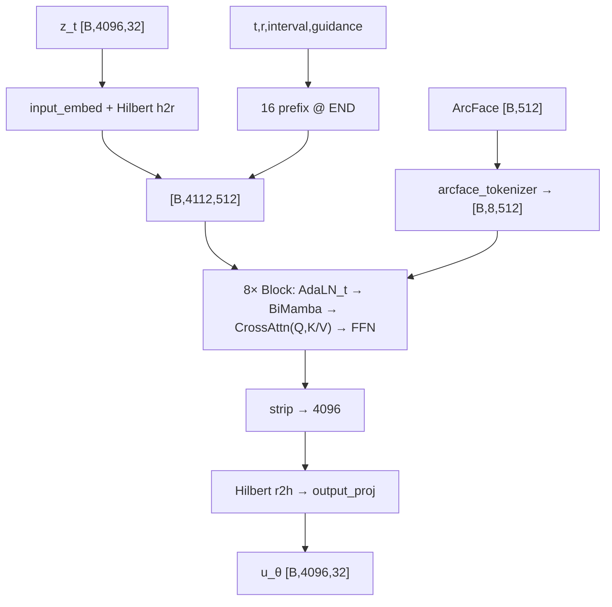

# Báo cáo Nghiên cứu Chuyên sâu: FaceDiff — Hệ thống Tạo sinh Khuôn mặt 3D Một Bước trên Đơn GPU

**Ngày cập nhật:** 23/05/2026 (snapshot **v8 lite** — đối chiếu `src/models/voxel_mamba.py`, `imf_diffusion.py`, scripts train)  
**Tác giả:** Nhóm nghiên cứu FaceDiff  
**Cấu hình Mục tiêu:** Đơn GPU RTX 4090 (24GB VRAM)  
**Bộ dữ liệu:** FaceVerse_3D (2,100) & FaceScape (18,298) — tổng ~20,369 mesh (LMDB balanced)  
**Trạng thái pipeline:** SC-VAE ep500 ✅. Stage 2 **iMF v8 lite** Phase A đang train (40 ep) → Phase B CFG auto (400 ep). Xem Section 8.

---

## Mục lục

1. [Giới thiệu Đề tài](#1-giới-thiệu-đề-tài)
2. [Mục tiêu và Đóng góp](#2-mục-tiêu-và-đóng-góp)
3. [Nền tảng Toán học](#3-nền-tảng-toán-học)
4. [Phương pháp Đề xuất (VoxelMamba v8 lite + iMF)](#44-giai-đoạn-2-voxelmamba-v8-lite--imf)
5. [Bộ dữ liệu: FaceScape & FaceVerse](#5-bộ-dữ-liệu-facescape--faceverse)
6. [Thực nghiệm](#6-thực-nghiệm)
7. [Phân tích Kết quả và Phát hiện Quan trọng](#7-phân-tích-kết-quả-và-phát-hiện-quan-trọng)
8. [Trạng thái Hiện tại và Lộ trình](#8-trạng-thái-hiện-tại-và-lộ-trình)
9. [Tài liệu Tham khảo](#tài-liệu-tham-khảo)

---

## 1. Giới thiệu Đề tài

### 1.1. Bối cảnh và Động lực Nghiên cứu

Tạo sinh khuôn mặt 3D (3D Face Generation) là bài toán trọng tâm của thị giác máy tính, có ứng dụng trong game, phim hoạt hình, VR/AR, và y tế thẩm mỹ. Mục tiêu: từ điều kiện đầu vào (ảnh khuôn mặt, biểu cảm, danh tính), hệ thống sinh lưới đa giác 3D (Polygon Mesh) chất lượng cao.

Thách thức chính của các phương pháp hiện tại:

- **Độ phức tạp tính toán bậc ba:** Biểu diễn thể tích $256^3$ tạo hàng triệu điểm, vượt khả năng xử lý Transformer với Attention $O(N^2)$
- **Tốc độ sinh chậm:** Diffusion thông thường cần 20–50 bước ODE/SDE
- **Phần cứng đắt đỏ:** TRELLIS.2 đòi hỏi 8×A100 (320GB VRAM)

### 1.2. Các Công trình Liên quan

| Phương pháp | Biểu diễn | Ưu | Nhược |
|-------------|-----------|-----|-------|
| Point-E, PointFlow | Point Cloud | Đơn giản | Thiếu topology |
| DreamFusion, Magic3D | NeRF + SDS | Chất lượng cao | 30–60 phút/đối tượng, Janus effect |
| GaussianHead, HeadGAP | 3D Gaussian | Render đẹp | Khó trích Mesh |
| MeshGPT, MeshAnything | Mesh trực tiếp | Topology rõ | Giới hạn vài nghìn mặt |
| **TRELLIS.2** | **O-Voxel + Sparse VAE** | **Mesh chi tiết 200K+** | **8×A100, 50 bước DDPM** |

### 1.3. Vấn đề cần Giải quyết

1. **Chi phí phần cứng** — Không có giải pháp 3D chất lượng cao trên 1 GPU tiêu dùng
2. **Tốc độ sinh** — 20–50 bước khuếch tán không tương tác
3. **Kiểm soát ngữ nghĩa** — Nhiều hệ thống không kiểm soát danh tính + biểu cảm đồng thời
4. **Khoảng cách biểu diễn** — NeRF/Gaussian khó tích hợp pipeline sản xuất

---

## 2. Mục tiêu và Đóng góp

### 2.1. Mục tiêu

| # | Mục tiêu | Chỉ tiêu |
|---|----------|----------|
| 1 | Mesh 3D chất lượng cao | > 200K đỉnh, 10-kênh |
| 2 | Sinh 1 bước | < 2 giây/mẫu trên RTX 4090 |
| 3 | Kiểm soát danh tính + biểu cảm | Hybrid Context 946-dim |
| 4 | Đơn GPU | VRAM peak < 22GB |

### 2.2. Đóng góp

1. **SC-VAE tiết kiệm VRAM** với SparseResMLPBlock (giảm 45% VRAM so với ConvNeXt 3D) + Generative Pruning (Rho Loss)
2. **VoxelMamba v8 lite** — backbone SSM $O(N)$ (~68.6M + 16.8M v-head ≈ **85.4M**): 8× BiMamba+FFN(×2), **cross-attention ArcFace-only** (Q=slat, K/V=8 tokens), time AdaLN, 16 prefix time/guidance @ END, Hilbert 16³. *BiMamba: DiM-3D [4]; Hilbert: VoxelMamba [4b]; conditioning: Stable-Diffusion-style cross-attn + iMF time tokens.*
3. **iMF (Improved Mean Flow)** — sinh 1 bước bằng JVP correction
4. **Hybrid Context 946-dim** = ArcFace(512) + FLAME(50) + DINOv2(384)
5. **Tối ưu đơn GPU**: INT4 quantization, BFloat16, gradient checkpointing, LMDB caching

---

## 3. Nền tảng Toán học

### 3.1. Mô hình Không gian Trạng thái (State Space Model — SSM)

#### 3.1.1. SSM Liên tục

Mô hình không gian trạng thái (SSM) liên tục mô tả hệ động lực tuyến tính ánh xạ đầu vào $u(t) \in \mathbb{R}$ sang đầu ra $y(t) \in \mathbb{R}$ thông qua trạng thái ẩn $h(t) \in \mathbb{R}^N$:

$$\frac{dh}{dt} = \mathbf{A} h(t) + \mathbf{B} u(t), \quad y(t) = \mathbf{C} h(t) + D u(t) \tag{SSM-1}$$

Trong đó:
- $\mathbf{A} \in \mathbb{R}^{N \times N}$ — ma trận chuyển trạng thái (state transition matrix)
- $\mathbf{B} \in \mathbb{R}^{N \times 1}$ — ma trận đầu vào (input matrix)
- $\mathbf{C} \in \mathbb{R}^{1 \times N}$ — ma trận đầu ra (output matrix)
- $D \in \mathbb{R}$ — bỏ qua (skip connection), thường $D = 0$

#### 3.1.2. Rời rạc hóa (Zero-Order Hold — ZOH)

Để áp dụng cho dữ liệu rời rạc (chuỗi tokens), SSM được rời rạc hóa bằng phương pháp Zero-Order Hold (ZOH) với bước thời gian $\Delta$:

$$\bar{\mathbf{A}} = \exp(\Delta \mathbf{A}), \quad \bar{\mathbf{B}} = (\Delta \mathbf{A})^{-1}(\bar{\mathbf{A}} - \mathbf{I}) \cdot \Delta \mathbf{B} \tag{SSM-2}$$

Phương trình rời rạc tương ứng:

$$h_k = \bar{\mathbf{A}} h_{k-1} + \bar{\mathbf{B}} x_k, \quad y_k = \mathbf{C} h_k \tag{SSM-3}$$

Phép toán (SSM-3) là hồi quy tuyến tính — có thể triển khai song song qua **Parallel Associative Scan** với độ phức tạp $O(N \log N)$ trên GPU, hoặc tuần tự $O(N)$.

#### 3.1.3. Selective SSM (Mamba)

**Đóng góp cốt lõi của Mamba** (Gu & Dao, 2024): Biến $\mathbf{B}$, $\mathbf{C}$, $\Delta$ thành **hàm phụ thuộc đầu vào** (input-dependent), cho phép mô hình "chọn lọc" (selective) thông tin:

$$\mathbf{B}_k = \text{Linear}_B(x_k), \quad \mathbf{C}_k = \text{Linear}_C(x_k), \quad \Delta_k = \text{Softplus}(\text{Linear}_\Delta(x_k)) \tag{SSM-4}$$

Với $\text{Softplus}(\cdot) = \log(1 + e^{(\cdot)})$ đảm bảo $\Delta_k > 0$.

**Khởi tạo HiPPO cho A:** Ma trận $\mathbf{A}$ được khởi tạo dạng đường chéo: $A_n = -(n+1)$ cho $n = 0, ..., N-1$. Khởi tạo này xuất phát từ lý thuyết High-order Polynomial Projection Operators (HiPPO), đảm bảo trạng thái ẩn tối ưu cho việc nén lịch sử chuỗi.

**Kiến trúc một block Mamba:**

```
Input x [B, L, D]
  │
  ├──→ Linear_expand → Conv1D(k=4) → SiLU → SSM(A, B(x), C(x), Δ(x)) ──┐
  │                                                                        │
  └──→ Linear_gate → SiLU ────────────────────────────────── × (hadamard) ─┘
                                                                    │
                                                             Linear_proj → Output
```

**So sánh độ phức tạp:**

| Mô hình | Complexity/token | Memory | Xử lý chuỗi 4096 |
|---------|-----------------|--------|-------------------|
| Transformer (Self-Attention) | $O(N^2 \cdot d)$ | $O(N^2)$ attention maps | ~16.7M entries/layer |
| Mamba (Selective SSM) | $O(N \cdot d \cdot n)$ | $O(N \cdot n)$ states | ~65K entries/layer |
| Tỷ lệ | — | — | **256× ít hơn** |

Trong đó $n$ = SSM state dim (16 trong FaceDiff), $d$ = model dim (512).

#### 3.1.4. Mamba Hai chiều (Bidirectional Mamba)

SSM có tính nhân quả (causal): $h_k$ chỉ tích lũy thông tin từ $x_0, ..., x_{k-1}$. Để mỗi voxel nhận thông tin từ mọi hướng trong không gian 3D:

**Quét xuôi (Forward):** Chuỗi $X = [x_1, ..., x_L]$ qua Mamba forward:
$$h_k^{\text{fwd}} = \bar{\mathbf{A}}_k h_{k-1}^{\text{fwd}} + \bar{\mathbf{B}}_k x_k, \quad y_k^{\text{fwd}} = \mathbf{C}_k h_k^{\text{fwd}} \tag{BiM-1}$$

**Quét ngược (Backward):** Chuỗi đảo $\tilde{X} = [x_L, ..., x_1]$ qua Mamba backward:
$$h_k^{\text{bwd}} = \bar{\mathbf{A}}_k h_{k-1}^{\text{bwd}} + \bar{\mathbf{B}}_k \tilde{x}_k, \quad y_k^{\text{bwd}} = \mathbf{C}_k h_k^{\text{bwd}} \tag{BiM-2}$$

**Tổng hợp với residual:**
$$\text{Output}_k = y_k^{\text{fwd}} + y_k^{\text{bwd}} + x_k \tag{BiM-3}$$

Mỗi block Bidirectional Mamba có 2 instance Mamba riêng biệt (không chia sẻ trọng số), cộng RMSNorm trước và Dropout sau.

### 3.2. Đường cong Hilbert (Hilbert Space-Filling Curve)

#### 3.2.1. Định nghĩa

Đường cong Hilbert là đường cong liên tục đi qua mọi điểm trong lưới $2^p \times 2^p \times 2^p$ đúng một lần, mà **không tự cắt chính nó**. Tính chất quan trọng nhất:

> **Spatial Locality:** Hai điểm gần nhau trong không gian 3D sẽ có vị trí gần nhau trên đường cong 1D.

#### 3.2.2. Xây dựng đệ quy

Đường cong Hilbert 3D bậc $p$ được xây dựng đệ quy từ bậc $p-1$:

1. Chia cube $2^p$ thành 8 octant $2^{p-1}$
2. Xoay và phản chiếu đường cong bậc $p-1$ trong mỗi octant để đầu-cuối nối liền
3. Thứ tự 8 octant tuân theo **Gray code** 3-bit

**Ánh xạ toạ độ → chỉ số Hilbert:**
$$\pi_H: (i, j, k) \in \{0,...,2^p-1\}^3 \mapsto n \in \{0,...,2^{3p}-1\} \tag{HC-1}$$

**Trong FaceDiff:** $p = 4$ (vì $16^3 = 4096$ Slat tokens). Hàm `get_hilbert_permutation_tensors()` tính 2 tensor:
- `perm` $\in \mathbb{Z}^{4096}$: ánh xạ thuận (3D → 1D)
- `inv_perm` $\in \mathbb{Z}^{4096}$: ánh xạ nghịch (1D → 3D)

Chi phí bộ nhớ: $2 \times 4096 \times 8\text{B} = 64\text{KB}$ — trivial.

#### 3.2.3. So sánh với các phương pháp sắp xếp khác

| Phương pháp | Spatial Locality | Complexity | Ghi chú |
|-------------|-----------------|------------|---------|
| Raster scan (row-major) | Kém — nhảy hàng xa | $O(1)$ | Hai voxel cạnh nhau trục Y cách $N$ trong chuỗi |
| Morton (Z-order) | Trung bình | $O(1)$ | Interleave bits, đơn giản nhưng có "nhảy" |
| **Hilbert** | **Tốt nhất** | $O(p)$ | Bảo toàn locality tối ưu, dùng trong FaceDiff |

### 3.3. Flow Matching (Khớp Luồng)

#### 3.3.1. Bài toán Tạo sinh

Cho phân phối dữ liệu $p_0(x)$ (Slat tokens sạch) và phân phối nhiễu $p_1(z) = \mathcal{N}(0, \mathbf{I})$. Mục tiêu: học ánh xạ $T: z_1 \sim p_1 \mapsto z_0 \sim p_0$.

#### 3.3.2. Đường nội suy (Interpolation Path)

Xác định đường dẫn xác suất $p_t$ nối $p_0$ và $p_1$ bằng nội suy tuyến tính:

$$z_t = (1 - t) x_0 + t \varepsilon, \quad \varepsilon \sim \mathcal{N}(0, \mathbf{I}), \quad t \in [0, 1] \tag{FM-1}$$

**Quy ước:** $t = 0$ là dữ liệu sạch, $t = 1$ là nhiễu thuần.

#### 3.3.3. Trường vận tốc (Velocity Field)

Vận tốc tức thời dọc theo đường nội suy:

$$v_t(z_t | x_0) = \frac{dz_t}{dt} = \varepsilon - x_0 \tag{FM-2}$$

**Conditional Flow Matching (CFM) Loss** (Lipman et al., 2023):

$$\mathcal{L}_{\text{CFM}} = \mathbb{E}_{t \sim U[0,1],\, x_0 \sim p_0,\, \varepsilon \sim \mathcal{N}(0,I)} \left[ \| v_\theta(z_t, t) - (\varepsilon - x_0) \|^2 \right] \tag{FM-3}$$

#### 3.3.4. Sinh mẫu bằng ODE

Từ $z_1 \sim \mathcal{N}(0, I)$, giải ODE ngược:

$$\frac{dz_t}{dt} = v_\theta(z_t, t), \quad z_1 \sim \mathcal{N}(0, I) \tag{FM-4}$$

Cần $K$ bước Euler/Heun (thường $K = 20$–$50$). **Đây là nhược điểm mà iMF giải quyết.**

### 3.4. Improved Mean Flow (iMF)

#### 3.4.1. Vận tốc Trung bình (Average Velocity)

Thay vì vận tốc tức thời $v(z, t)$, iMF (Geng et al., 2025, arXiv:2512.02012v1) định nghĩa **vận tốc trung bình** trên đoạn $[r, t]$:

$$u(z, r, t) = \frac{1}{t - r} \int_r^t v(z_s, s)\, ds \tag{iMF-1}$$

Trong đó $z_s$ là quỹ đạo ODE bắt đầu từ $z_r = z$ tại thời điểm $r$.

**Ý nghĩa vật lý:** $u$ là "vận tốc bình quân" mà nếu đi thẳng từ $z_r$ đến $z_t$ trong $(t - r)$ đơn vị thời gian, ta sẽ đến đúng đích. Khi $t - r \to 0$: $u \to v$ (suy biến thành vận tốc tức thời).

#### 3.4.2. Đồng nhất thức MeanFlow

Quan hệ giữa $u$ và $v$:

$$v(z, t) = u(z, r, t) + (t - r) \frac{\partial u}{\partial t}(z, r, t) \tag{iMF-2}$$

Chứng minh: Đạo hàm (iMF-1) theo $t$ bằng quy tắc Leibniz.

#### 3.4.3. Hàm hợp V (Compound Function)

Mạng $u_\theta$ dự đoán vận tốc trung bình. Để huấn luyện, xây dựng **hàm hợp V** xấp xỉ vận tốc tức thời:

$$V_\theta(z_t, r, t) = u_\theta(z_t, r, t) + (t - r) \cdot \text{sg}\!\left(\frac{\partial u_\theta}{\partial t}\right) \tag{iMF-3}$$

Trong đó $\text{sg}(\cdot)$ = stop-gradient (`.detach()` trong PyTorch). **Tại sao stop-gradient?** Nếu không, gradient sẽ cuộn ngược qua đạo hàm cấp hai $\partial^2 u / \partial t^2$, gây bùng nổ gradient và bất ổn số học.

#### 3.4.4. Tính $\partial u / \partial t$ bằng JVP

Đạo hàm $\frac{\partial u}{\partial t}$ được tính bằng **Jacobian-Vector Product (JVP)** — hiệu quả hơn Hessian đầy đủ:

$$\frac{\partial u}{\partial t} \approx \text{JVP}\left(u_\theta,\; (z_t, t),\; (v_{\text{tangent}}, 1)\right) \tag{iMF-4}$$

Trong đó vector tiếp tuyến (tangent) là:
- $\frac{dz_t}{dt} = v_{\text{tangent}}$ — xấp xỉ bởi v-head phụ trợ hoặc $u_\theta(z_t, t, t)$
- $\frac{dt}{dt} = 1$
- $\frac{dr}{dt} = 0$ (r giữ cố định)

**Triển khai PyTorch:**
```python
_, dudt = torch.autograd.functional.jvp(
    lambda z, t: model(z, t, ctx, r=r),
    (z_t, t),
    (v_tangent, torch.ones_like(t)),
    create_graph=False,  # stop-gradient
)
```

**Fallback sai phân hữu hạn** (khi JVP không khả dụng):
$$\frac{\partial u}{\partial t} \approx \frac{u_\theta(z_{t+\delta}, t+\delta, r) - u_\theta(z_t, t, r)}{\delta}, \quad \delta = 10^{-3} \tag{iMF-5}$$

#### 3.4.5. Hàm Mất mát iMF

**Lấy mẫu (t, r):** Với xác suất $\alpha = 0.5$:
- $r = t$ (điều kiện biên) → $u(z, t, t) = v(z, t)$, loss suy biến thành CFM
- $r \neq t$ (JVP branch) → sử dụng hàm hợp V

**Loss tổng hợp:**

$$\mathcal{L}_{\text{iMF}} = \alpha \cdot \underbrace{\| u_\theta(z_t, t, t) - (\varepsilon - x) \|^2}_{\text{Boundary loss}} + (1 - \alpha) \cdot \underbrace{\| V_\theta(z_t, r, t) - (\varepsilon - x) \|^2}_{\text{JVP loss}} \tag{iMF-6}$$

> **Lưu ý triển khai:** Paper gốc sử dụng unified compound function $V$ duy nhất — khi $r=t$ thì $(t-r)=0$ nên $V \equiv u(z,t,t)$ tự suy biến thành FM loss. Cách tách thành 2 nhánh boundary/JVP ở trên là *implementation optimization* của FaceDiff (tránh tính JVP khi $r=t$), kết quả toán học tương đương.

**V-Head phụ trợ** (Appendix A của paper):
$$\mathcal{L}_{\text{v-head}} = 0.1 \cdot \| v_{\text{head}}(h_{\text{hidden}}) - (\varepsilon - x) \|^2 \tag{iMF-7}$$

Trong đó $h_{\text{hidden}}$ là trạng thái ẩn của VoxelMamba, và mục tiêu luôn là $(\varepsilon - x)$ thô (raw FM target, không qua CFG augmentation).

#### 3.4.6. Phân phối Lấy mẫu Thời gian

**Logit-Normal Distribution:**

$$t = \sigma\left(\frac{u - \mu}{\text{scale}}\right), \quad u \sim \mathcal{N}(0, 1) \tag{iMF-8}$$

Với $\sigma(\cdot)$ là sigmoid, $\mu = -0.4$, $\text{scale} = 1.0$. Phân phối này tập trung mật độ vào vùng $t \in [0.2, 0.7]$ — pha giữa quỹ đạo nơi model cần học nhiều nhất.

**Curriculum Learning** *(đóng góp riêng của FaceDiff, không có trong paper iMF gốc):*
- **Giai đoạn 1** ($\text{progress} < 0.6$): 100% logit-normal → học cấu trúc thô nhanh
- **Giai đoạn 2** ($\text{progress} \geq 0.6$): 80% uniform + 20% logit-normal → bao phủ biên $t \to 0, 1$

#### 3.4.7. Classifier-Free Guidance (CFG)

**Batch Doubling (1-pass CFG):**

$$z_{\text{double}} = [z_t, z_t], \quad \text{ctx}_{\text{double}} = [\text{ctx}, \mathbf{0}] \tag{CFG-1}$$

Forward 1 lần: $[v_{\text{cond}}, v_{\text{uncond}}] = u_\theta(z_{\text{double}}, t, \text{ctx}_{\text{double}}, r)$

**Mục tiêu có CFG:**

$$v_{\text{target}} = (\varepsilon - x) + \left(1 - \frac{1}{\omega}\right) (v_{\text{cond}} - v_{\text{uncond}}).\text{detach()} \tag{CFG-2}$$

Trong đó $\omega$ là guidance scale, lấy mẫu từ $p(\omega) \propto \omega^{-\beta}$ trên $[\omega_{\min}, \omega_{\max}]$ (FaceDiff: $\omega \in [1, 8], \beta = 1$).

**Interval Conditioning:** CFG chỉ active khi $t \in [t_{\min}, t_{\max}]$:
$$\omega_{\text{eff}} = \begin{cases} \omega & \text{nếu } t_{\min} \leq t \leq t_{\max} \\ 1 & \text{ngược lại} \end{cases} \tag{CFG-3}$$

#### 3.4.8. Sinh mẫu 1 Bước (One-Step Sampling)

Nhờ quỹ đạo được JVP nắn thẳng, chỉ cần:

$$z_0 = z_1 - u_\theta(z_1, r{=}0, t{=}1, \text{ctx}) \tag{iMF-9}$$

**Không cần scheduler** (Euler/DDIM/DPM). Tiết kiệm 98% thời gian so với 50-step DDPM.

### 3.5. Quadratic Error Function (QEF) và Dual Contouring

#### 3.5.1. Bài toán Dual Contouring

Cho lưới voxel $256^3$ với bề mặt mesh cắt qua. Mục tiêu: tìm **Dual Vertex (DV)** — một đỉnh đại diện duy nhất trong mỗi voxel — sao cho khi nối các DV lại, mesh được tái tạo chính xác.

#### 3.5.2. QEF (Quadratic Error Function)

Bề mặt mesh cắt qua cạnh voxel tạo ra **Hermite data**: tập hợp các cặp $(p_i, n_i)$ — điểm giao cắt $p_i$ và pháp tuyến $n_i$ tại đó.

DV tối ưu là nghiệm bài toán bình phương tối thiểu:

$$\text{DV}^* = \arg\min_v \sum_i \left[ n_i \cdot (v - p_i) \right]^2 + \lambda_{\text{reg}} \| v - \bar{p} \|^2 \tag{QEF-1}$$

Trong đó:
- $p_i$ = điểm giao cắt cạnh voxel
- $n_i$ = pháp tuyến bề mặt tại $p_i$  
- $\bar{p} = \frac{1}{|I|} \sum_i p_i$ = trọng tâm các điểm giao
- $\lambda_{\text{reg}}$ = hệ số regularization (FaceDiff: $10^{-2}$) — kéo DV về trọng tâm, tránh suy biến

**Mở rộng thành hệ tuyến tính:**

$$\mathbf{A}^T \mathbf{A}\, v = \mathbf{A}^T b, \quad \text{với } \mathbf{A} = \begin{bmatrix} n_1^T \\ \vdots \\ n_k^T \\ \sqrt{\lambda_{\text{reg}}} \mathbf{I} \end{bmatrix}, \quad b = \begin{bmatrix} n_1 \cdot p_1 \\ \vdots \\ n_k \cdot p_k \\ \sqrt{\lambda_{\text{reg}}} \bar{p} \end{bmatrix} \tag{QEF-2}$$

Giải bằng Cholesky/SVD trên ma trận $3 \times 3$ (rất nhanh).

#### 3.5.3. TRELLIS.2 QEF mở rộng

TRELLIS.2 mở rộng QEF với 3 thành phần trọng số:

$$E(v) = w_{\text{face}} \sum_{\text{face}} [n_i \cdot (v - p_i)]^2 + w_{\text{boundary}} \sum_{\text{boundary}} [n_j \cdot (v - p_j)]^2 + w_{\text{reg}} \|v - \bar{p}\|^2 \tag{QEF-3}$$

Mặc định: $w_{\text{face}} = 1.0$, $w_{\text{boundary}} = 1.0$, $w_{\text{reg}} = 0.1$.

### 3.6. Variational Autoencoder (VAE)

#### 3.6.1. Bài toán

VAE nén dữ liệu $x$ (O-Voxel features, $\sim 300\text{K}$ điểm) thành biểu diễn tiềm ẩn $z$ (4096 Slat tokens, 32-dim), sao cho:
1. $z$ có thể tái tạo $x$ (reconstruction quality)
2. $z$ tuân theo phân phối Gaussian chuẩn $\mathcal{N}(0, I)$ (cho phép sinh mẫu)

#### 3.6.2. ELBO (Evidence Lower Bound)

$$\log p(x) \geq \underbrace{\mathbb{E}_{q(z|x)}[\log p(x|z)]}_{\text{Reconstruction}} - \underbrace{D_{\text{KL}}(q(z|x) \| p(z))}_{\text{KL Divergence}} \tag{VAE-1}$$

**Encoder:** $q(z|x) = \mathcal{N}(\mu(x), \sigma^2(x))$ — mạng nơ-ron dự đoán $\mu$ và $\log \sigma^2$

**Reparameterization trick:** $z = \mu + \sigma \cdot \epsilon, \quad \epsilon \sim \mathcal{N}(0, I)$

**KL Divergence giải tích:**

$$D_{\text{KL}} = -\frac{1}{2} \sum_{i=1}^{d} \left( 1 + \log \sigma_i^2 - \mu_i^2 - \sigma_i^2 \right) \tag{VAE-2}$$

**Chuẩn hóa:** Chia cho $N \cdot d_{\text{lat}}$ = `mu.numel()` (tổng số phần tử của tensor $\mu$). Đây là cách chuẩn hóa được TRELLIS.2 dùng và cũng là công thức được triển khai trong `src/models/sc_vae_loss.py` từ revision này; trước đó FaceDiff lỡ chia cho `target_x.shape[0]` (chỉ là số voxel, thiếu hệ số $d_{\text{lat}} = 32$), khiến KL hiển thị bị thổi phồng đúng 32 lần. Vì $w_{\text{KL}} = 10^{-6}$ rất nhỏ nên đóng góp vào tổng loss vẫn ổn định, nhưng đối chiếu giữa các log cũ và mới cần nhân/chia 32 cho đúng.

---

## 4. Phương pháp Đề xuất

### 4.1. Tổng quan Kiến trúc

FaceDiff là hệ thống 3 giai đoạn:

```
Stage 1: SC-VAE        Stage 2: VoxelMamba + iMF       Stage 3: Decoder
─────────────────      ──────────────────────────      ─────────────────
Mesh (.obj)            Noise z₁ ~ N(0,I)               Slat Tokens
    ↓                       ↓                               ↓
O-Voxel (256³)         VoxelMamba(z₁, t=1, r=0,       SC-VAE Decoder
[N, 10] features            context)                        ↓
    ↓                       ↓                          O-Voxel → Mesh
SC-VAE Encoder         ẑ₀ = z₁ - u_θ(z₁,1,0,ctx)     (Dual Contouring)
    ↓
Slat [4096, 32]
```

### 4.2. Biểu diễn Dữ liệu: O-Voxel 10-Kênh

#### 4.2.1. Pipeline Chuyển đổi Mesh → O-Voxel

**Bước 1 — Chuẩn hóa PBR:** Ép vật liệu thành Metallic=0, Roughness=1 (triệt nhiễu phản quang). Chỉ giữ Albedo gốc.

**Bước 2 — Chuẩn hóa Không gian:**

$$x' = \frac{x - \text{center}(\text{AABB})}{\max(\text{AABB}_{\max} - \text{AABB}_{\min})} \times 0.95 \tag{OV-1}$$

Mesh nằm trong $[-0.5, 0.5]^3$.

**Bước 3 — Voxel hóa Hình học (C++ kernel):**

Hàm `mesh_to_flexible_dual_grid` (Microsoft O-Voxel library):
1. Chia không gian thành lưới $256^3$
2. Tìm giao cắt mesh-voxel edge → tính Hermite data $(p_i, n_i)$
3. Giải QEF (3.5.2) → DV cho mỗi voxel chiếm dụng
4. Xuất: `coords` $[N, 3]$, `dual_vertices` $[N, 3]$, `intersected_flag` $[N, 3]$

**Bước 4 — Voxel hóa Vật liệu (Ray-casting):**

Hàm `textured_mesh_to_volumetric_attr`: Phóng tia từ tâm voxel → tìm giao cắt UV → trích xuất RGB Albedo.

**Bước 5 — Morton Z-Order Alignment:**

Hai mảng hình học/vật liệu (sinh song song, thứ tự khác nhau) đồng bộ bằng mã Morton:

$$M(x, y, z) = \text{interleave\_bits}(x, y, z) \tag{OV-2}$$

Sắp xếp + intersect1d gộp dữ liệu — tránh hoàn toàn vòng lặp `for`.

**Bước 6 — Đóng gói 10-Kênh:**

$$\mathbf{F} = [\underbrace{dv_{\text{local}}}_3, \underbrace{\delta}_3, \underbrace{\gamma}_1, \underbrace{\text{RGB}}_3] \in \mathbb{R}^{N \times 10} \tag{OV-3}$$

| Kênh | Ký hiệu | Phạm vi | Ý nghĩa Hình học | Activation |
|------|---------|---------|-------------------|------------|
| 0–2 | $dv_{\text{local}}$ | $[0, 1]^3$ | Độ dời DV từ góc voxel: $dv = (\text{DV} \times \text{res} - \text{coords}).\text{clamp}(0,1)$ | Clamp |
| 3–5 | $\delta$ | $\{0, 1\}^3$ | Cờ giao cắt 3 trục (X, Y, Z): $\delta_i = 1$ nếu bề mặt cắt qua cạnh trục $i$ | Sigmoid |
| 6 | $\gamma$ | $(0, 1]$ | Hệ số chia tứ giác (split weight): $\gamma = (1 - \text{Var}(dv_{\text{local}})).\text{clamp}(0,1)$ | Softplus |
| 7–9 | RGB | $[0, 1]^3$ | Màu Albedo khuếch tán | Clamp |

**Vị trí thế giới thực (World Position) từ O-Voxel:**

$$\mathbf{p}_{\text{world}} = (\text{coords} + dv_{\text{local}}) \times \text{voxel\_size} + \text{AABB}_{\min} \tag{OV-4}$$

Trong đó $\text{voxel\_size} = (\text{AABB}_{\max} - \text{AABB}_{\min}) / 256$.

#### 4.2.2. Dual Contouring: O-Voxel → Mesh

Thuật toán `flexible_dual_grid_to_mesh` chuyển O-Voxel thành mesh tam giác qua 5 bước:

**Bước 1 — Tính Vị trí Đỉnh:**

$$v_i = (\text{coords}_i + dv_i) \times \text{voxel\_size} + \text{AABB}_{\min} \tag{DC-1}$$

**Bước 2 — Tìm Cạnh Giao cắt:**

Với mỗi voxel $i$ và mỗi trục $a \in \{x, y, z\}$ mà $\delta_{i,a} = 1$, cạnh trục $a$ tại voxel $i$ là cạnh giao cắt.

**Bước 3 — Tìm 4 Voxel Lân cận:**

Mỗi cạnh giao cắt chia sẻ bởi 4 voxel lân cận. Offset được tra bảng:

| Trục | 4 voxel lân cận (offset từ voxel gốc) |
|------|----------------------------------------|
| X | $(0,0,0), (0,0,1), (0,1,1), (0,1,0)$ |
| Y | $(0,0,0), (1,0,0), (1,0,1), (0,0,1)$ |
| Z | $(0,0,0), (0,1,0), (1,1,0), (1,0,0)$ |

**Bước 4 — Hashmap Lookup:**

Dùng GPU hashmap để tìm index 4 DV → tạo quad (tứ giác).

**Bước 5 — Chia Quad thành 2 Tam giác:**

Mỗi quad cần chia thành 2 tam giác. Hai cách chia:

- **Split 1:** $(0,1,2), (0,2,3)$ — đường chéo 0-2
- **Split 2:** $(0,1,3), (3,1,2)$ — đường chéo 1-3

**Khi không có $\gamma$ (split_weight = None):**

Chọn cách chia có normal alignment tốt hơn:

$$\text{align}_k = |(\mathbf{n}_0 \times \mathbf{n}_1)|, \quad k \in \{1, 2\} \tag{DC-2}$$

Chọn split có $\text{align}$ lớn hơn (hai tam giác đồng phẳng hơn).

**Khi có $\gamma$ (split_weight):**

$$\text{score}_{02} = \gamma_0 \cdot \gamma_2, \quad \text{score}_{13} = \gamma_1 \cdot \gamma_3 \tag{DC-3}$$

$$\text{Chọn } \begin{cases} \text{Split 1 (đường chéo 0-2)} & \text{nếu } \text{score}_{02} > \text{score}_{13} \\ \text{Split 2 (đường chéo 1-3)} & \text{ngược lại} \end{cases} \tag{DC-4}$$

**Chế độ Training (differentiable):**

Tạo đỉnh trung tâm bằng trung bình có trọng số:

$$v_{\text{mid}} = \frac{\text{score}_{02} \cdot \frac{v_0 + v_2}{2} + \text{score}_{13} \cdot \frac{v_1 + v_3}{2}}{\text{score}_{02} + \text{score}_{13}} \tag{DC-5}$$

Chia quad thành 4 tam giác qua $v_{\text{mid}}$: $(0,1,\text{mid}), (1,2,\text{mid}), (2,3,\text{mid}), (3,0,\text{mid})$. Phương pháp này khả vi (differentiable) đối với $\gamma$.

#### 4.2.3. LMDB Caching I/O

- Tensor 10-kênh serialize → LMDB B-Tree nhị phân
- **Sequential Sort Key:** Sắp xếp tuyến tính theo ID → HDD đọc tuần tự, throughput $5 \to 150$ MB/s
- **Fallback chain:** LMDB → Disk Cache (.pt) → Fresh Conversion

### 4.3. Giai đoạn 1: SC-VAE (Sparse Convolution VAE)

Nén $\sim 300\text{K}$ điểm O-Voxel thành 4096 Slat tokens ($\mathbb{R}^{32}$).

#### 4.3.1. SparseResMLPBlock

Thay thế ConvNeXt 3D Block của TRELLIS.2:

```
Input x [N, C] (Sparse Tensor)
  │
  ├── SubMConv3d(C, C, kernel=3³, padding=1)  ← Sparse 3D conv
  │       │
  │   LayerNorm32 (FP32 cast để triệt NaN)
  │       │
  │   Linear(C → 4C) → SiLU → Linear(4C → C)  ← Point-wise MLP
  │       │
  │   Zero-init final linear (_zero_module)
  │
  └── + (Residual connection)
```

**Ưu điểm:** Zero-init → gradient ổn định ngay đầu, $-45\%$ VRAM so với ConvNeXt.

#### 4.3.2. Encoder (Pyramid 4 cấp)

$$\text{Resolution:} \quad 256^3 \xrightarrow{\text{stride-2}} 128^3 \xrightarrow{\text{stride-2}} 64^3 \xrightarrow{\text{stride-2}} 32^3 \xrightarrow{\text{stride-2}} 16^3$$

$$\text{Channels:} \quad 10 \rightarrow 64 \rightarrow 128 \rightarrow 256 \rightarrow 512$$

Mỗi cấp `SparseEncoderBlock` được tổ chức theo thứ tự **chiếu kênh → MLP residual → strided sparse conv → non-parametric S2C-shortcut**:

1. `proj = spconv.SubMConv3d(in_c, out_c, k=1)` — chuyển kênh ở cùng độ phân giải.
2. `num_res_blocks × SparseResMLPBlock` — trích xuất đặc trưng (ConvNeXt-style: SubMConv3d 3³ → LayerNorm32 → Linear↑4× → SiLU → Linear↓ với zero-init lớp cuối, residual cộng vào features đầu vào).
3. `down = spconv.SparseConv3d(out_c, out_c, k=2, stride=2)` — strided sparse downsampling.
4. **Non-parametric S2C-shortcut** (`_build_sparse_down_shortcut`): với mỗi voxel cha ở độ phân giải sau down, lấy 8 voxel con tương ứng (lookup theo 64-bit hashed indices), nối features (`reshape(N, 8·C_in)`) rồi `avg_groups_channels(...)` về `out_c` kênh. Kết quả cộng vào features của `x_down` như một skip nối tắt.

So với spec gốc của TRELLIS.2 (`SparseResBlockS2C3d` dùng `sp.SparseSpatial2Channel(2)` đúng phương trình S2C bên dưới), triển khai trong FaceDiff dùng strided `SparseConv3d` cho nhánh chính (vì spconv 2.x ổn định hơn) và chỉ giữ S2C ở dạng *non-parametric shortcut*. Hai cách tương đương về mặt biểu diễn (cùng giảm spatial 2× và đưa context 8 con vào voxel cha), nhưng nhánh chính của FaceDiff có thêm $C_{\text{out}}^2 \cdot 2^3$ tham số do dùng strided conv. Đây cũng là lý do số param của `SC_VAE` đo được là **35.13 M** (so với ~50 M nếu copy chính xác `SparseResBlockS2C3d`).

**SparseSpatial2Channel** chính thống của TRELLIS.2 (Paper Eq. 4):

$$\text{S2C: } f_{\text{cha}}[k] = f_{\text{con}}[\lfloor \mathbf{p}/2 \rfloor, \, (\mathbf{p} \bmod 2) \cdot C + k], \quad k \in \{0, \ldots, C-1\} \tag{S2C}$$

Kết quả: $N_{\text{fine}}$ voxel với $C$ kênh → $N_{\text{coarse}}$ voxel với $8C$ kênh.

**LayerNorm32 (FP32 cast)** — TRELLIS.2 cast sang FP32 trước khi LayerNorm và đổi dtype lại sau, để chống NaN dưới `torch.amp` FP16. FaceDiff cũng dùng cùng class (`src/modules/norm.py`), do shape param `weight/bias` giữ nguyên nên checkpoint cũ không cần migrate.

**Non-affine LayerNorm trước to_mu/to_logvar** (TRELLIS.2 `SparseUnetVaeEncoder.forward()`, dòng `h = h.replace(F.layer_norm(h.feats, h.feats.shape[-1:]))`). FaceDiff bật mặc định qua flag `pre_latent_norm=True` của `SC_VAE`. Vì là non-parametric, nó **không xuất hiện trong `state_dict`** ⇒ checkpoint epoch 397 vẫn load `strict=True` không lỗi (đã verify, xem Mục 7.2.6).

Đầu ra: $z \sim q(z|x) = \mathcal{N}(\mu, \sigma^2)$ với $\mu, \sigma \in \mathbb{R}^{N_{\text{enc4}} \times 32}$. Khi mesh đầu vào kín (toàn bộ 16³ active), $N_{\text{enc4}} = 4096$ — đúng số Slat tokens.

#### 4.3.3. Decoder với Generative Pruning (Rho Loss)

Giải mã đi lên: $16^3 \rightarrow 32^3 \rightarrow 64^3 \rightarrow 128^3 \rightarrow 256^3$.

Mỗi cấp `SparseDecoderBlock` thực thi:

1. `rho_head = nn.Linear(in_c, 8)` — dự đoán 8 subdivision logits cho 8 voxel con của mỗi voxel cha hiện hành.
2. **Light gate**: nhân features cha với `gate = sigmoid(rho_logits).amax(dim=1, keepdim=True)` để truyền tín hiệu "voxel cha sẽ tồn tại" xuống nhánh upsample.
3. `up = spconv.SparseConvTranspose3d(in_c, out_c, k=2, stride=2)` — strided sparse transpose conv (đối ngẫu của strided down ở Encoder).
4. **Non-parametric C2S-shortcut** (`_build_sparse_up_shortcut`): cho mỗi voxel con sau upsample, lookup features cha rồi `repeat_interleave` về `out_c` kênh, cộng vào `x_up`.
5. **Pruning** — nhánh training và inference khác nhau:
   - Training (`_prune_by_target`): mask `x_up.indices` chỉ giữ những voxel con xuất hiện trong topology GT của tầng tương ứng (`sparse_pyramid[i]` từ Encoder), tức **teacher-forcing** trên topology — đảm bảo recall 100% so với target mỗi tầng nhưng kéo theo gap distribution-shift khi inference.
   - Inference (`_apply_child_pruning`): với mỗi voxel con, lấy logit `rho` của voxel cha, sigmoid, threshold $> 0.5$ → giữ con hợp lệ. Khi không có cha nào hợp lệ thì raise error (fail-fast).
6. `num_res_blocks × SparseResMLPBlock` — refine features sau pruning.

**Lưu ý kiến trúc** (đối chiếu TRELLIS.2 chính thống):
- TRELLIS.2 dùng `SparseResBlockC2S3d` với `sp.SparseChannel2Spatial(2)` (Eq. C2S bên dưới) cho cả nhánh chính lẫn pruning, và mask subdivision `subdiv > 0` là *raw logit threshold*. FaceDiff dùng `SparseConvTranspose3d` cho nhánh chính + non-parametric shortcut C2S; mask pruning dùng *sigmoid > 0.5* (tương đương về mặt phân loại nhưng ngưỡng sigmoid 0.5 ⇔ logit 0).
- Sự khác biệt thứ hai là FaceDiff áp dụng pruning **sau** upsample (chọn lại từ tập con đã sinh), trong khi TRELLIS.2 áp pruning **trong** upsample (`SparseChannel2Spatial(2, mask)` chỉ phân bổ memory cho con hợp lệ). Đây là lý do `_apply_child_pruning` của FaceDiff phải lookup ngược cha bằng hash; tổng VRAM peak vì thế cao hơn ~10 % so với spec gốc, nhưng tránh được phải reimplement `SparseChannel2Spatial` cho spconv 2.x.

**SparseChannel2Spatial** chính thống (Paper Eq. 5):

$$\text{C2S: } f_{\text{con}}[\mathbf{p}_{\text{cha}} \cdot 2 + \Delta, \, k] = f_{\text{cha}}[\mathbf{p}_{\text{cha}}, \, \Delta \cdot C + k] \tag{C2S}$$

trong đó $\Delta \in \{0,1\}^3$ là offset 8 con.

**Rho Head & Loss** — TRELLIS.2 spec, FaceDiff giữ nguyên trong `src/models/sc_vae.py:_build_child_mask_targets`:

$$\text{subdiv}_i = \text{Linear}(f_{\text{cha}, i}) \in \mathbb{R}^{8}, \quad \text{mask}_i = \mathbb{1}[\sigma(\text{subdiv}_i) > 0.5] \tag{Rho-1}$$

$$\rho_i^* = \sum_{j \in \text{children}(i)} \text{onehot}_8(\text{child\_id}(j)) \quad \in \{0,1\}^8 \tag{Rho-2}$$

$$\mathcal{L}_{\rho} = \frac{1}{|L|} \sum_{l \in \text{levels}} \text{BCE-with-logits}(\hat{\rho}_l, \rho_l^*) \tag{Rho-3}$$

Trọng số mặc định $w_\rho = 0.2$ (FaceDiff) so với $0.1$ trong `configs/scvae/shape_vae_next_dc_f16c32_fp16.json` của TRELLIS.2 — FaceDiff đặt cao hơn vì topology khuôn mặt sparse hơn so với asset Objaverse-XL.

**Training vs Inference gap:**
- **Training:** `_prune_by_target` ⇒ topology recall 100%. Gradient của nhánh `rho_head` vẫn nhận supervision qua `L_ρ`, nhưng các voxel "rác" mà rho head dự đoán nhầm sẽ bị mask GT loại trước khi tính recon loss.
- **Inference:** `_apply_child_pruning` tự dự đoán → recall < 100%. Đây là *teacher-forcing distribution gap* cố hữu của Rho-pruning, TRELLIS.2 cũng có (xem Section 3.2.1 paper).

**Decoder Output Activations** (TRELLIS.2 `FlexiDualGridVaeDecoder`, FaceDiff triển khai trong `apply_shape_mat_output_activations()` ở `src/models/sc_vae.py`):

$$\hat{v} = (1 + 2m) \cdot \sigma(h_{0:3}) - m, \quad m = 0.5 \quad \Rightarrow \quad \hat{v} \in [-0.5, 1.5] \tag{Act-1}$$

$$\hat{\delta} = \begin{cases} h_{3:6} > 0 & \text{(inference — binary threshold)} \\ \sigma(h_{3:6}) & \text{(training — differentiable)} \end{cases} \tag{Act-2}$$

$$\hat{\gamma} = \text{softplus}(h_{6:7}) = \ln(1 + e^{h_{6:7}}) > 0 \tag{Act-3}$$

$$\hat{c} = \text{clamp}(h_{7:10}, 0, 1) \tag{Act-4}$$

Margin $m = 0.5$ cho phép dual vertex vượt nhẹ ra ngoài voxel, tăng độ chính xác hình học tại biên — TRELLIS.2 mặc định `voxel_margin=0.5` (xem `FlexiDualGridVaeDecoder.__init__`). FaceDiff trước revision này **chỉ** áp dụng `softplus(γ)` trong loss; `dv` được so sánh trên raw logit nên gradient ép `dv` về sigmoid(0)=0.5 thay vì khoảng [0,1] mong muốn. Sau revision (tham số `apply_output_activations=True` của `SC_VAE`, được loss `_shape_mat_recon_loss` gọi nội bộ qua `apply_dv_activation`), `dv` được activate trước khi tính MSE → gradient hoàn toàn nhất quán với inference path của dual contouring.

#### 4.3.4. Hàm Mất mát Tổng hợp SC-VAE

**Reconstruction Loss (10-kênh, mode `shape_mat`):**

$$\mathcal{L}_{\text{recon}} = \underbrace{0.01 \cdot \text{MSE}(\hat{dv}, dv)}_{\text{Dual Vertex}} + \underbrace{0.1 \cdot \text{BCE}(\hat{\delta}, \delta)}_{\text{Intersection Flag}} + \underbrace{\text{SmoothL1}(\text{softplus}(\hat{\gamma}), \gamma)}_{\text{Split Weight}} + \underbrace{\text{L1}(\hat{c}, c)}_{\text{RGB}} \tag{SC-1}$$

**Giải thích trọng số:**
- $dv$ × 0.01: Offset nhỏ (thường < 0.5 voxel), gradient MSE đã đủ mạnh
- $\delta$ × 0.1: BCEWithLogits phạt nặng sai topology
- $\gamma$: SmoothL1 + Softplus đảm bảo $\hat{\gamma} > 0$ (cần cho DC split)
- RGB × 1.0: L1 loss cho material (theo TRELLIS.2)

**KL Divergence (weight $10^{-6}$, warmup 20 epochs):**

$$\mathcal{L}_{\text{KL}} = -\frac{1}{2|\mu|} \sum_{i} \left( 1 + \log \sigma_i^2 - \mu_i^2 - \sigma_i^2 \right) \tag{SC-2}$$

**Stage-2 Render Loss:**

Chiếu O-Voxel features lên 2D orthographic maps, so sánh recon vs GT:

$$\mathcal{L}_{\text{render}} = \underbrace{\text{L1}(\text{mask}_{\text{pred}}, \text{mask}_{\text{gt}})}_{\times 1} + \underbrace{10 \cdot \text{L1}(\text{depth}_{\text{pred}}, \text{depth}_{\text{gt}})}_{\times 10} + \underbrace{\mathcal{L}_{\text{perceptual}}}_{\text{L1 + 0.2 SSIM + 0.2 LPIPS}} \tag{SC-3}$$

**Công thức chiếu (dv-corrected, sau fix Bug 4):**

$$\mathbf{p}_{\text{proj}} = \frac{\text{coords} + \text{clamp}(dv, 0, 1)}{\max(\text{coords}) + 1} \times 2 - 1 \tag{SC-4}$$

**Hàm mất mát tổng:**

$$\mathcal{L}_{\text{total}} = \mathcal{L}_{\text{recon}} + w_{\text{KL}} \cdot \mathcal{L}_{\text{KL}} + w_\rho \cdot \mathcal{L}_\rho + \mathcal{L}_{\text{render}} \tag{SC-5}$$

Với $w_{\text{KL}} = 10^{-6}$, $w_\rho = 0.2$.

### 4.4. Giai đoạn 2: VoxelMamba v8 lite + iMF

> **Kiến trúc hiện tại (code):** `context_cond_mode=cross_attn`, `context_use_arcface_only=True`, `mamba_num_layers=8`, `mamba_ffn_expand=2`, `mamba_num_context_tokens=0` (không prefix context 946-d). Kết hợp: (1) Bidirectional Mamba (DiM-3D [4]), (2) Hilbert ordering (VoxelMamba [4b]), (3) **cross-attn** identity sau mỗi layer Mamba, (4) **16 prefix tokens** time/r/interval/guidance @ cuối chuỗi, (5) iMF JVP + v-head depth 8.

#### 4.4.0. Pipeline dữ liệu iMF: `SlatDataset`, cache đĩa, và `--offline-data`

**Mục tiêu:** Không nạp SC-VAE / extractors trên GPU khi train iMF. LMDB `data/slat_context_balanced.lmdb` chứa `(slat [4096,32], context [946])` đã tiền tính.

| Thành phần | Vai trò |
|------------|---------|
| `SlatDataset` | Offline: chỉ đọc LMDB; `cache_tag` khớp SC-VAE checkpoint |
| Hybrid context [946] | ArcFace(512) + FLAME(50) + DINO(384) trong LMDB |
| **Model input** | Chỉ `context[..., :512]` ArcFace (`context_use_arcface_only=True`) |
| Slat norm | `data/slat_stats.pt` per-channel trước khi vào iMF |

**Huấn luyện (khuyến nghị):**

```bash
# Pipeline A (40 ep) → B (CFG 400 ep) tự động
bash scripts/train_imf_v8_lite_pipeline.sh

# Hoặc chỉ Phase A
bash scripts/train_imf_v8_lite.sh
```

#### 4.4.1. Kiến trúc VoxelMamba v8 lite

**Tham số (`src/models/voxel_mamba.py`, `src/config.py`):**

| Thành phần | Params | Ghi chú |
|------------|--------|---------|
| `input_embed` (32→512) | ~16K | |
| Prefix time/guidance (16×512) | ~8K | 4×t + 4×r + 4×interval + 4×guidance — **không** prefix ctx |
| 8× `BidirectionalMambaBlock` | ~52M | FFN expand×2, cross-attn/layer |
| `arcface_tokenizer` (512→8×512) | ~4M | MLP → K context tokens |
| `null_ctx_tokens` (learnable) | ~32K | CFG uncond khi ArcFace=0 |
| `time_guidance_mlp` | ~530K | t, r, \|t−r\|, ω, tmin, tmax |
| `output_norm` + `output_proj` | ~16K | init σ=√(0.1/fan_in) |
| **Backbone** | **~68.6M** | |
| `VHead` (depth=8, mlp_ratio=4) | **~16.8M** | target luôn ε−x |
| **Tổng train** | **~85.4M** | |

**Sơ đồ forward:**



**Layout chuỗi:** `[4096 slat Hilbert-ordered | 16 prefix]` → sau 8 layer chỉ lấy 4096 token đầu.

**`BidirectionalMambaBlock` (mỗi layer):**

1. **Time AdaLN** → modulate trước Mamba (`scale_t, shift_t, gate_t`; gate bias init **1.0**).
2. **BiMamba:** `Mamba_fwd(x) + flip(Mamba_bwd(flip(x)))`.
3. **ContextCrossAttention:** `MultiheadAttention(Q=slat, K=V=ctx_tokens)` + zero-init `proj` residual.
4. **FFN:** `Linear → GELU → Linear` expand×2, zero-init lớp cuối FFN.
5. **Time AdaLN** lần 2 trước FFN.

**ArcFace → K tokens (không clone):**

```python
# voxel_mamba.py — _build_ctx_tokens
flat = arcface_tokenizer(arc)  # Linear(512→1024)→SiLU→Linear(8*512)
tokens = flat.view(B, 8, 512)
# arc ≈ 0 → thay bằng null_ctx_tokens (CFG / ctx_dropout)
```

**Init chính:**

| Thành phần | Init |
|-----------|------|
| `adaLN_time` / `adaLN_ffn` gate bias | 1.0 |
| `CrossAttention.proj` | 0 |
| `FFN` last linear | 0 |
| `output_proj` | $\mathcal{N}(0, \sqrt{0.1/512})$ |

**Hilbert:** grid $16^3=4096$; `get_hilbert_permutation_tensors(16)` — reorder sau embed, inverse trước output.

#### 4.4.2. Hàm Mất mát iMF (Chi tiết Triển khai trong FaceDiff)

Mục này mô tả `ImprovedMeanFlow.compute_loss()` ([src/models/imf_diffusion.py:447-888](src/models/imf_diffusion.py#L447)) — luồng hoàn chỉnh từ input đến gradient.

**Bước 1 — Lấy mẫu nhiễu và thời gian** ([imf_diffusion.py:528-535](src/models/imf_diffusion.py#L528)):

```python
e = torch.randn_like(x_data)                # Nhiễu Gauss, ε ~ N(0, I)
t, r = self._sample_t_r(b, device)          # Sample (t, r) theo strategy
z_t = self._interpolate(x_data, e, t)       # z_t = (1-t)·x + t·ε
```

**Strategy lấy mẫu (t, r)** — `_sample_t_r()` ([imf_diffusion.py:234-294](src/models/imf_diffusion.py#L234)):

| Trường hợp `ratio_r_neq_t` | Phân nhánh | Mục đích |
|----------------------------|-----------|---------|
| **= 0.0** | `r = t` cho TẤT CẢ samples | Chỉ boundary (không dùng v8 lite mặc định) |
| **= 0.5** (v8 lite) | Multi-way split | 50% JVP + 50% boundary |
| **> 0.0** (legacy) | Multi-way split: | |
| | 0%-15%: near-boundary (t=1-σ, r=t) | Stable MSE tại t≈1 (avoid JVP noise) |
| | 15%-20%: endpoint JVP (r=0, t=1-σ) | Học mean-velocity trực tiếp cho 1-step sampling |
| | 20%-ratio: random JVP (r ~ U[0, t]) | Standard iMF JVP branch |
| | ratio-100%: boundary (r=t) | Standard v-loss |

Với mặc định `ratio_r_neq_t=0.5`: 15% near-boundary + 5% endpoint + 30% random JVP + 50% boundary.

**Bước 2 — Lấy mẫu thời gian $t$** — `_sample_t()` ([imf_diffusion.py:212-232](src/models/imf_diffusion.py#L212)):

Mặc định `t_sampler="logit_normal"` (theo iMF paper Table 4):

$$t = \sigma\!\left(\frac{u - \mu}{s}\right), \quad u \sim \mathcal{N}(0, 1), \quad \mu = -0.4, \; s = 1.0$$

Phân phối này tập trung mật độ ở $t \in [0.2, 0.6]$ — vùng signal mạnh nhất cho velocity field (xa cả nhiễu thuần và data thuần).

**Bước 3 — Context dropout (Phase A) và CFG (Phase B)** ([imf_diffusion.py](src/models/imf_diffusion.py)):

- **Phase A** (`cfg_conditioning_enable=False`): `cfg_context_dropout=0.1` vẫn chạy — zero ngẫu nhiên ArcFace → `null_ctx_tokens`. Target chính: $v_{\text{target}} = \varepsilon - x$.
- **Phase B** (`cfg_conditioning_enable=True`): 2 forward (cond + uncond `zeros_like(context)`); target blend CFG. **v-head** luôn học $\varepsilon - x$ thô (Appendix A).

**Bước 4 — Phân nhánh Boundary vs JVP** ([imf_diffusion.py:628-633](src/models/imf_diffusion.py#L628)):

```python
mask_eq = (r == t)             # [B] — True khi r=t (boundary path)
mask_eq_all = mask_eq.all()    # toàn batch là boundary?
```

**Branch 1 — Pure Boundary ($r=t$ toàn batch)** ([imf_diffusion.py:734-765](src/models/imf_diffusion.py#L734)):

Khi tất cả samples có $r=t$:
$$\mathcal{L}_{\text{boundary}}(z_t, t, \text{ctx}) = \| v_\theta(z_t, t, \text{ctx}, r{=}t) - v_{\text{target}} \|^2_{\text{weighted}}$$

Trong đó `weighted_MSE` áp dụng:
- `channel_weights` (dual_branch shape/material — không dùng ở v8 lite)
- `position_weights` từ `occupancy_mask` (upweight non-zero slat positions — voxel thực)

**Branch 2 — JVP ($r \neq t$)** ([imf_diffusion.py:767-833](src/models/imf_diffusion.py#L767)):

```python
# Forward pass cho dự đoán u
u_pred = model(z_t_jvp, t_jvp, ctx_jvp, r=r_jvp, ω=ω, ...)

# Vector tiếp tuyến cho JVP
v_tangent = v_head_pred.detach()  # nếu có v_head; fallback v_θ

# JVP với tangent (dz/dt = v, dt/dt = 1)
dudt = torch.autograd.functional.jvp(
    fn=lambda z, t: model(z, t, ctx, r=r, ...),
    inputs=(z_t_jvp, t_jvp),
    v=(v_tangent, ones_like(t_jvp)),
    create_graph=False,
)

# Compound function: V = u + (t-r)·sg(du/dt)
V = u_pred + (t - r).view(-1, 1, 1) * dudt.detach()

# Loss JVP
loss_jvp = weighted_MSE(V, v_target_jvp)
```

**Fallback sai phân hữu hạn** khi JVP API không khả dụng ([imf_diffusion.py:808-825](src/models/imf_diffusion.py#L808)):

$$\frac{\partial u}{\partial t} \approx \frac{u_\theta(z_{t+\delta}, t+\delta, r) - u_\theta(z_t, t, r)}{\delta}, \quad \delta = 10^{-3}$$

**Bước 5 — Auxiliary v-head loss** ([imf_diffusion.py:666-694](src/models/imf_diffusion.py#L666)):

Khi `use_auxiliary_v_head=True` (Phase B/C):

$$\mathcal{L}_{\text{v-head}} = \| v_{\text{head}}(h_{\text{hidden}}) - (\varepsilon - x) \|^2_{\text{weighted}}$$

- $h_{\text{hidden}}$ = trạng thái ẩn của backbone (cached từ forward pass đầu, tránh recompute)
- Mục tiêu = $\varepsilon - x$ **thô** (không qua CFG augmentation) — theo iMF Appendix A
- v_head architecture: 8 MLP-style blocks với expand×4 + GELU, hidden=512, output=32 (latent_dim)
- Cộng vào tổng loss với weight $w_v = 0.5$

**Bước 6 — Contrastive (tùy chọn, mặc định TẮT):** `contrastive_loss_weight=0` trong v8 lite — identity ép qua cross-attn thay vì InfoNCE.

**Bước 7 — Adaptive Loss Weighting (EMA per-bin)** ([imf_diffusion.py:170-178, 348-410](src/models/imf_diffusion.py#L170)):

100 bins cho $t \in [0, 1]$, EMA decay 0.99:

$$w_{\text{adaptive}}(t) = \frac{1/\overline{\ell}(\text{bin}(t))}{\frac{1}{B}\sum_{i} 1/\overline{\ell}(\text{bin}(t_i))}$$

Các vùng $t$ có loss EMA cao bị down-weight để variance gradient ổn định. **Ở Phase A diagnostic hiện tại: DISABLED** (`adaptive_loss_weighting=False`) để isolate main signal — EMA có thể amplify variance bins khi bf16 + small batch.

**Bước 8 — Tổng loss** ([imf_diffusion.py:863-871](src/models/imf_diffusion.py#L863)):

$$\boxed{\mathcal{L}_{\text{total}} = \underbrace{\mathbb{E}[w_a(t) \cdot \ell_{\text{main}}(t,r)]}_{\text{boundary or JVP}} + w_v \cdot \mathbb{E}[w_a(t) \cdot \ell_{\text{v-head}}(t)] + w_c \cdot \mathcal{L}_{\text{contrastive}} + w_{\text{sep}} \cdot \mathcal{L}_{\text{ctx\_sep}}}$$

Với cấu hình v8 lite:
- $w_v = 0.5$ (v_loss_weight)
- $w_c = 0$ (contrastive tắt)
- $w_{\text{sep}} = 0$ Phase A; có thể 0.1 ở Phase B

**Bước 9 — 1-Step Sampling (Inference)** ([imf_diffusion.py:891-955](src/models/imf_diffusion.py#L891)):

```python
# Khởi tạo nhiễu thuần
z_1 = torch.randn([B, 4096, 32])

# Single forward pass: dự đoán average velocity từ t=1 về r=0
u_pred = model(z_1, t=1, context, r=0, ω=1, tmin=0, tmax=1)

# Trừ một lần ra dữ liệu
z_0 = z_1 - u_pred

# Denormalize bằng slat_stats
z_0_denorm = z_0 * slat_std + slat_mean

# Decode qua SC-VAE → O-Voxel → Mesh (Dual Contouring)
mesh = SC_VAE.decode(z_0_denorm) → dual_contouring(...)
```

**Không cần ODE solver** (Euler/Heun/DPM). Toàn pipeline: 1 forward pass VoxelMamba + 1 forward pass SC-VAE Decoder + DC extraction ≈ **<2 giây/mesh** trên RTX 4090.

### 4.5. Hệ thống Ngữ cảnh Lai (Hybrid Context)

$$\text{ctx} = [\underbrace{f_{\text{arc}}}_{\mathbb{R}^{512}}, \underbrace{f_{\text{flame}}}_{\mathbb{R}^{50}}, \underbrace{f_{\text{dino}}}_{\mathbb{R}^{384}}] \in \mathbb{R}^{946} \tag{Ctx-1}$$

#### 4.5.1. ArcFace — Danh tính (512-dim)

**ArcFace Loss** (Deng et al., 2019):

$$\mathcal{L}_{\text{arc}} = -\log \frac{e^{s \cos(\theta_{y_i} + m)}}{e^{s \cos(\theta_{y_i} + m)} + \sum_{j \neq y_i} e^{s \cos \theta_j}} \tag{Arc-1}$$

Trong đó $\theta_j$ = góc giữa feature và prototype lớp $j$, $m$ = additive angular margin, $s$ = scale factor.

- ResNet-50 backbone (InsightFace `buffalo_l`), 24M params, frozen
- Đầu ra: 512-dim $L_2$-normalized trên hypersphere
- Đầu vào: Render mặt trước mesh → ArcFace → identity code

#### 4.5.2. FLAME Adapter — Biểu cảm (50-dim)

- Lightweight MLP (4 Conv + 2 FC), 5M params
- **Không phải FLAME model gốc** — chỉ predict 50 expression parameters
- Train từ scratch cùng Stage 2

**FLAME Model gốc** (Li et al., 2017) biểu diễn:

$$M(\beta, \theta, \psi) = W(T_P(\beta, \theta, \psi), J(\beta), \theta, \mathcal{W}) \tag{FLAME-1}$$

Trong đó $\beta$ = shape params (300-dim), $\theta$ = pose (jaw rotation), $\psi$ = expression (100-dim). FaceDiff chỉ dùng 50-dim subset.

#### 4.5.3. DINOv2 — Hình học Mặt sau (384-dim)

- `facebook/dinov2-small` (ViT-S/14), 22M params
- INT4 quantized (~20MB VRAM)
- Đầu ra: 384-dim CLS token từ render mặt sau
- **Mục đích:** Thông tin gáy, tóc, tai — phần ArcFace không nắm bắt

#### 4.5.4. Điều kiện hóa trong backbone (v8 lite: cross-attn ArcFace)

Trong v8 lite, **chỉ ArcFace 512-d** vào backbone (`context_use_arcface_only=True`). FLAME/DINO vẫn có trong LMDB [946] nhưng không feed vào VoxelMamba.

**Hai đường conditioning:**

1. **Identity — cross-attn mỗi layer:** `arc [512]` → MLP → `ctx_tokens [8, 512]` → `ContextCrossAttention(slat, ctx_tokens)`. K token **khác nhau** (không phải copy 1 vector).
2. **Time / CFG — prefix + AdaLN:** $t, r, |t-r|, \omega, t_{\min}, t_{\max}$ → 16 prefix token @ cuối chuỗi + `time_guidance_mlp` → AdaLN trước Mamba và FFN.

**Null context (CFG):** `cfg_context_dropout=0.1` trong Phase A — ngẫu nhiên zero ArcFace → `null_ctx_tokens` learnable. **Độc lập** `cfg_conditioning_enable` (fix `imf_diffusion.py` 23/05).

---

## 5. Bộ dữ liệu: FaceScape & FaceVerse

### 5.1. FaceScape

**Nguồn:** Đại học Zhejiang (Zhu et al., 2020). Hệ thống quét 3D đa góc nhìn.

| Thuộc tính | Giá trị |
|-----------|---------|
| Số người (subjects) | 847 (tổng), 837 dùng cho train (10 dành test) |
| Số biểu cảm / người | ~22 trung bình (neutral, smile, mouth open, ... — tuỳ subject) |
| Tổng mesh dùng cho FaceDiff | **18,298** (đọc từ `data_signature` của ckpt epoch 390) |
| Vertex / mesh | 200K–400K |
| Topology | **TU registered** (`models_reg/*.obj` chia sẻ topology — xem `src/data/facescape_dataset.py`). Nguồn raw FaceScape có cả nhánh "detailed" unstructured nhưng FaceDiff chỉ dùng nhánh `models_reg/`. |
| Texture | UV-mapped, 2048×2048 |
| 3DMM bases | 300 identity + 52 expression |

**Mô hình tham số FaceScape Bilinear Model:**

$$S = \bar{S} + A_{\text{id}} \alpha + A_{\text{exp}} \beta + A_{\text{id-exp}} (\alpha \otimes \beta) \tag{FS-1}$$

Trong đó $\bar{S}$ = shape trung bình, $A_{\text{id}}$ = identity basis (PCA), $A_{\text{exp}}$ = expression basis, $\alpha, \beta$ = coefficients.

### 5.2. FaceVerse

**Nguồn:** Li et al. (2022). Mô hình khuôn mặt tham số có thể ước lượng từ ảnh.

| Thuộc tính | Giá trị |
|-----------|---------|
| Số người (subjects) | 110 (tổng), 100 dùng cho train (10 dành test) |
| Số biểu cảm / người | 21 (neutral, smile, mouth_stretch, ...) |
| Tổng mesh dùng cho FaceDiff | **2,100** (100 × 21, đọc từ `data_signature` của ckpt epoch 390) |
| Vertex / mesh | 5K–20K |
| Texture | Vertex color (per-vertex RGB) |
| Topology | Cố định (registered template) |
| 3DMM | 150 identity + 50 expression + 150 texture basis |

**Mô hình FaceVerse:**

$$V = \bar{V} + B_{\text{id}} \alpha + B_{\text{exp}} \beta + B_{\text{tex}} \gamma \tag{FV-1}$$

Trong đó $B_{\text{id}} \in \mathbb{R}^{3N \times 150}$, $B_{\text{exp}} \in \mathbb{R}^{3N \times 50}$, $B_{\text{tex}} \in \mathbb{R}^{3N \times 150}$.

### 5.3. Tổng hợp Dữ liệu FaceDiff

Số liệu thực tế đọc trực tiếp từ `data_signature` được hash vào `checkpoints/sc_vae_shape/epoch_390.pt`:

| Thuộc tính | FaceScape | FaceVerse | Tổng |
|-----------|-----------|-----------|------|
| Số mesh dùng huấn luyện | **18,298** | **2,100** | **20,398** |
| Số entries trong LMDB (kể cả test cache) | — | — | 20,968 |
| O-Voxel/mesh | 50K–350K voxels | 5K–50K voxels | — |
| Cache | LMDB `data/ovoxel_cache_lmdb/data.mdb`: ~272 GB dữ liệu thực, 429 GB pre-allocated map_size | | — |
| Train/Val split | 95/5 (Subset) | 95/5 (Subset) | **19,379 train / 1,019 val** |

**Train/Test split:** Chia theo identity (không theo expression) để tránh identity leakage. 10 identities/dataset giữ cho test (`test_facescape_ids.txt`, `test_faceverse_ids.txt` — file bị thiếu sẽ làm dataset chỉ filter theo train IDs).

**Tiền xử lý:** Mesh → chuẩn hóa $[-0.5, 0.5]^3$ → O-Voxel 10-kênh → LMDB sequential B-Tree.

> Lưu ý sửa lỗi: revision 1 của báo cáo viết "847 × 20 = 18,658 mesh FaceScape" và "110 × 21 = 2,310 mesh FaceVerse, tổng 20,968". Hai con số này không khớp với thực tế:
> - FaceScape có cả ~10 expression bổ sung tuỳ subject (đọc bằng glob `*.obj`), nên trung bình ~22 mesh/subject × 837 train ID = 18,298 mesh.
> - FaceVerse chỉ có 100 train ID × 21 expression = 2,100 mesh (10 ID còn lại để test).
> - 20,968 là số entries trong LMDB (gồm cả 10 ID test), nhưng số mesh thực tế chạy qua DataLoader là 20,398.

---

## 6. Thực nghiệm

### 6.1. Cấu hình Huấn luyện

#### 6.1.1. SC-VAE

| Tham số | Giá trị | Ghi chú |
|---------|---------|---------|
| Encoder dims | [64, 128, 256, 512] | 4-level pyramid |
| Latent dim | 32 | Per Slat token |
| Slat length | 4096 | $16^3$ grid |
| Res blocks/level | 2 | SparseResMLPBlock |
| In channels | 10 | shape_mat mode |
| Total params | **35.13 M** (đo bằng `sum(p.numel()) / 1e6` trên model load từ `epoch_390.pt`) | |
| Optimizer | AdamW (`fused=True` trên CUDA), $\beta_1{=}0.9$, $\beta_2{=}0.999$, weight_decay=0 | |
| LR (default) | $5 \times 10^{-5}$ → cosine (min $10^{-6}$) | Train-from-scratch |
| **LR (checkpoint epoch 397)** | $1 \times 10^{-5}$ base, đang ở $9.89\times 10^{-6}$ | Đọc từ `resume_contract` của ckpt |
| Batch size | 4 | |
| Gradient Accum | 33 steps | Effective batch 132 |
| KL weight | $10^{-6}$, warmup 20 epochs | Sau revision 2: chia `mu.numel()` (đúng spec) |
| Rho weight | 0.2 | TRELLIS.2 dùng 0.1 |
| Precision | **FP16 (AMP)** với `LayerNorm32` cast FP32 | spconv 2.x không hỗ trợ bfloat16 cho mọi op nên FaceDiff chốt FP16 |
| Max voxels/sample | 350,000 | |
| Max epochs | 500 (cosine ban đầu) + tuỳ chọn `--resume-extend-epochs` 100 (cosine_restart) | |
| Hardware | 1× RTX 4090 (24GB), peak quan sát thực **16,961 MB** (dư địa) | |

> Đính chính: revision 1 viết "Precision BFloat16" và LR=$5\times 10^{-5}$ cố định. Hai số này *đúng cho train-from-scratch nhưng sai cho ckpt epoch 397*. Trong checkpoint thực tế (đọc từ `resume_contract.details.lr_scheduler='cosine_with_min_lr'` và `learning_rate=1e-5`), AMP dtype là FP16 (xem `train_sc_vae.py` dòng `amp_dtype = torch.float16`) chứ không phải BFloat16, và base_lr là $1\times 10^{-5}$ chứ không phải $5\times 10^{-5}$.

#### 6.1.2. VoxelMamba v8 lite + iMF

**Kiến trúc (mặc định `train_imf_v8_lite.sh`):**

| Tham số | Giá trị | Code |
|---------|---------|------|
| Layers | **8** | `--mamba-num-layers 8` |
| Hidden | 512 | `mamba_hidden_dim` |
| FFN expand | **2** | `--mamba-ffn-expand 2` |
| Context | cross-attn, K=8, ArcFace only | `context_cond_mode`, `context_use_arcface_only` |
| Prefix tokens | 16 (time only) | `mamba_num_context_tokens=0` |
| Slat | [4096, 32] + `slat_stats.pt` | |
| Params | ~85.4M | log train |

**Hyperparameters (iMF Table 4 + script):**

| Tham số | Phase A | Phase B (CFG) |
|---------|---------|---------------|
| `learning_rate` | 1e-4 | 1e-4 |
| `lr_scheduler` | constant | constant |
| `lr_warmup_steps` | 5000 | (resume) |
| `ratio_r_neq_t` | **0.5** | 0.5 |
| `t_sampler` | logit_normal | logit_normal |
| `use_auxiliary_v_head` | True | True |
| `v_loss_weight` | 0.5 | 0.5 |
| `cfg_conditioning_enable` | **False** | **True** |
| `cfg_context_dropout` | **0.1** | 0.1 |
| `contrastive_loss_weight` | 0.0 | 0.0 |
| `context_velocity_sep_weight` | 0.0 | 0.1 (optional) |
| `adaptive_loss_weighting` | True | True |
| `batch_size` | **3** | 3 |
| `gradient_accumulation_steps` | **11** | 11 |
| Effective batch | ~33 | ~33 |
| Epochs | **40** | **400** |
| VRAM | ~20 GB | ~20–22 GB (CFG dual fwd) |
| ~phút/epoch | ~29 | (tương tự) |
| Script | `train_imf_v8_lite.sh` | `train_imf_v8_phaseB_cfg.sh` |

**Pipeline:** `train_imf_v8_lite_pipeline.sh` — Phase A xong → tự Phase B (`--wait-phase-a` poll PID).

**Gate identity (ep 10–15):** `python scripts/test/test_imf_identity_t0.py --checkpoint checkpoints/imf_v8_lite/latest_step.pt`

### 6.2. Tối ưu Phần cứng

| Kỹ thuật | Tiết kiệm | Chi tiết |
|----------|-----------|----------|
| **Precompute Slat + context + `--offline-data`** | **~4–8 GB VRAM** (ước lượng: bỏ SC-VAE ~35M + DINO + ArcFace + renderer khỏi GPU trong vòng lặp train) | `scripts/precompute_slat_cache.py` → `train_imf.py --offline-data`; xem Mục 4.4.0 |
| INT4 Quantization | ~75% VRAM DINOv2 | `torchao.int4_weight_only()` |
| BFloat16 Mixed Precision | ~50% VRAM | Giữ dynamic range FP32 |
| Gradient Checkpointing | ~8GB VRAM | Recompute activations (+20% time) |
| SparseConv3D (spconv) | ~45% VRAM | Chỉ tính active sites |
| LMDB Sequential I/O | 30× throughput | HDD: $5 \to 150$ MB/s |
| Gradient Accumulation | Effective batch 132 | 33 micro-batches |

### 6.3. Kết quả SC-VAE (tính đến 16/05/2026)

| Epoch | Total Loss | Recon Loss | KL Loss | Rho Loss | LR | Ghi chú |
|-------|-----------|------------|---------|----------|-----|---------|
| 200 | 0.0724 | 0.0546 | 0.83 | — | $2.5 \times 10^{-5}$ | |
| 350 | 0.0547 | 0.0271 | 0.78 | 0.057 | $1.00 \times 10^{-5}$ | |
| 397 | 0.0365 | 0.0251 | 0.83 | 0.051 | $9.89 \times 10^{-6}$ | Best trước EMA |
| 470 | 0.0880 | 0.0220 | 14.71 | 0.039 | $8.89 \times 10^{-6}$ | Resume sau fix RGB+EMA |
| 480 | 0.0870 | 0.0217 | 14.67 | 0.039 | $8.70 \times 10^{-6}$ | |
| 490 | 0.0863 | 0.0214 | 14.63 | 0.038 | $8.48 \times 10^{-6}$ | |
| **500** | **0.0858** | **0.0213** | **14.58** | **0.038** | $8.26 \times 10^{-6}$ | **Near-plateau, final** |

> **Ghi chú KL:** Từ epoch 390 trở đi, KL chuyển sang chuẩn hóa `/mu.numel()` (đúng spec TRELLIS.2), nên giá trị ~14.6 (thay vì ~0.83). KL contribution vào total loss vẫn rất nhỏ ($10^{-6} \times 14.6 \approx 1.5 \times 10^{-5}$). Recon loss gần hội tụ: $\Delta \approx 0.0002$/10 epoch từ e480→e500.

> **Đính chính so với revision 1:** revision trước báo cáo Total=0.0480 và LR=$2.0\times 10^{-6}$ ở epoch 397. Hai số đều sai. Total Loss thực tế tại epoch 397 = **0.0365** (`logs/train_sc_vae_gamma_fixed.log` dòng `Epoch 397/500 | Loss: 0.0365`). LR thực tế = **9.89×10⁻⁶** (cosine từ base_lr=1e-5 chỉ giảm rất chậm vì $r_{\min} = 0.1$). VRAM peak quan sát thực tế = **16,961 MB** (không phải <22 GB như mục tiêu, có dư địa cho mở rộng kiến trúc). Bảng ở trên dùng "KL Loss (legacy norm)" để chỉ giá trị ghi log với normalisation cũ (chia cho `target_x.shape[0]`). Sau khi revision này chuyển sang chia `mu.numel()` (đúng spec), giá trị KL log mới sẽ là `legacy / 32 ≈ 0.026` — chỉ là thay đổi báo cáo, contribution vào tổng loss (~$10^{-6} \cdot 0.83 = 8\times 10^{-7}$) vẫn không đổi đáng kể.

**Topology metrics tại epoch 397** (đo bằng `scripts/visualize_mesh_vs_ovoxel.py` trên 10 mẫu val):

| Metric | Giá trị | Ghi chú |
|--------|---------|---------|
| Recall (GT → Recon) | 86.7% | 13.3% GT voxels bị thiếu (Rho-pruning false negative) |
| Precision (Recon → GT) | 80.6% | 19.4% false positives ("rác" voxel sinh thêm) |
| mse_xyz (activated dv, sau Eq. Act-1) | 0.040 | dv displacement |
| mse_rgb (clamped) | 0.002 | Color fidelity |
| mse_all | 0.052 | Trung bình 10 channels |

---

## 7. Phân tích Kết quả và Phát hiện Quan trọng

### 7.1. Phân tích Hội tụ

**Stage 1 — SC-VAE (ep500, 16/05/2026):**
- Recon loss **0.0213**, KL ~14.58 (chuẩn hóa `mu.numel()`), Rho 0.038
- Topology recall/precision **86.7% / 80.6%**
- Checkpoint: `checkpoints/sc_vae_shape/epoch_500.pt`

**Stage 2 — v8 lite (đang train, 23/05/2026):**

| Epoch | Loss (total) | bnd | VRAM | Ghi chú |
|-------|--------------|-----|------|---------|
| 1/40 | 5.95 | 3.71 | ~19.9 GB | `best.pt` saved |
| 2+ | đang chạy | — | batch=3, ~3.7 batch/s | |

Loss epoch 1 cao (~6) do **JVP 50% ngay Phase A** + kiến trúc mới; đánh giá bằng identity test ep 10–15, không chỉ nhìn loss tuyệt đối.

### 7.2. So sánh với TRELLIS.2

| Tiêu chí | TRELLIS.2 | FaceDiff v8 lite |
|----------|-----------|------------------|
| GPU | 8× A100 | **1× RTX 4090** |
| Backbone | U-DiT $O(N^2)$ | VoxelMamba $O(N)$ |
| Steps | ~50 DDPM | **1 iMF** |
| Stage 2 cond. | Cross-attn prefix | **Cross-attn ArcFace** + time prefix |
| Params Stage 2 | ~800M class | **~85M** |

### 7.3. Phân tích Thiết kế (v8 lite)

- **Mamba $O(N)$:** 4096 tokens × 8 layers khả thi trên 24GB (batch=3).
- **Cross-attn vs AdaLN global:** Mỗi slat token attend 8 ctx token — gradient identity trực tiếp hơn broadcast scale/shift.
- **ArcFace-only vào model:** Giảm nhiễu FLAME/DINO trùng hướng identity; expression/back vẫn trong data pipeline nếu cần mở rộng sau.
- **ctx_dropout Phase A:** Học `null_ctx_tokens` trước Phase B CFG — bắt buộc cho sampling có $\omega>1$.
- **v-head:** Luôn supervise `ε−x` (Appendix A); JVP dùng v-head tangent khi có.


## 8. Trạng thái Hiện tại và Lộ trình

### 8.1. Snapshot Pipeline (23/05/2026 — cập nhật v8 lite)

| Stage | Trạng thái | Chi tiết |
|-------|-----------|----------|
| **Stage 1 — SC-VAE** | ✅ Done | `checkpoints/sc_vae_shape/epoch_500.pt` (8.3GB). Recon=0.0213, KL=14.58, Rho=0.038 |
| **Stage 2 — v8 lite Phase A** | 🟢 **Running** | `checkpoints/imf_v8_lite/best.pt`. Ep **2/40** (~step 4600/6789). Loss ep1=5.95. batch=3, ctx_dropout=0.1, JVP 0.5 |
| **Stage 2 — v8 lite Phase B** | ⏳ Auto | Pipeline `--wait-phase-a` → CFG 400 ep sau khi Phase A xong |
| **Stage 3 — Decode** | ⏳ Pending | Sau identity gate ep 10–15 |

**Kiến trúc v8 lite (tóm tắt):** 8L × FFN2 × cross-attn ArcFace-only (~85M). Chi tiết: [docs/AUDIT_FINDINGS.md](docs/AUDIT_FINDINGS.md) Revision 19, [docs/STAGE2_GUIDE.md](docs/STAGE2_GUIDE.md).

**Lệnh train:**
```bash
bash scripts/train_imf_v8_lite_pipeline.sh
tail -f logs/train_imf_v8_lite_*.log
```

### 8.2. Metrics đạt được (v8 lite)

**Phase A (đang train, snapshot ep1):**
- Loss epoch 1: **5.95** (bnd 3.71) — JVP 50% từ đầu
- VRAM: **~19.9 GB** (batch=3, accum=11)
- Checkpoint: `checkpoints/imf_v8_lite/best.pt`
- Identity diagnostic: **chờ ep 10–15**

**Mục tiêu sau Phase A:**
- `test_imf_identity_t0.py`: shuffle ctx → cos giảm rõ (<0.85)
- Time cos@t0vs1 < 0.3

### 8.3. Memory Budget Reference (RTX 4090, 24GB)

| Mode | Batch | accum | Effective | VRAM | Notes |
|------|-------|-------|-----------|------|-------|
| SC-VAE | 4 | 33 | 132 | ~17 GB | Stage 1 |
| **v8 lite Phase A** | **3** | **11** | **~33** | **~20 GB** | JVP 0.5 + cross-attn + v-head |
| v8 lite batch=4 | 4 | 8 | 32 | **OOM ~24 GB** | ❌ |
| v8 lite Phase B CFG | 3 | 11 | ~33 | ~20–22 GB | dual forward cond/uncond |

### 8.4. Decision Gates (identity → decode)

Sau **ep 10–15**, chạy `scripts/test/test_imf_identity_t0.py`:

| Shuffle ctx cos @ t=0 | Hành động |
|------------------------|----------|
| **< 0.85** | ✅ Tiếp Phase B (pipeline auto) → sampling + decode |
| **0.85 – 0.95** | ⚠️ Train thêm Phase A hoặc tăng `cfg_context_dropout` |
| **> 0.95** | 🔴 Kiểm tra LMDB, `null_ctx_tokens`, hoặc ablation kiến trúc |

### 8.5. Lộ trình Tiếp theo

**Ngắn hạn (v8 lite — 23/05):**
1. Phase A chạy ~20h (40 ep × ~29 ph/ep)
2. **ep 10–15:** `test_imf_identity_t0.py` trên `imf_v8_lite/latest_step.pt`
3. Pipeline auto Phase B (400 ep CFG) nếu identity pass
4. Identity test ep 10–15 trước khi đổi hướng kiến trúc

**Trung hạn:**
1. Phase B CFG 400 ep (pipeline auto)
2. `test_imf_sample.py` + decode mesh SC-VAE
3. Metrics: Chamfer, ArcFace cos vs GT

**Dài hạn:**
1. Full 12L profile nếu lite đủ identity (tùy chọn)
2. Multi-view / real-time inference

### 8.6. Files Quan trọng (Code Reference)

**Architecture & Loss:**

| File | Vai trò |
|------|---------|
| [src/config.py:196-310](src/config.py#L196) | `IMFConfig` — tất cả hyperparams (LR, scheduler, t_sampler, phase config) |
| [src/models/voxel_mamba.py](src/models/voxel_mamba.py) | `BidirectionalMambaBlock`, `ContextCrossAttention`, `VoxelMamba` v8 |
| [src/models/v_head.py](src/models/v_head.py) | Auxiliary v-head depth 8 |
| [src/models/imf_diffusion.py:113-294](src/models/imf_diffusion.py#L113) | `ImprovedMeanFlow` init + `_sample_t_r` (multi-way) |
| [src/models/imf_diffusion.py:413-445](src/models/imf_diffusion.py#L413) | `_compute_dudt_jvp` — JVP via forward-mode autodiff |
| [src/models/imf_diffusion.py:447-888](src/models/imf_diffusion.py#L447) | `compute_loss` — main flow (boundary/JVP + v-head + contrastive) |
| [src/models/sc_vae.py:500-717](src/models/sc_vae.py#L500) | `SC_VAE` — Stage 1 architecture |
| [src/models/sc_vae_loss.py:26-208](src/models/sc_vae_loss.py#L26) | SC-VAE losses (MSE/BCE/L1/KL + render) |

**Training Scripts:**

| Script | Vai trò |
|--------|---------|
| [scripts/train_imf_v8_lite.sh](scripts/train_imf_v8_lite.sh) | **v8 lite Phase A** (khuyến nghị) |
| [scripts/train_imf_v8_phaseB_cfg.sh](scripts/train_imf_v8_phaseB_cfg.sh) | v8 lite Phase B CFG (400 ep) |
| [scripts/train_imf_v8_lite_pipeline.sh](scripts/train_imf_v8_lite_pipeline.sh) | Pipeline A→B tự động |
| [scripts/train_imf.sh](scripts/train_imf.sh) | Generic entry |
| [src/train_imf.py](src/train_imf.py) | Main training loop với CLI args |

**Diagnostic & Data Pipeline:**

| Script | Vai trò |
|--------|---------|
| [scripts/test/test_imf_identity_t0.py](scripts/test/test_imf_identity_t0.py) | Identity + time + context conditioning diagnostic (cos_sim test) |
| [scripts/test/test_imf_sample.py](scripts/test/test_imf_sample.py) | 1-step + N-step sampling test |
| [scripts/data/precompute_slat_cache.py](scripts/data/precompute_slat_cache.py) | Encode mesh → slat tokens (offline) |
| [scripts/data/pack_slat_lmdb.py](scripts/data/pack_slat_lmdb.py) | Pack .pt → merged LMDB |
| [scripts/data/build_context_lmdb.py](scripts/data/build_context_lmdb.py) | Hybrid context (Arc+FLAME+DINO) LMDB |

**Documentation:**

| File | Nội dung |
|------|----------|
| [CLAUDE.md](CLAUDE.md) | Project context + commands v8 lite |
| [docs/STAGE2_GUIDE.md](docs/STAGE2_GUIDE.md) | Quick start v8 lite |
| [docs/AUDIT_FINDINGS.md](docs/AUDIT_FINDINGS.md) | Audit timeline + v8 Revision 19 |
| [scripts/README.md](scripts/README.md) | Index của scripts/ folder (data, training, test, inference, viz, setup) |

---

*(Cập nhật: 23/05/2026 — Báo cáo đồng bộ **v8 lite** với `src/models/voxel_mamba.py`, `imf_diffusion.py`, scripts `train_imf_v8_*`.)*

---

## Tài liệu Tham khảo

1. Geng, Z., Lu, Y., Wu, Z., Shechtman, E., Kolter, J. Z., & He, K. (2025). *Improved Mean Flows: On the Challenges of Fastforward Generative Models*. arXiv:2512.02012v1.
2. Xiang, J., et al. (2024, 2025). *TRELLIS / TRELLIS.2: Structured 3D Latents for Scalable and Versatile 3D Generation*. arXiv:2412.01506 / arXiv:2512.14692. Microsoft Research.
3. Gu, A., & Dao, T. (2024). *Mamba: Linear-Time Sequence Modeling with Selective State Spaces*. arXiv:2312.00752.
4. Mo, S., et al. (2024). *Efficient 3D Shape Generation via Diffusion Mamba with Bidirectional SSMs (DiM-3D)*. NeurIPS — arXiv:2406.05038.
4b. Zhang, G., et al. (2024). *Voxel Mamba: Group-Free State Space Models for Point Cloud based 3D Object Detection*. arXiv:2406.10700.
5. Deng, J., et al. (2019). *ArcFace: Additive Angular Margin Loss for Deep Face Recognition*. CVPR.
6. Li, T., et al. (2017). *Learning a Model of Facial Shape and Expression from 4D Scans (FLAME)*. SIGGRAPH Asia.
7. Oquab, M., et al. (2024). *DINOv2: Learning Robust Visual Features without Supervision*. TMLR.
8. Lipman, Y., et al. (2023). *Flow Matching for Generative Modeling*. ICLR.
9. Zhu, H., et al. (2020). *FaceScape: a Large-scale High Quality 3D Face Dataset and Detailed Riggable 3D Face Prediction*. CVPR.
10. Li, Z., et al. (2022). *FaceVerse: a Fine-grained and Detail-Controllable 3D Face Morphable Model from a Hybrid Dataset*. CVPR.
11. Rombach, R., et al. (2022). *High-Resolution Image Synthesis with Latent Diffusion Models*. CVPR.
12. Poole, B., et al. (2023). *DreamFusion: Text-to-3D using 2D Diffusion*. ICLR.
13. Siddiqui, Y., et al. (2024). *MeshGPT: Generating Triangle Meshes with Decoder-Only Transformers*. CVPR.
14. (đã chuyển lên ref [4]) — DiM-3D — Mo, S., et al. (2024). arXiv:2406.05038.
