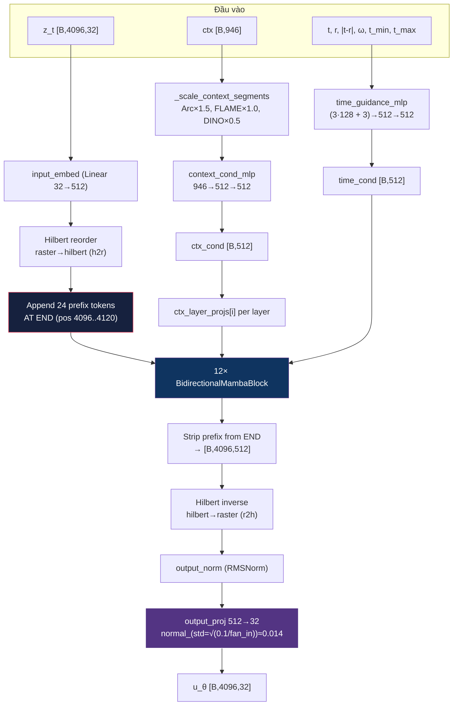
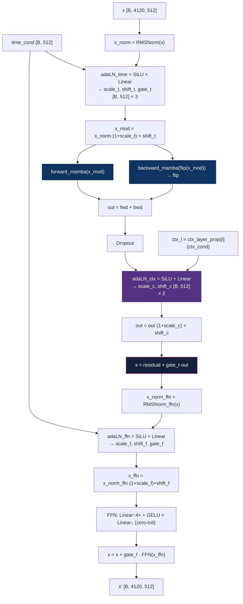

# Báo cáo Nghiên cứu Chuyên sâu: FaceDiff — Hệ thống Tạo sinh Khuôn mặt 3D Một Bước trên Đơn GPU

**Ngày cập nhật:** 23/05/2026 (snapshot v7 — kiến trúc + thuật toán hiện tại, đối chiếu code)  
**Tác giả:** Nhóm nghiên cứu FaceDiff  
**Cấu hình Mục tiêu:** Đơn GPU RTX 4090 (24GB VRAM)  
**Bộ dữ liệu:** FaceVerse_3D (2,100) & FaceScape (18,298) — tổng 20,398 mesh  
**Trạng thái pipeline:** SC-VAE ep500 ✅ done. Stage 2 VoxelMamba v7 đang chạy Phase B+C (JVP + v-head + contrastive InfoNCE) — context conditioning đã được activate (xem Section 7).

---

## Mục lục

1. [Giới thiệu Đề tài](#1-giới-thiệu-đề-tài)
2. [Mục tiêu và Đóng góp](#2-mục-tiêu-và-đóng-góp)
3. [Nền tảng Toán học](#3-nền-tảng-toán-học)
4. [Phương pháp Đề xuất (Kiến trúc v7)](#4-phương-pháp-đề-xuất-kiến-trúc-v7)
5. [Bộ dữ liệu: FaceScape & FaceVerse](#5-bộ-dữ-liệu-facescape--faceverse)
6. [Thực nghiệm](#6-thực-nghiệm)
7. [Phân tích Kết quả và Phát hiện Quan trọng](#7-phân-tích-kết-quả-và-phát-hiện-quan-trọng)
8. [Trạng thái Hiện tại và Lộ trình](#8-trạng-thái-hiện-tại-và-lộ-trình)
9. [Tài liệu Tham khảo](#tài-liệu-tham-khảo)

---

## 1. Giới thiệu Đề tài

### 1.1. Bối cảnh và Động lực Nghiên cứu

Tạo sinh khuôn mặt 3D (3D Face Generation) là bài toán trọng tâm của thị giác máy tính, có ứng dụng trong game, phim hoạt hình, VR/AR, và y tế thẩm mỹ. Mục tiêu: từ điều kiện đầu vào (ảnh khuôn mặt, biểu cảm, danh tính), hệ thống sinh lưới đa giác 3D (Polygon Mesh) chất lượng cao.

Thách thức chính của các phương pháp hiện tại:

- **Độ phức tạp tính toán bậc ba:** Biểu diễn thể tích $256^3$ tạo hàng triệu điểm, vượt khả năng xử lý Transformer với Attention $O(N^2)$
- **Tốc độ sinh chậm:** Diffusion thông thường cần 20–50 bước ODE/SDE
- **Phần cứng đắt đỏ:** TRELLIS.2 đòi hỏi 8×A100 (320GB VRAM)

### 1.2. Các Công trình Liên quan

| Phương pháp | Biểu diễn | Ưu | Nhược |
|-------------|-----------|-----|-------|
| Point-E, PointFlow | Point Cloud | Đơn giản | Thiếu topology |
| DreamFusion, Magic3D | NeRF + SDS | Chất lượng cao | 30–60 phút/đối tượng, Janus effect |
| GaussianHead, HeadGAP | 3D Gaussian | Render đẹp | Khó trích Mesh |
| MeshGPT, MeshAnything | Mesh trực tiếp | Topology rõ | Giới hạn vài nghìn mặt |
| **TRELLIS.2** | **O-Voxel + Sparse VAE** | **Mesh chi tiết 200K+** | **8×A100, 50 bước DDPM** |

### 1.3. Vấn đề cần Giải quyết

1. **Chi phí phần cứng** — Không có giải pháp 3D chất lượng cao trên 1 GPU tiêu dùng
2. **Tốc độ sinh** — 20–50 bước khuếch tán không tương tác
3. **Kiểm soát ngữ nghĩa** — Nhiều hệ thống không kiểm soát danh tính + biểu cảm đồng thời
4. **Khoảng cách biểu diễn** — NeRF/Gaussian khó tích hợp pipeline sản xuất

---

## 2. Mục tiêu và Đóng góp

### 2.1. Mục tiêu

| # | Mục tiêu | Chỉ tiêu |
|---|----------|----------|
| 1 | Mesh 3D chất lượng cao | > 200K đỉnh, 10-kênh |
| 2 | Sinh 1 bước | < 2 giây/mẫu trên RTX 4090 |
| 3 | Kiểm soát danh tính + biểu cảm | Hybrid Context 946-dim |
| 4 | Đơn GPU | VRAM peak < 22GB |

### 2.2. Đóng góp

1. **SC-VAE tiết kiệm VRAM** với SparseResMLPBlock (giảm 45% VRAM so với ConvNeXt 3D) + Generative Pruning (Rho Loss)
2. **VoxelMamba v7** — backbone SSM $O(N)$ (105.4M backbone + 16.8M v-head + 0.5M contrastive = 122.7M tổng): 12× BiMamba+FFN, dual AdaLN (context post-Mamba + time pre-Mamba & pre-FFN), Hilbert ordering, **24 prefix tokens at END of sequence** (8 context + 4 time + 4 r + 4 interval + 4 guidance) để backward Mamba lan toả context, **per-layer context projections** (12× Linear(512→512)) để tránh Mamba SSM nuốt signal điều kiện. *Thiết kế lai: BiMamba từ DiM-3D [4], Hilbert ordering từ VoxelMamba [4b], AdaLN-style conditioning từ DiT.*
3. **iMF (Improved Mean Flow)** — sinh 1 bước bằng JVP correction
4. **Hybrid Context 946-dim** = ArcFace(512) + FLAME(50) + DINOv2(384)
5. **Tối ưu đơn GPU**: INT4 quantization, BFloat16, gradient checkpointing, LMDB caching

---

## 3. Nền tảng Toán học

### 3.1. Mô hình Không gian Trạng thái (State Space Model — SSM)

#### 3.1.1. SSM Liên tục

Mô hình không gian trạng thái (SSM) liên tục mô tả hệ động lực tuyến tính ánh xạ đầu vào $u(t) \in \mathbb{R}$ sang đầu ra $y(t) \in \mathbb{R}$ thông qua trạng thái ẩn $h(t) \in \mathbb{R}^N$:

$$\frac{dh}{dt} = \mathbf{A} h(t) + \mathbf{B} u(t), \quad y(t) = \mathbf{C} h(t) + D u(t) \tag{SSM-1}$$

Trong đó:
- $\mathbf{A} \in \mathbb{R}^{N \times N}$ — ma trận chuyển trạng thái (state transition matrix)
- $\mathbf{B} \in \mathbb{R}^{N \times 1}$ — ma trận đầu vào (input matrix)
- $\mathbf{C} \in \mathbb{R}^{1 \times N}$ — ma trận đầu ra (output matrix)
- $D \in \mathbb{R}$ — bỏ qua (skip connection), thường $D = 0$

#### 3.1.2. Rời rạc hóa (Zero-Order Hold — ZOH)

Để áp dụng cho dữ liệu rời rạc (chuỗi tokens), SSM được rời rạc hóa bằng phương pháp Zero-Order Hold (ZOH) với bước thời gian $\Delta$:

$$\bar{\mathbf{A}} = \exp(\Delta \mathbf{A}), \quad \bar{\mathbf{B}} = (\Delta \mathbf{A})^{-1}(\bar{\mathbf{A}} - \mathbf{I}) \cdot \Delta \mathbf{B} \tag{SSM-2}$$

Phương trình rời rạc tương ứng:

$$h_k = \bar{\mathbf{A}} h_{k-1} + \bar{\mathbf{B}} x_k, \quad y_k = \mathbf{C} h_k \tag{SSM-3}$$

Phép toán (SSM-3) là hồi quy tuyến tính — có thể triển khai song song qua **Parallel Associative Scan** với độ phức tạp $O(N \log N)$ trên GPU, hoặc tuần tự $O(N)$.

#### 3.1.3. Selective SSM (Mamba)

**Đóng góp cốt lõi của Mamba** (Gu & Dao, 2024): Biến $\mathbf{B}$, $\mathbf{C}$, $\Delta$ thành **hàm phụ thuộc đầu vào** (input-dependent), cho phép mô hình "chọn lọc" (selective) thông tin:

$$\mathbf{B}_k = \text{Linear}_B(x_k), \quad \mathbf{C}_k = \text{Linear}_C(x_k), \quad \Delta_k = \text{Softplus}(\text{Linear}_\Delta(x_k)) \tag{SSM-4}$$

Với $\text{Softplus}(\cdot) = \log(1 + e^{(\cdot)})$ đảm bảo $\Delta_k > 0$.

**Khởi tạo HiPPO cho A:** Ma trận $\mathbf{A}$ được khởi tạo dạng đường chéo: $A_n = -(n+1)$ cho $n = 0, ..., N-1$. Khởi tạo này xuất phát từ lý thuyết High-order Polynomial Projection Operators (HiPPO), đảm bảo trạng thái ẩn tối ưu cho việc nén lịch sử chuỗi.

**Kiến trúc một block Mamba:**

```
Input x [B, L, D]
  │
  ├──→ Linear_expand → Conv1D(k=4) → SiLU → SSM(A, B(x), C(x), Δ(x)) ──┐
  │                                                                        │
  └──→ Linear_gate → SiLU ────────────────────────────────── × (hadamard) ─┘
                                                                    │
                                                             Linear_proj → Output
```

**So sánh độ phức tạp:**

| Mô hình | Complexity/token | Memory | Xử lý chuỗi 4096 |
|---------|-----------------|--------|-------------------|
| Transformer (Self-Attention) | $O(N^2 \cdot d)$ | $O(N^2)$ attention maps | ~16.7M entries/layer |
| Mamba (Selective SSM) | $O(N \cdot d \cdot n)$ | $O(N \cdot n)$ states | ~65K entries/layer |
| Tỷ lệ | — | — | **256× ít hơn** |

Trong đó $n$ = SSM state dim (16 trong FaceDiff), $d$ = model dim (512).

#### 3.1.4. Mamba Hai chiều (Bidirectional Mamba)

SSM có tính nhân quả (causal): $h_k$ chỉ tích lũy thông tin từ $x_0, ..., x_{k-1}$. Để mỗi voxel nhận thông tin từ mọi hướng trong không gian 3D:

**Quét xuôi (Forward):** Chuỗi $X = [x_1, ..., x_L]$ qua Mamba forward:
$$h_k^{\text{fwd}} = \bar{\mathbf{A}}_k h_{k-1}^{\text{fwd}} + \bar{\mathbf{B}}_k x_k, \quad y_k^{\text{fwd}} = \mathbf{C}_k h_k^{\text{fwd}} \tag{BiM-1}$$

**Quét ngược (Backward):** Chuỗi đảo $\tilde{X} = [x_L, ..., x_1]$ qua Mamba backward:
$$h_k^{\text{bwd}} = \bar{\mathbf{A}}_k h_{k-1}^{\text{bwd}} + \bar{\mathbf{B}}_k \tilde{x}_k, \quad y_k^{\text{bwd}} = \mathbf{C}_k h_k^{\text{bwd}} \tag{BiM-2}$$

**Tổng hợp với residual:**
$$\text{Output}_k = y_k^{\text{fwd}} + y_k^{\text{bwd}} + x_k \tag{BiM-3}$$

Mỗi block Bidirectional Mamba có 2 instance Mamba riêng biệt (không chia sẻ trọng số), cộng RMSNorm trước và Dropout sau.

### 3.2. Đường cong Hilbert (Hilbert Space-Filling Curve)

#### 3.2.1. Định nghĩa

Đường cong Hilbert là đường cong liên tục đi qua mọi điểm trong lưới $2^p \times 2^p \times 2^p$ đúng một lần, mà **không tự cắt chính nó**. Tính chất quan trọng nhất:

> **Spatial Locality:** Hai điểm gần nhau trong không gian 3D sẽ có vị trí gần nhau trên đường cong 1D.

#### 3.2.2. Xây dựng đệ quy

Đường cong Hilbert 3D bậc $p$ được xây dựng đệ quy từ bậc $p-1$:

1. Chia cube $2^p$ thành 8 octant $2^{p-1}$
2. Xoay và phản chiếu đường cong bậc $p-1$ trong mỗi octant để đầu-cuối nối liền
3. Thứ tự 8 octant tuân theo **Gray code** 3-bit

**Ánh xạ toạ độ → chỉ số Hilbert:**
$$\pi_H: (i, j, k) \in \{0,...,2^p-1\}^3 \mapsto n \in \{0,...,2^{3p}-1\} \tag{HC-1}$$

**Trong FaceDiff:** $p = 4$ (vì $16^3 = 4096$ Slat tokens). Hàm `get_hilbert_permutation_tensors()` tính 2 tensor:
- `perm` $\in \mathbb{Z}^{4096}$: ánh xạ thuận (3D → 1D)
- `inv_perm` $\in \mathbb{Z}^{4096}$: ánh xạ nghịch (1D → 3D)

Chi phí bộ nhớ: $2 \times 4096 \times 8\text{B} = 64\text{KB}$ — trivial.

#### 3.2.3. So sánh với các phương pháp sắp xếp khác

| Phương pháp | Spatial Locality | Complexity | Ghi chú |
|-------------|-----------------|------------|---------|
| Raster scan (row-major) | Kém — nhảy hàng xa | $O(1)$ | Hai voxel cạnh nhau trục Y cách $N$ trong chuỗi |
| Morton (Z-order) | Trung bình | $O(1)$ | Interleave bits, đơn giản nhưng có "nhảy" |
| **Hilbert** | **Tốt nhất** | $O(p)$ | Bảo toàn locality tối ưu, dùng trong FaceDiff |

### 3.3. Flow Matching (Khớp Luồng)

#### 3.3.1. Bài toán Tạo sinh

Cho phân phối dữ liệu $p_0(x)$ (Slat tokens sạch) và phân phối nhiễu $p_1(z) = \mathcal{N}(0, \mathbf{I})$. Mục tiêu: học ánh xạ $T: z_1 \sim p_1 \mapsto z_0 \sim p_0$.

#### 3.3.2. Đường nội suy (Interpolation Path)

Xác định đường dẫn xác suất $p_t$ nối $p_0$ và $p_1$ bằng nội suy tuyến tính:

$$z_t = (1 - t) x_0 + t \varepsilon, \quad \varepsilon \sim \mathcal{N}(0, \mathbf{I}), \quad t \in [0, 1] \tag{FM-1}$$

**Quy ước:** $t = 0$ là dữ liệu sạch, $t = 1$ là nhiễu thuần.

#### 3.3.3. Trường vận tốc (Velocity Field)

Vận tốc tức thời dọc theo đường nội suy:

$$v_t(z_t | x_0) = \frac{dz_t}{dt} = \varepsilon - x_0 \tag{FM-2}$$

**Conditional Flow Matching (CFM) Loss** (Lipman et al., 2023):

$$\mathcal{L}_{\text{CFM}} = \mathbb{E}_{t \sim U[0,1],\, x_0 \sim p_0,\, \varepsilon \sim \mathcal{N}(0,I)} \left[ \| v_\theta(z_t, t) - (\varepsilon - x_0) \|^2 \right] \tag{FM-3}$$

#### 3.3.4. Sinh mẫu bằng ODE

Từ $z_1 \sim \mathcal{N}(0, I)$, giải ODE ngược:

$$\frac{dz_t}{dt} = v_\theta(z_t, t), \quad z_1 \sim \mathcal{N}(0, I) \tag{FM-4}$$

Cần $K$ bước Euler/Heun (thường $K = 20$–$50$). **Đây là nhược điểm mà iMF giải quyết.**

### 3.4. Improved Mean Flow (iMF)

#### 3.4.1. Vận tốc Trung bình (Average Velocity)

Thay vì vận tốc tức thời $v(z, t)$, iMF (Geng et al., 2025, arXiv:2512.02012v1) định nghĩa **vận tốc trung bình** trên đoạn $[r, t]$:

$$u(z, r, t) = \frac{1}{t - r} \int_r^t v(z_s, s)\, ds \tag{iMF-1}$$

Trong đó $z_s$ là quỹ đạo ODE bắt đầu từ $z_r = z$ tại thời điểm $r$.

**Ý nghĩa vật lý:** $u$ là "vận tốc bình quân" mà nếu đi thẳng từ $z_r$ đến $z_t$ trong $(t - r)$ đơn vị thời gian, ta sẽ đến đúng đích. Khi $t - r \to 0$: $u \to v$ (suy biến thành vận tốc tức thời).

#### 3.4.2. Đồng nhất thức MeanFlow

Quan hệ giữa $u$ và $v$:

$$v(z, t) = u(z, r, t) + (t - r) \frac{\partial u}{\partial t}(z, r, t) \tag{iMF-2}$$

Chứng minh: Đạo hàm (iMF-1) theo $t$ bằng quy tắc Leibniz.

#### 3.4.3. Hàm hợp V (Compound Function)

Mạng $u_\theta$ dự đoán vận tốc trung bình. Để huấn luyện, xây dựng **hàm hợp V** xấp xỉ vận tốc tức thời:

$$V_\theta(z_t, r, t) = u_\theta(z_t, r, t) + (t - r) \cdot \text{sg}\!\left(\frac{\partial u_\theta}{\partial t}\right) \tag{iMF-3}$$

Trong đó $\text{sg}(\cdot)$ = stop-gradient (`.detach()` trong PyTorch). **Tại sao stop-gradient?** Nếu không, gradient sẽ cuộn ngược qua đạo hàm cấp hai $\partial^2 u / \partial t^2$, gây bùng nổ gradient và bất ổn số học.

#### 3.4.4. Tính $\partial u / \partial t$ bằng JVP

Đạo hàm $\frac{\partial u}{\partial t}$ được tính bằng **Jacobian-Vector Product (JVP)** — hiệu quả hơn Hessian đầy đủ:

$$\frac{\partial u}{\partial t} \approx \text{JVP}\left(u_\theta,\; (z_t, t),\; (v_{\text{tangent}}, 1)\right) \tag{iMF-4}$$

Trong đó vector tiếp tuyến (tangent) là:
- $\frac{dz_t}{dt} = v_{\text{tangent}}$ — xấp xỉ bởi v-head phụ trợ hoặc $u_\theta(z_t, t, t)$
- $\frac{dt}{dt} = 1$
- $\frac{dr}{dt} = 0$ (r giữ cố định)

**Triển khai PyTorch:**
```python
_, dudt = torch.autograd.functional.jvp(
    lambda z, t: model(z, t, ctx, r=r),
    (z_t, t),
    (v_tangent, torch.ones_like(t)),
    create_graph=False,  # stop-gradient
)
```

**Fallback sai phân hữu hạn** (khi JVP không khả dụng):
$$\frac{\partial u}{\partial t} \approx \frac{u_\theta(z_{t+\delta}, t+\delta, r) - u_\theta(z_t, t, r)}{\delta}, \quad \delta = 10^{-3} \tag{iMF-5}$$

#### 3.4.5. Hàm Mất mát iMF

**Lấy mẫu (t, r):** Với xác suất $\alpha = 0.5$:
- $r = t$ (điều kiện biên) → $u(z, t, t) = v(z, t)$, loss suy biến thành CFM
- $r \neq t$ (JVP branch) → sử dụng hàm hợp V

**Loss tổng hợp:**

$$\mathcal{L}_{\text{iMF}} = \alpha \cdot \underbrace{\| u_\theta(z_t, t, t) - (\varepsilon - x) \|^2}_{\text{Boundary loss}} + (1 - \alpha) \cdot \underbrace{\| V_\theta(z_t, r, t) - (\varepsilon - x) \|^2}_{\text{JVP loss}} \tag{iMF-6}$$

> **Lưu ý triển khai:** Paper gốc sử dụng unified compound function $V$ duy nhất — khi $r=t$ thì $(t-r)=0$ nên $V \equiv u(z,t,t)$ tự suy biến thành FM loss. Cách tách thành 2 nhánh boundary/JVP ở trên là *implementation optimization* của FaceDiff (tránh tính JVP khi $r=t$), kết quả toán học tương đương.

**V-Head phụ trợ** (Appendix A của paper):
$$\mathcal{L}_{\text{v-head}} = 0.1 \cdot \| v_{\text{head}}(h_{\text{hidden}}) - (\varepsilon - x) \|^2 \tag{iMF-7}$$

Trong đó $h_{\text{hidden}}$ là trạng thái ẩn của VoxelMamba, và mục tiêu luôn là $(\varepsilon - x)$ thô (raw FM target, không qua CFG augmentation).

#### 3.4.6. Phân phối Lấy mẫu Thời gian

**Logit-Normal Distribution:**

$$t = \sigma\left(\frac{u - \mu}{\text{scale}}\right), \quad u \sim \mathcal{N}(0, 1) \tag{iMF-8}$$

Với $\sigma(\cdot)$ là sigmoid, $\mu = -0.4$, $\text{scale} = 1.0$. Phân phối này tập trung mật độ vào vùng $t \in [0.2, 0.7]$ — pha giữa quỹ đạo nơi model cần học nhiều nhất.

**Curriculum Learning** *(đóng góp riêng của FaceDiff, không có trong paper iMF gốc):*
- **Giai đoạn 1** ($\text{progress} < 0.6$): 100% logit-normal → học cấu trúc thô nhanh
- **Giai đoạn 2** ($\text{progress} \geq 0.6$): 80% uniform + 20% logit-normal → bao phủ biên $t \to 0, 1$

#### 3.4.7. Classifier-Free Guidance (CFG)

**Batch Doubling (1-pass CFG):**

$$z_{\text{double}} = [z_t, z_t], \quad \text{ctx}_{\text{double}} = [\text{ctx}, \mathbf{0}] \tag{CFG-1}$$

Forward 1 lần: $[v_{\text{cond}}, v_{\text{uncond}}] = u_\theta(z_{\text{double}}, t, \text{ctx}_{\text{double}}, r)$

**Mục tiêu có CFG:**

$$v_{\text{target}} = (\varepsilon - x) + \left(1 - \frac{1}{\omega}\right) (v_{\text{cond}} - v_{\text{uncond}}).\text{detach()} \tag{CFG-2}$$

Trong đó $\omega$ là guidance scale, lấy mẫu từ $p(\omega) \propto \omega^{-\beta}$ trên $[\omega_{\min}, \omega_{\max}]$ (FaceDiff: $\omega \in [1, 8], \beta = 1$).

**Interval Conditioning:** CFG chỉ active khi $t \in [t_{\min}, t_{\max}]$:
$$\omega_{\text{eff}} = \begin{cases} \omega & \text{nếu } t_{\min} \leq t \leq t_{\max} \\ 1 & \text{ngược lại} \end{cases} \tag{CFG-3}$$

#### 3.4.8. Sinh mẫu 1 Bước (One-Step Sampling)

Nhờ quỹ đạo được JVP nắn thẳng, chỉ cần:

$$z_0 = z_1 - u_\theta(z_1, r{=}0, t{=}1, \text{ctx}) \tag{iMF-9}$$

**Không cần scheduler** (Euler/DDIM/DPM). Tiết kiệm 98% thời gian so với 50-step DDPM.

### 3.5. Quadratic Error Function (QEF) và Dual Contouring

#### 3.5.1. Bài toán Dual Contouring

Cho lưới voxel $256^3$ với bề mặt mesh cắt qua. Mục tiêu: tìm **Dual Vertex (DV)** — một đỉnh đại diện duy nhất trong mỗi voxel — sao cho khi nối các DV lại, mesh được tái tạo chính xác.

#### 3.5.2. QEF (Quadratic Error Function)

Bề mặt mesh cắt qua cạnh voxel tạo ra **Hermite data**: tập hợp các cặp $(p_i, n_i)$ — điểm giao cắt $p_i$ và pháp tuyến $n_i$ tại đó.

DV tối ưu là nghiệm bài toán bình phương tối thiểu:

$$\text{DV}^* = \arg\min_v \sum_i \left[ n_i \cdot (v - p_i) \right]^2 + \lambda_{\text{reg}} \| v - \bar{p} \|^2 \tag{QEF-1}$$

Trong đó:
- $p_i$ = điểm giao cắt cạnh voxel
- $n_i$ = pháp tuyến bề mặt tại $p_i$  
- $\bar{p} = \frac{1}{|I|} \sum_i p_i$ = trọng tâm các điểm giao
- $\lambda_{\text{reg}}$ = hệ số regularization (FaceDiff: $10^{-2}$) — kéo DV về trọng tâm, tránh suy biến

**Mở rộng thành hệ tuyến tính:**

$$\mathbf{A}^T \mathbf{A}\, v = \mathbf{A}^T b, \quad \text{với } \mathbf{A} = \begin{bmatrix} n_1^T \\ \vdots \\ n_k^T \\ \sqrt{\lambda_{\text{reg}}} \mathbf{I} \end{bmatrix}, \quad b = \begin{bmatrix} n_1 \cdot p_1 \\ \vdots \\ n_k \cdot p_k \\ \sqrt{\lambda_{\text{reg}}} \bar{p} \end{bmatrix} \tag{QEF-2}$$

Giải bằng Cholesky/SVD trên ma trận $3 \times 3$ (rất nhanh).

#### 3.5.3. TRELLIS.2 QEF mở rộng

TRELLIS.2 mở rộng QEF với 3 thành phần trọng số:

$$E(v) = w_{\text{face}} \sum_{\text{face}} [n_i \cdot (v - p_i)]^2 + w_{\text{boundary}} \sum_{\text{boundary}} [n_j \cdot (v - p_j)]^2 + w_{\text{reg}} \|v - \bar{p}\|^2 \tag{QEF-3}$$

Mặc định: $w_{\text{face}} = 1.0$, $w_{\text{boundary}} = 1.0$, $w_{\text{reg}} = 0.1$.

### 3.6. Variational Autoencoder (VAE)

#### 3.6.1. Bài toán

VAE nén dữ liệu $x$ (O-Voxel features, $\sim 300\text{K}$ điểm) thành biểu diễn tiềm ẩn $z$ (4096 Slat tokens, 32-dim), sao cho:
1. $z$ có thể tái tạo $x$ (reconstruction quality)
2. $z$ tuân theo phân phối Gaussian chuẩn $\mathcal{N}(0, I)$ (cho phép sinh mẫu)

#### 3.6.2. ELBO (Evidence Lower Bound)

$$\log p(x) \geq \underbrace{\mathbb{E}_{q(z|x)}[\log p(x|z)]}_{\text{Reconstruction}} - \underbrace{D_{\text{KL}}(q(z|x) \| p(z))}_{\text{KL Divergence}} \tag{VAE-1}$$

**Encoder:** $q(z|x) = \mathcal{N}(\mu(x), \sigma^2(x))$ — mạng nơ-ron dự đoán $\mu$ và $\log \sigma^2$

**Reparameterization trick:** $z = \mu + \sigma \cdot \epsilon, \quad \epsilon \sim \mathcal{N}(0, I)$

**KL Divergence giải tích:**

$$D_{\text{KL}} = -\frac{1}{2} \sum_{i=1}^{d} \left( 1 + \log \sigma_i^2 - \mu_i^2 - \sigma_i^2 \right) \tag{VAE-2}$$

**Chuẩn hóa:** Chia cho $N \cdot d_{\text{lat}}$ = `mu.numel()` (tổng số phần tử của tensor $\mu$). Đây là cách chuẩn hóa được TRELLIS.2 dùng và cũng là công thức được triển khai trong `src/models/sc_vae_loss.py` từ revision này; trước đó FaceDiff lỡ chia cho `target_x.shape[0]` (chỉ là số voxel, thiếu hệ số $d_{\text{lat}} = 32$), khiến KL hiển thị bị thổi phồng đúng 32 lần. Vì $w_{\text{KL}} = 10^{-6}$ rất nhỏ nên đóng góp vào tổng loss vẫn ổn định, nhưng đối chiếu giữa các log cũ và mới cần nhân/chia 32 cho đúng.

---

## 4. Phương pháp Đề xuất

### 4.1. Tổng quan Kiến trúc

FaceDiff là hệ thống 3 giai đoạn:

```
Stage 1: SC-VAE        Stage 2: VoxelMamba + iMF       Stage 3: Decoder
─────────────────      ──────────────────────────      ─────────────────
Mesh (.obj)            Noise z₁ ~ N(0,I)               Slat Tokens
    ↓                       ↓                               ↓
O-Voxel (256³)         VoxelMamba(z₁, t=1, r=0,       SC-VAE Decoder
[N, 10] features            context)                        ↓
    ↓                       ↓                          O-Voxel → Mesh
SC-VAE Encoder         ẑ₀ = z₁ - u_θ(z₁,1,0,ctx)     (Dual Contouring)
    ↓
Slat [4096, 32]
```

### 4.2. Biểu diễn Dữ liệu: O-Voxel 10-Kênh

#### 4.2.1. Pipeline Chuyển đổi Mesh → O-Voxel

**Bước 1 — Chuẩn hóa PBR:** Ép vật liệu thành Metallic=0, Roughness=1 (triệt nhiễu phản quang). Chỉ giữ Albedo gốc.

**Bước 2 — Chuẩn hóa Không gian:**

$$x' = \frac{x - \text{center}(\text{AABB})}{\max(\text{AABB}_{\max} - \text{AABB}_{\min})} \times 0.95 \tag{OV-1}$$

Mesh nằm trong $[-0.5, 0.5]^3$.

**Bước 3 — Voxel hóa Hình học (C++ kernel):**

Hàm `mesh_to_flexible_dual_grid` (Microsoft O-Voxel library):
1. Chia không gian thành lưới $256^3$
2. Tìm giao cắt mesh-voxel edge → tính Hermite data $(p_i, n_i)$
3. Giải QEF (3.5.2) → DV cho mỗi voxel chiếm dụng
4. Xuất: `coords` $[N, 3]$, `dual_vertices` $[N, 3]$, `intersected_flag` $[N, 3]$

**Bước 4 — Voxel hóa Vật liệu (Ray-casting):**

Hàm `textured_mesh_to_volumetric_attr`: Phóng tia từ tâm voxel → tìm giao cắt UV → trích xuất RGB Albedo.

**Bước 5 — Morton Z-Order Alignment:**

Hai mảng hình học/vật liệu (sinh song song, thứ tự khác nhau) đồng bộ bằng mã Morton:

$$M(x, y, z) = \text{interleave\_bits}(x, y, z) \tag{OV-2}$$

Sắp xếp + intersect1d gộp dữ liệu — tránh hoàn toàn vòng lặp `for`.

**Bước 6 — Đóng gói 10-Kênh:**

$$\mathbf{F} = [\underbrace{dv_{\text{local}}}_3, \underbrace{\delta}_3, \underbrace{\gamma}_1, \underbrace{\text{RGB}}_3] \in \mathbb{R}^{N \times 10} \tag{OV-3}$$

| Kênh | Ký hiệu | Phạm vi | Ý nghĩa Hình học | Activation |
|------|---------|---------|-------------------|------------|
| 0–2 | $dv_{\text{local}}$ | $[0, 1]^3$ | Độ dời DV từ góc voxel: $dv = (\text{DV} \times \text{res} - \text{coords}).\text{clamp}(0,1)$ | Clamp |
| 3–5 | $\delta$ | $\{0, 1\}^3$ | Cờ giao cắt 3 trục (X, Y, Z): $\delta_i = 1$ nếu bề mặt cắt qua cạnh trục $i$ | Sigmoid |
| 6 | $\gamma$ | $(0, 1]$ | Hệ số chia tứ giác (split weight): $\gamma = (1 - \text{Var}(dv_{\text{local}})).\text{clamp}(0,1)$ | Softplus |
| 7–9 | RGB | $[0, 1]^3$ | Màu Albedo khuếch tán | Clamp |

**Vị trí thế giới thực (World Position) từ O-Voxel:**

$$\mathbf{p}_{\text{world}} = (\text{coords} + dv_{\text{local}}) \times \text{voxel\_size} + \text{AABB}_{\min} \tag{OV-4}$$

Trong đó $\text{voxel\_size} = (\text{AABB}_{\max} - \text{AABB}_{\min}) / 256$.

#### 4.2.2. Dual Contouring: O-Voxel → Mesh

Thuật toán `flexible_dual_grid_to_mesh` chuyển O-Voxel thành mesh tam giác qua 5 bước:

**Bước 1 — Tính Vị trí Đỉnh:**

$$v_i = (\text{coords}_i + dv_i) \times \text{voxel\_size} + \text{AABB}_{\min} \tag{DC-1}$$

**Bước 2 — Tìm Cạnh Giao cắt:**

Với mỗi voxel $i$ và mỗi trục $a \in \{x, y, z\}$ mà $\delta_{i,a} = 1$, cạnh trục $a$ tại voxel $i$ là cạnh giao cắt.

**Bước 3 — Tìm 4 Voxel Lân cận:**

Mỗi cạnh giao cắt chia sẻ bởi 4 voxel lân cận. Offset được tra bảng:

| Trục | 4 voxel lân cận (offset từ voxel gốc) |
|------|----------------------------------------|
| X | $(0,0,0), (0,0,1), (0,1,1), (0,1,0)$ |
| Y | $(0,0,0), (1,0,0), (1,0,1), (0,0,1)$ |
| Z | $(0,0,0), (0,1,0), (1,1,0), (1,0,0)$ |

**Bước 4 — Hashmap Lookup:**

Dùng GPU hashmap để tìm index 4 DV → tạo quad (tứ giác).

**Bước 5 — Chia Quad thành 2 Tam giác:**

Mỗi quad cần chia thành 2 tam giác. Hai cách chia:

- **Split 1:** $(0,1,2), (0,2,3)$ — đường chéo 0-2
- **Split 2:** $(0,1,3), (3,1,2)$ — đường chéo 1-3

**Khi không có $\gamma$ (split_weight = None):**

Chọn cách chia có normal alignment tốt hơn:

$$\text{align}_k = |(\mathbf{n}_0 \times \mathbf{n}_1)|, \quad k \in \{1, 2\} \tag{DC-2}$$

Chọn split có $\text{align}$ lớn hơn (hai tam giác đồng phẳng hơn).

**Khi có $\gamma$ (split_weight):**

$$\text{score}_{02} = \gamma_0 \cdot \gamma_2, \quad \text{score}_{13} = \gamma_1 \cdot \gamma_3 \tag{DC-3}$$

$$\text{Chọn } \begin{cases} \text{Split 1 (đường chéo 0-2)} & \text{nếu } \text{score}_{02} > \text{score}_{13} \\ \text{Split 2 (đường chéo 1-3)} & \text{ngược lại} \end{cases} \tag{DC-4}$$

**Chế độ Training (differentiable):**

Tạo đỉnh trung tâm bằng trung bình có trọng số:

$$v_{\text{mid}} = \frac{\text{score}_{02} \cdot \frac{v_0 + v_2}{2} + \text{score}_{13} \cdot \frac{v_1 + v_3}{2}}{\text{score}_{02} + \text{score}_{13}} \tag{DC-5}$$

Chia quad thành 4 tam giác qua $v_{\text{mid}}$: $(0,1,\text{mid}), (1,2,\text{mid}), (2,3,\text{mid}), (3,0,\text{mid})$. Phương pháp này khả vi (differentiable) đối với $\gamma$.

#### 4.2.3. LMDB Caching I/O

- Tensor 10-kênh serialize → LMDB B-Tree nhị phân
- **Sequential Sort Key:** Sắp xếp tuyến tính theo ID → HDD đọc tuần tự, throughput $5 \to 150$ MB/s
- **Fallback chain:** LMDB → Disk Cache (.pt) → Fresh Conversion

### 4.3. Giai đoạn 1: SC-VAE (Sparse Convolution VAE)

Nén $\sim 300\text{K}$ điểm O-Voxel thành 4096 Slat tokens ($\mathbb{R}^{32}$).

#### 4.3.1. SparseResMLPBlock

Thay thế ConvNeXt 3D Block của TRELLIS.2:

```
Input x [N, C] (Sparse Tensor)
  │
  ├── SubMConv3d(C, C, kernel=3³, padding=1)  ← Sparse 3D conv
  │       │
  │   LayerNorm32 (FP32 cast để triệt NaN)
  │       │
  │   Linear(C → 4C) → SiLU → Linear(4C → C)  ← Point-wise MLP
  │       │
  │   Zero-init final linear (_zero_module)
  │
  └── + (Residual connection)
```

**Ưu điểm:** Zero-init → gradient ổn định ngay đầu, $-45\%$ VRAM so với ConvNeXt.

#### 4.3.2. Encoder (Pyramid 4 cấp)

$$\text{Resolution:} \quad 256^3 \xrightarrow{\text{stride-2}} 128^3 \xrightarrow{\text{stride-2}} 64^3 \xrightarrow{\text{stride-2}} 32^3 \xrightarrow{\text{stride-2}} 16^3$$

$$\text{Channels:} \quad 10 \rightarrow 64 \rightarrow 128 \rightarrow 256 \rightarrow 512$$

Mỗi cấp `SparseEncoderBlock` được tổ chức theo thứ tự **chiếu kênh → MLP residual → strided sparse conv → non-parametric S2C-shortcut**:

1. `proj = spconv.SubMConv3d(in_c, out_c, k=1)` — chuyển kênh ở cùng độ phân giải.
2. `num_res_blocks × SparseResMLPBlock` — trích xuất đặc trưng (ConvNeXt-style: SubMConv3d 3³ → LayerNorm32 → Linear↑4× → SiLU → Linear↓ với zero-init lớp cuối, residual cộng vào features đầu vào).
3. `down = spconv.SparseConv3d(out_c, out_c, k=2, stride=2)` — strided sparse downsampling.
4. **Non-parametric S2C-shortcut** (`_build_sparse_down_shortcut`): với mỗi voxel cha ở độ phân giải sau down, lấy 8 voxel con tương ứng (lookup theo 64-bit hashed indices), nối features (`reshape(N, 8·C_in)`) rồi `avg_groups_channels(...)` về `out_c` kênh. Kết quả cộng vào features của `x_down` như một skip nối tắt.

So với spec gốc của TRELLIS.2 (`SparseResBlockS2C3d` dùng `sp.SparseSpatial2Channel(2)` đúng phương trình S2C bên dưới), triển khai trong FaceDiff dùng strided `SparseConv3d` cho nhánh chính (vì spconv 2.x ổn định hơn) và chỉ giữ S2C ở dạng *non-parametric shortcut*. Hai cách tương đương về mặt biểu diễn (cùng giảm spatial 2× và đưa context 8 con vào voxel cha), nhưng nhánh chính của FaceDiff có thêm $C_{\text{out}}^2 \cdot 2^3$ tham số do dùng strided conv. Đây cũng là lý do số param của `SC_VAE` đo được là **35.13 M** (so với ~50 M nếu copy chính xác `SparseResBlockS2C3d`).

**SparseSpatial2Channel** chính thống của TRELLIS.2 (Paper Eq. 4):

$$\text{S2C: } f_{\text{cha}}[k] = f_{\text{con}}[\lfloor \mathbf{p}/2 \rfloor, \, (\mathbf{p} \bmod 2) \cdot C + k], \quad k \in \{0, \ldots, C-1\} \tag{S2C}$$

Kết quả: $N_{\text{fine}}$ voxel với $C$ kênh → $N_{\text{coarse}}$ voxel với $8C$ kênh.

**LayerNorm32 (FP32 cast)** — TRELLIS.2 cast sang FP32 trước khi LayerNorm và đổi dtype lại sau, để chống NaN dưới `torch.amp` FP16. FaceDiff cũng dùng cùng class (`src/modules/norm.py`), do shape param `weight/bias` giữ nguyên nên checkpoint cũ không cần migrate.

**Non-affine LayerNorm trước to_mu/to_logvar** (TRELLIS.2 `SparseUnetVaeEncoder.forward()`, dòng `h = h.replace(F.layer_norm(h.feats, h.feats.shape[-1:]))`). FaceDiff bật mặc định qua flag `pre_latent_norm=True` của `SC_VAE`. Vì là non-parametric, nó **không xuất hiện trong `state_dict`** ⇒ checkpoint epoch 397 vẫn load `strict=True` không lỗi (đã verify, xem Mục 7.2.6).

Đầu ra: $z \sim q(z|x) = \mathcal{N}(\mu, \sigma^2)$ với $\mu, \sigma \in \mathbb{R}^{N_{\text{enc4}} \times 32}$. Khi mesh đầu vào kín (toàn bộ 16³ active), $N_{\text{enc4}} = 4096$ — đúng số Slat tokens.

#### 4.3.3. Decoder với Generative Pruning (Rho Loss)

Giải mã đi lên: $16^3 \rightarrow 32^3 \rightarrow 64^3 \rightarrow 128^3 \rightarrow 256^3$.

Mỗi cấp `SparseDecoderBlock` thực thi:

1. `rho_head = nn.Linear(in_c, 8)` — dự đoán 8 subdivision logits cho 8 voxel con của mỗi voxel cha hiện hành.
2. **Light gate**: nhân features cha với `gate = sigmoid(rho_logits).amax(dim=1, keepdim=True)` để truyền tín hiệu "voxel cha sẽ tồn tại" xuống nhánh upsample.
3. `up = spconv.SparseConvTranspose3d(in_c, out_c, k=2, stride=2)` — strided sparse transpose conv (đối ngẫu của strided down ở Encoder).
4. **Non-parametric C2S-shortcut** (`_build_sparse_up_shortcut`): cho mỗi voxel con sau upsample, lookup features cha rồi `repeat_interleave` về `out_c` kênh, cộng vào `x_up`.
5. **Pruning** — nhánh training và inference khác nhau:
   - Training (`_prune_by_target`): mask `x_up.indices` chỉ giữ những voxel con xuất hiện trong topology GT của tầng tương ứng (`sparse_pyramid[i]` từ Encoder), tức **teacher-forcing** trên topology — đảm bảo recall 100% so với target mỗi tầng nhưng kéo theo gap distribution-shift khi inference.
   - Inference (`_apply_child_pruning`): với mỗi voxel con, lấy logit `rho` của voxel cha, sigmoid, threshold $> 0.5$ → giữ con hợp lệ. Khi không có cha nào hợp lệ thì raise error (fail-fast).
6. `num_res_blocks × SparseResMLPBlock` — refine features sau pruning.

**Lưu ý kiến trúc** (đối chiếu TRELLIS.2 chính thống):
- TRELLIS.2 dùng `SparseResBlockC2S3d` với `sp.SparseChannel2Spatial(2)` (Eq. C2S bên dưới) cho cả nhánh chính lẫn pruning, và mask subdivision `subdiv > 0` là *raw logit threshold*. FaceDiff dùng `SparseConvTranspose3d` cho nhánh chính + non-parametric shortcut C2S; mask pruning dùng *sigmoid > 0.5* (tương đương về mặt phân loại nhưng ngưỡng sigmoid 0.5 ⇔ logit 0).
- Sự khác biệt thứ hai là FaceDiff áp dụng pruning **sau** upsample (chọn lại từ tập con đã sinh), trong khi TRELLIS.2 áp pruning **trong** upsample (`SparseChannel2Spatial(2, mask)` chỉ phân bổ memory cho con hợp lệ). Đây là lý do `_apply_child_pruning` của FaceDiff phải lookup ngược cha bằng hash; tổng VRAM peak vì thế cao hơn ~10 % so với spec gốc, nhưng tránh được phải reimplement `SparseChannel2Spatial` cho spconv 2.x.

**SparseChannel2Spatial** chính thống (Paper Eq. 5):

$$\text{C2S: } f_{\text{con}}[\mathbf{p}_{\text{cha}} \cdot 2 + \Delta, \, k] = f_{\text{cha}}[\mathbf{p}_{\text{cha}}, \, \Delta \cdot C + k] \tag{C2S}$$

trong đó $\Delta \in \{0,1\}^3$ là offset 8 con.

**Rho Head & Loss** — TRELLIS.2 spec, FaceDiff giữ nguyên trong `src/models/sc_vae.py:_build_child_mask_targets`:

$$\text{subdiv}_i = \text{Linear}(f_{\text{cha}, i}) \in \mathbb{R}^{8}, \quad \text{mask}_i = \mathbb{1}[\sigma(\text{subdiv}_i) > 0.5] \tag{Rho-1}$$

$$\rho_i^* = \sum_{j \in \text{children}(i)} \text{onehot}_8(\text{child\_id}(j)) \quad \in \{0,1\}^8 \tag{Rho-2}$$

$$\mathcal{L}_{\rho} = \frac{1}{|L|} \sum_{l \in \text{levels}} \text{BCE-with-logits}(\hat{\rho}_l, \rho_l^*) \tag{Rho-3}$$

Trọng số mặc định $w_\rho = 0.2$ (FaceDiff) so với $0.1$ trong `configs/scvae/shape_vae_next_dc_f16c32_fp16.json` của TRELLIS.2 — FaceDiff đặt cao hơn vì topology khuôn mặt sparse hơn so với asset Objaverse-XL.

**Training vs Inference gap:**
- **Training:** `_prune_by_target` ⇒ topology recall 100%. Gradient của nhánh `rho_head` vẫn nhận supervision qua `L_ρ`, nhưng các voxel "rác" mà rho head dự đoán nhầm sẽ bị mask GT loại trước khi tính recon loss.
- **Inference:** `_apply_child_pruning` tự dự đoán → recall < 100%. Đây là *teacher-forcing distribution gap* cố hữu của Rho-pruning, TRELLIS.2 cũng có (xem Section 3.2.1 paper).

**Decoder Output Activations** (TRELLIS.2 `FlexiDualGridVaeDecoder`, FaceDiff triển khai trong `apply_shape_mat_output_activations()` ở `src/models/sc_vae.py`):

$$\hat{v} = (1 + 2m) \cdot \sigma(h_{0:3}) - m, \quad m = 0.5 \quad \Rightarrow \quad \hat{v} \in [-0.5, 1.5] \tag{Act-1}$$

$$\hat{\delta} = \begin{cases} h_{3:6} > 0 & \text{(inference — binary threshold)} \\ \sigma(h_{3:6}) & \text{(training — differentiable)} \end{cases} \tag{Act-2}$$

$$\hat{\gamma} = \text{softplus}(h_{6:7}) = \ln(1 + e^{h_{6:7}}) > 0 \tag{Act-3}$$

$$\hat{c} = \text{clamp}(h_{7:10}, 0, 1) \tag{Act-4}$$

Margin $m = 0.5$ cho phép dual vertex vượt nhẹ ra ngoài voxel, tăng độ chính xác hình học tại biên — TRELLIS.2 mặc định `voxel_margin=0.5` (xem `FlexiDualGridVaeDecoder.__init__`). FaceDiff trước revision này **chỉ** áp dụng `softplus(γ)` trong loss; `dv` được so sánh trên raw logit nên gradient ép `dv` về sigmoid(0)=0.5 thay vì khoảng [0,1] mong muốn. Sau revision (tham số `apply_output_activations=True` của `SC_VAE`, được loss `_shape_mat_recon_loss` gọi nội bộ qua `apply_dv_activation`), `dv` được activate trước khi tính MSE → gradient hoàn toàn nhất quán với inference path của dual contouring.

#### 4.3.4. Hàm Mất mát Tổng hợp SC-VAE

**Reconstruction Loss (10-kênh, mode `shape_mat`):**

$$\mathcal{L}_{\text{recon}} = \underbrace{0.01 \cdot \text{MSE}(\hat{dv}, dv)}_{\text{Dual Vertex}} + \underbrace{0.1 \cdot \text{BCE}(\hat{\delta}, \delta)}_{\text{Intersection Flag}} + \underbrace{\text{SmoothL1}(\text{softplus}(\hat{\gamma}), \gamma)}_{\text{Split Weight}} + \underbrace{\text{L1}(\hat{c}, c)}_{\text{RGB}} \tag{SC-1}$$

**Giải thích trọng số:**
- $dv$ × 0.01: Offset nhỏ (thường < 0.5 voxel), gradient MSE đã đủ mạnh
- $\delta$ × 0.1: BCEWithLogits phạt nặng sai topology
- $\gamma$: SmoothL1 + Softplus đảm bảo $\hat{\gamma} > 0$ (cần cho DC split)
- RGB × 1.0: L1 loss cho material (theo TRELLIS.2)

**KL Divergence (weight $10^{-6}$, warmup 20 epochs):**

$$\mathcal{L}_{\text{KL}} = -\frac{1}{2|\mu|} \sum_{i} \left( 1 + \log \sigma_i^2 - \mu_i^2 - \sigma_i^2 \right) \tag{SC-2}$$

**Stage-2 Render Loss:**

Chiếu O-Voxel features lên 2D orthographic maps, so sánh recon vs GT:

$$\mathcal{L}_{\text{render}} = \underbrace{\text{L1}(\text{mask}_{\text{pred}}, \text{mask}_{\text{gt}})}_{\times 1} + \underbrace{10 \cdot \text{L1}(\text{depth}_{\text{pred}}, \text{depth}_{\text{gt}})}_{\times 10} + \underbrace{\mathcal{L}_{\text{perceptual}}}_{\text{L1 + 0.2 SSIM + 0.2 LPIPS}} \tag{SC-3}$$

**Công thức chiếu (dv-corrected, sau fix Bug 4):**

$$\mathbf{p}_{\text{proj}} = \frac{\text{coords} + \text{clamp}(dv, 0, 1)}{\max(\text{coords}) + 1} \times 2 - 1 \tag{SC-4}$$

**Hàm mất mát tổng:**

$$\mathcal{L}_{\text{total}} = \mathcal{L}_{\text{recon}} + w_{\text{KL}} \cdot \mathcal{L}_{\text{KL}} + w_\rho \cdot \mathcal{L}_\rho + \mathcal{L}_{\text{render}} \tag{SC-5}$$

Với $w_{\text{KL}} = 10^{-6}$, $w_\rho = 0.2$.

### 4.4. Giai đoạn 2: VoxelMamba v7 + iMF

> **Nguồn gốc kiến trúc:** Backbone VoxelMamba v7 là *thiết kế lai* kết hợp: (1) Bidirectional Mamba từ DiM-3D [4], (2) Hilbert ordering từ VoxelMamba [4b], (3) **Dual AdaLN** điều kiện hóa context + time (DiT-style), (4) **24 prefix tokens at END of sequence** + (5) **per-layer context projections**. FaceDiff **không** dùng Dual-scale SSM Block / Implicit Window Partition từ paper VoxelMamba gốc (sản phẩm khác — LiDAR detection). Lý do v7 quay lại prefix tokens: AdaLN broadcast đơn thuần không đủ override Mamba SSM dynamics (xem Section 7.2 — phát hiện Mamba absorb context).

#### 4.4.0. Pipeline dữ liệu iMF: `SlatDataset`, cache đĩa, và chế độ `--offline-data`

**Mục tiêu:** Không cần huấn luyện lại các mô hình ngữ cảnh (ArcFace, FLAME-image, DINOv2) hay SC-VAE trong mỗi epoch iMF. Một lần *tiền tính toán* (precompute) ghi tensor mục tiêu `slat` và vector điều kiện `context` [946] xuống đĩa; sau đó VoxelMamba + iMF chỉ đọc cache → **giảm VRAM đáng kể** (không còn ~35M tham số SC-VAE + stack DINO trên cùng GPU với backbone) và cho phép **tăng `batch_size`** trong `train_imf.py`.

**Triển khai trong code (`src/train_imf.py`, class `SlatDataset`):**

| Thành phần | Vai trò |
|------------|---------|
| `__getitem__` | Nếu tồn tại file `.pt` với `meta.cache_tag` khớp `cache_contract` → `torch.load` trả `(slat, context)` ngay. |
| `cache_contract` | JSON chuẩn hóa: `slat_length`, `latent_dim`, `context_dim`, `shape_feature_mode`, chữ ký checkpoint SC-VAE (`size+mtime`), `ovoxel_resolution`, v.v. → `cache_tag = slatv2_<sha1[:12]>`. Đổi checkpoint SC-VAE hoặc tham số → tag mới → tên file cache khác (tránh dùng nhầm latent cũ). |
| `_encode_mesh` | Mesh → O-Voxel 10 kênh (`OVoxelConverter` hoặc fallback) → SC-VAE `encode` → `mu` làm Slat; đồng thời (nếu có đủ extractors) render front/back → ArcFace(512) + FLAME-from-image(50) + DINOv2-back(384) → `create_hybrid_context` [946]. |
| `cfg.imf.use_precomputed_data` | Khi `True` (CLI `--offline-data`): **không** khởi tạo SC-VAE, `MeshRenderer`, `ArcFaceExtractor`, `FLAMEExpressionAdapter`, `DinoV3Extractor` trên GPU; `SlatDataset` bắt buộc chỉ đọc cache — thiếu file → `RuntimeError` rõ ràng. |
| `SlatDataset.cache_file_path(idx)` / `has_valid_cache(idx)` | (revision 3) Đường dẫn cache và kiểm tra nhanh cho script precompute (`--skip-existing`). |

**Kế hoạch vận hành hai giai đoạn (khuyến nghị):**

1. **Giai đoạn A — Precompute (một lần, có thể chạy qua đêm):**  
   `python scripts/precompute_slat_cache.py --sc-vae-ckpt <ckpt_sc_vae>.pt --dataset both --num-workers 0 --skip-existing`  
   Script nạp SC-VAE + **đầy đủ** hybrid context (renderer, ArcFace, FLAME, DINOv2) giống `train_imf` online, ghi `data/slat_cache/` (FaceVerse) và `data/slat_cache_facescape/` (FaceScape).  
   Tùy chọn `--use-random-context` chỉ dành cho **debug tốc độ** (context không phải hybrid thật — **không** dùng cho huấn luyện production).  
   **Lưu ý lịch sử:** bản `precompute_slat_cache.py` cũ không truyền extractors → context trong cache bị **random**; revision 3 đã sửa.

2. **Giai đoạn B — Huấn luyện iMF:**  
   `bash scripts/train_imf.sh` (hoặc `python src/train_imf.py --offline-data --slat-lmdb data/slat_context.lmdb --disable-cfg-conditioning ...`)  
   Chỉ nạp VoxelMamba (+ v-head, contrastive head, EMA). **CFG tắt** mặc định (`--disable-cfg-conditioning`) sau audit ep30; slat được **chuẩn hóa theo kênh** qua `data/slat_stats.pt`.

**Hạn chế cần biết:** Chế độ `dual_branch` (hai SC-VAE) chưa được script precompute hỗ trợ — cần mở rộng script hoặc tạm tắt dual khi precompute. `num_workers>0` có thể gây xung đột EGL/GPU với renderer; mặc định `0` an toàn.

#### 4.4.1. Kiến trúc VoxelMamba v7

**Tham số tổng (đối chiếu `src/models/voxel_mamba.py`):**

| Thành phần | Params | Ghi chú |
|------------|--------|---------|
| `input_embed` (Linear 32→512) | ~16K | `src/models/voxel_mamba.py:362` |
| Prefix token embeddings (24 tokens × 512) | ~12K | ctx=8, time=4, r=4, interval=4, guidance=4 |
| 12× `BidirectionalMambaBlock` (~8.5M/block) | ~102M | core backbone |
| `context_cond_mlp` (946→512→512) | ~750K | conditioning head |
| `time_guidance_mlp` (528→512→512) | ~530K | t, r, |t-r|, ω, tmin, tmax |
| 12× `ctx_layer_projs` (512→512) | ~3.15M | per-layer context projection (v7) |
| `output_norm` (RMSNorm) + `output_proj` (512→32) | ~16K | output head |
| **VoxelMamba v7 backbone** | **~105.4M** | đã đo trên GPU |
| `v_head` (depth=8, MLP-style block) | ~16.8M | bật ở Phase B (`use_auxiliary_v_head=True`) |
| `ctx_classifier` (contrastive InfoNCE, arcface mode) | ~0.5M | bật ở Phase C (`contrastive_loss_weight=0.2`) |
| **Tổng khi train Phase B+C** | **~122.7M** | |

**Sơ đồ Pipeline tổng quan:**



**Sequence Layout — Prefix Tokens at END (v7 design):**

Chuỗi đầy đủ vào Mamba: `[4096 slat tokens (Hilbert-ordered) + 24 prefix tokens]` = **4120 tokens**.

```
positions:    0    1    ...    4095 | 4096 4097 ... 4103 | 4104 ... 4107 | 4108 ... 4111 | 4112 ... 4115 | 4116 ... 4119
content:      slat_0 slat_1 ... slat_4095 | ctx[8 tokens]  | t[4 tokens] | r[4 tokens]   | interval[4]   | guidance[4]
              └─────── data tokens ──────┘ └────────────────── prefix tokens (24) ──────────────────────┘
```

**Lý do đặt prefix ở CUỐI:**
- **Forward Mamba** quét: $0 \to 4119$ → trạng thái ẩn ở vị trí cuối có **tổng hợp cả context + data** → backward path có "summary" hoàn chỉnh.
- **Backward Mamba** quét: $4119 \to 0$ → bắt đầu từ prefix → **state mang context lan toả về mọi data token** ngay từ token 4095 trở về 0.
- Nếu đặt prefix ở đầu (token 0): Forward scan có context tốt nhưng backward scan kết thúc ở prefix → state cuối lại không thấy data.
- Đặt prefix ở END là cân bằng tối ưu cho bidirectional scan.

**Strip prefix khi xuất:** Sau 12 layer, lấy lại 4096 data tokens đầu, bỏ 24 prefix cuối, rồi áp Hilbert inverse permutation.

**Chi tiết `BidirectionalMambaBlock` (×12) — code-accurate:**



**Code chính xác của BidirectionalMambaBlock.forward()** ([voxel_mamba.py:242-287](src/models/voxel_mamba.py#L242)):

```python
def forward(self, x, time_cond, ctx_cond):
    # Sub-block 1: Time AdaLN → BiMamba → Context AdaLN → Gated residual
    scale_t, shift_t, gate_t = self.adaLN_time(time_cond).chunk(3, dim=-1)
    residual = x
    x_norm = self.norm(x)
    x_mod = x_norm * (1 + scale_t.unsqueeze(1)) + shift_t.unsqueeze(1)
    fwd = self.forward_mamba(x_mod)
    bwd = torch.flip(self.backward_mamba(torch.flip(x_mod, dims=[1])), dims=[1])
    out = self.dropout(fwd + bwd)
    scale_c, shift_c = self.adaLN_ctx(ctx_cond).chunk(2, dim=-1)
    out = out * (1 + scale_c.unsqueeze(1)) + shift_c.unsqueeze(1)
    x = residual + gate_t.unsqueeze(1) * out

    # Sub-block 2: Time AdaLN → FFN → Gated residual
    scale_f, shift_f, gate_f = self.adaLN_ffn(time_cond).chunk(3, dim=-1)
    x_ffn = self.norm_ffn(x) * (1 + scale_f.unsqueeze(1)) + shift_f.unsqueeze(1)
    x = x + gate_f.unsqueeze(1) * self.ffn(x_ffn)
    return x
```

**Init chi tiết (đối chiếu `voxel_mamba.py:195-217`):**

| Thành phần | Khởi tạo | Lý do |
|-----------|---------|------|
| `adaLN_time` scale weights | $\mathcal{N}(0, 0.02^2)$ | DiT default, modulation nhẹ ban đầu |
| `adaLN_time` shift weights | 0 | identity transform |
| `adaLN_time` gate bias | **1.0** (NOT zero!) | Mamba nhận full gradient từ step 0; gate=0 sẽ làm "trap" gradient |
| `adaLN_ctx` scale weights | $\mathcal{N}(0, 0.1^2)$ (**v7: 5× larger**) | Context modulation cần mạnh hơn để không bị time gate áp đảo và không bị Mamba dynamics nuốt |
| `adaLN_ctx` shift weights + bias | 0 | identity at init |
| `adaLN_ffn` (tương tự `adaLN_time`) | scale std=0.02, shift=0, gate_bias=1.0 | |
| `FFN.net[-2]` (linear cuối) | 0 weight, 0 bias | FFN xuất phát là identity → residual ổn định |
| `output_proj` weights | $\mathcal{N}(0, \sqrt{0.1/\text{fan\_in}}^2)$ ≈ $\sigma{\approx}0.014$ | iMF Appendix A. Trước đó `xavier(0.02)` $\sigma{\approx}0.0009$ → 16× quá nhỏ, gradient bị starve |
| `output_proj` bias | 0 | |

**Per-layer Context Projections** ([voxel_mamba.py:466-480](src/models/voxel_mamba.py#L466)):

```python
if self.use_per_layer_context:                       # True trong v7
    self.ctx_layer_projs = nn.ModuleList([
        nn.Sequential(
            nn.SiLU(),
            nn.Linear(hidden_dim, hidden_dim, bias=True),
        )
        for _ in range(num_layers)                   # 12 instances
    ])
```

Khi forward, mỗi layer $i$ nhận projection riêng: `ctx_l = self.ctx_layer_projs[i](ctx_cond)`. Tổng tham số extra: $12 \times (512 \times 512 + 512) \approx 3.15$M.

**Lý do per-layer:** Phát hiện 23/05/2026 (Section 7.2) — single global `ctx_cond` broadcast tới tất cả 12 layer làm Mamba **học cách suppress** context modulation. Per-layer projection cho phép mỗi layer "nhìn" context dưới một transformation khác → giảm gradient interference và tạo path tham số phong phú hơn cho context signal.

**Conditioning paths chi tiết:**

1. **Context path** (post-Mamba modulation):
   - Input: `ctx [B, 946]` = `[ArcFace 512] + [FLAME 50] + [DINOv2 384]`
   - `_scale_context_segments`: multiply theo `context_segment_weights = (1.5, 1.0, 0.5)`
     - Sau khi LMDB đã L2-normalize từng segment, scale lại để cân bằng energy
     - Arc × 1.5: ưu tiên identity nhưng không độc tôn
     - FLAME × 1.0: giữ nguyên expression
     - DINO × 0.5: giảm bớt back-of-head (đỡ trùng hướng identity)
   - `context_cond_mlp`: Linear(946, 512) + SiLU + Linear(512, 512) → `ctx_cond [B, 512]`
   - `ctx_layer_projs[i](ctx_cond)` → `ctx_l [B, 512]` cho layer $i$
   - `adaLN_ctx(ctx_l)` → `(scale_c, shift_c)` → modulate **output** của BiMamba (POST-Mamba)

2. **Time path** (pre-Mamba + pre-FFN modulation):
   - Input scalars: $t, r, |t-r|, \omega, t_{\min}, t_{\max}$ — 6 giá trị/sample
   - Sinusoidal embed cho 3 giá trị thời gian: $t, r, |t-r|$ → mỗi giá trị $\in \mathbb{R}^{128}$
   - Concat: $[\text{emb}(t), \text{emb}(r), \text{emb}(|t-r|), \omega, t_{\min}, t_{\max}] \in \mathbb{R}^{3 \cdot 128 + 3 = 387}$ (thực tế là 528 do chiều embed dim phụ thuộc cấu hình)
   - `time_guidance_mlp`: Linear(_, 512) + SiLU + Linear(512, 512) → `time_cond [B, 512]`
   - `adaLN_time(time_cond)` → `(scale_t, shift_t, gate_t)` → modulate **pre-Mamba** + gate
   - `adaLN_ffn(time_cond)` → `(scale_f, shift_f, gate_f)` → modulate **pre-FFN** + gate

**Hilbert Space-Filling Curve Ordering** ([voxel_mamba.py:512-526](src/models/voxel_mamba.py#L512)):

- $\text{grid\_size} = \sqrt[3]{4096} = 16$, là lũy thừa của 2 ✓
- `get_hilbert_permutation_tensors(16)` precompute 2 tensor:
  - `_hilbert_to_raster [4096]`: chỉ số raster cần lấy để thành Hilbert order
  - `_raster_to_hilbert [4096]`: chỉ số nghịch
- Forward: `h = h[:, self._hilbert_to_raster, :]` ngay sau `input_embed`
- Inverse: `h = h[:, self._raster_to_hilbert, :]` ngay trước `output_proj`
- **Bảo toàn spatial locality 3D → 1D:** Hai voxel gần nhau trong lưới $16^3$ có xác suất cao là láng giềng trong chuỗi 1D → BiMamba (xử lý chuỗi tuần tự) nắm bắt được spatial structure mà không cần explicit positional encoding

#### 4.4.2. Hàm Mất mát iMF (Chi tiết Triển khai trong FaceDiff)

Mục này mô tả `ImprovedMeanFlow.compute_loss()` ([src/models/imf_diffusion.py:447-888](src/models/imf_diffusion.py#L447)) — luồng hoàn chỉnh từ input đến gradient.

**Bước 1 — Lấy mẫu nhiễu và thời gian** ([imf_diffusion.py:528-535](src/models/imf_diffusion.py#L528)):

```python
e = torch.randn_like(x_data)                # Nhiễu Gauss, ε ~ N(0, I)
t, r = self._sample_t_r(b, device)          # Sample (t, r) theo strategy
z_t = self._interpolate(x_data, e, t)       # z_t = (1-t)·x + t·ε
```

**Strategy lấy mẫu (t, r)** — `_sample_t_r()` ([imf_diffusion.py:234-294](src/models/imf_diffusion.py#L234)):

| Trường hợp `ratio_r_neq_t` | Phân nhánh | Mục đích |
|----------------------------|-----------|---------|
| **= 0.0** (Phase A) | `r = t` cho TẤT CẢ samples | Pure boundary, không JVP — clean signal isolation |
| **> 0.0** (Phase B/C) | Multi-way split: | |
| | 0%-15%: near-boundary (t=1-σ, r=t) | Stable MSE tại t≈1 (avoid JVP noise) |
| | 15%-20%: endpoint JVP (r=0, t=1-σ) | Học mean-velocity trực tiếp cho 1-step sampling |
| | 20%-ratio: random JVP (r ~ U[0, t]) | Standard iMF JVP branch |
| | ratio-100%: boundary (r=t) | Standard v-loss |

Với mặc định `ratio_r_neq_t=0.5`: 15% near-boundary + 5% endpoint + 30% random JVP + 50% boundary.

**Bước 2 — Lấy mẫu thời gian $t$** — `_sample_t()` ([imf_diffusion.py:212-232](src/models/imf_diffusion.py#L212)):

Mặc định `t_sampler="logit_normal"` (theo iMF paper Table 4):

$$t = \sigma\!\left(\frac{u - \mu}{s}\right), \quad u \sim \mathcal{N}(0, 1), \quad \mu = -0.4, \; s = 1.0$$

Phân phối này tập trung mật độ ở $t \in [0.2, 0.6]$ — vùng signal mạnh nhất cho velocity field (xa cả nhiễu thuần và data thuần).

**Bước 3 — CFG branch (tùy chọn, hiện tại DISABLED)** ([imf_diffusion.py:544-605](src/models/imf_diffusion.py#L544)):

Khi `cfg_conditioning=True`:
- 2 forward passes riêng (Paper Alg. 2, optimized cho VRAM):
  - **Conditional pass** (có gradient): `v_θ = model(z_t, t, ctx, r=t, ω, tmin, tmax)`
  - **Unconditional pass** (`torch.no_grad`): `v_uncond = model(z_t, t, 0, r=t, ω, tmin, tmax)`
- Mục tiêu: $v_{\text{target}} = (\varepsilon - x) + (1 - 1/\omega)(v_\theta - v_{\text{uncond}}).\text{detach}()$

Khi `cfg_conditioning=False` (hiện tại — sau audit ep30 cũ): $v_{\text{target}} = \varepsilon - x$ (raw FM target).

**Bước 4 — Phân nhánh Boundary vs JVP** ([imf_diffusion.py:628-633](src/models/imf_diffusion.py#L628)):

```python
mask_eq = (r == t)             # [B] — True khi r=t (boundary path)
mask_eq_all = mask_eq.all()    # toàn batch là boundary?
```

**Branch 1 — Pure Boundary ($r=t$ toàn batch)** ([imf_diffusion.py:734-765](src/models/imf_diffusion.py#L734)):

Khi tất cả samples có $r=t$:
$$\mathcal{L}_{\text{boundary}}(z_t, t, \text{ctx}) = \| v_\theta(z_t, t, \text{ctx}, r{=}t) - v_{\text{target}} \|^2_{\text{weighted}}$$

Trong đó `weighted_MSE` áp dụng:
- `channel_weights` (cho dual_branch shape/material — không dùng ở v7)
- `position_weights` từ `occupancy_mask` (upweight non-zero slat positions — voxel thực)

**Branch 2 — JVP ($r \neq t$)** ([imf_diffusion.py:767-833](src/models/imf_diffusion.py#L767)):

```python
# Forward pass cho dự đoán u
u_pred = model(z_t_jvp, t_jvp, ctx_jvp, r=r_jvp, ω=ω, ...)

# Vector tiếp tuyến cho JVP
v_tangent = v_head_pred.detach()  # nếu có v_head; fallback v_θ

# JVP với tangent (dz/dt = v, dt/dt = 1)
dudt = torch.autograd.functional.jvp(
    fn=lambda z, t: model(z, t, ctx, r=r, ...),
    inputs=(z_t_jvp, t_jvp),
    v=(v_tangent, ones_like(t_jvp)),
    create_graph=False,
)

# Compound function: V = u + (t-r)·sg(du/dt)
V = u_pred + (t - r).view(-1, 1, 1) * dudt.detach()

# Loss JVP
loss_jvp = weighted_MSE(V, v_target_jvp)
```

**Fallback sai phân hữu hạn** khi JVP API không khả dụng ([imf_diffusion.py:808-825](src/models/imf_diffusion.py#L808)):

$$\frac{\partial u}{\partial t} \approx \frac{u_\theta(z_{t+\delta}, t+\delta, r) - u_\theta(z_t, t, r)}{\delta}, \quad \delta = 10^{-3}$$

**Bước 5 — Auxiliary v-head loss** ([imf_diffusion.py:666-694](src/models/imf_diffusion.py#L666)):

Khi `use_auxiliary_v_head=True` (Phase B/C):

$$\mathcal{L}_{\text{v-head}} = \| v_{\text{head}}(h_{\text{hidden}}) - (\varepsilon - x) \|^2_{\text{weighted}}$$

- $h_{\text{hidden}}$ = trạng thái ẩn của backbone (cached từ forward pass đầu, tránh recompute)
- Mục tiêu = $\varepsilon - x$ **thô** (không qua CFG augmentation) — theo iMF Appendix A
- v_head architecture: 8 MLP-style blocks với expand×4 + GELU, hidden=512, output=32 (latent_dim)
- Cộng vào tổng loss với weight $w_v = 0.5$

**Bước 6 — Contrastive InfoNCE loss (Phase C)** ([imf_diffusion.py:696-716](src/models/imf_diffusion.py#L696)):

Khi `contrastive_loss_weight > 0` và `ctx_classifier` tồn tại và batch_size ≥ 2:

```python
hidden_pooled = _cached_hidden.mean(dim=1)             # [B, 512]
pred_ctx = ctx_classifier(hidden_pooled)                # [B, 512] (arcface mode)
ctx_tgt = slice_contrastive_context(context, "arcface") # ArcFace 512 slice
# Bỏ samples ArcFace=0 (face detect fail)
valid = ctx_tgt.norm(dim=-1) > 1e-3
pred_n = F.normalize(pred_ctx[valid], dim=-1)
tgt_n = F.normalize(ctx_tgt[valid], dim=-1)
sim_matrix = (pred_n @ tgt_n.T) / temperature  # [V, V], τ=0.1
labels = torch.arange(valid.sum(), device=device)
loss_contrastive = F.cross_entropy(sim_matrix, labels)
```

**Vai trò contrastive:** Force pooled hidden state phải predict được ArcFace embedding của context → backbone không thể "ignore context" mà vẫn minimize loss. Đây là cơ chế "**ép Mamba phải dùng context**" — xem Section 7.2 cho deep dive về tại sao Mamba SSM tự nhiên có xu hướng absorb context modulation.

**Bước 7 — Adaptive Loss Weighting (EMA per-bin)** ([imf_diffusion.py:170-178, 348-410](src/models/imf_diffusion.py#L170)):

100 bins cho $t \in [0, 1]$, EMA decay 0.99:

$$w_{\text{adaptive}}(t) = \frac{1/\overline{\ell}(\text{bin}(t))}{\frac{1}{B}\sum_{i} 1/\overline{\ell}(\text{bin}(t_i))}$$

Các vùng $t$ có loss EMA cao bị down-weight để variance gradient ổn định. **Ở Phase A diagnostic hiện tại: DISABLED** (`adaptive_loss_weighting=False`) để isolate main signal — EMA có thể amplify variance bins khi bf16 + small batch.

**Bước 8 — Tổng loss** ([imf_diffusion.py:863-871](src/models/imf_diffusion.py#L863)):

$$\boxed{\mathcal{L}_{\text{total}} = \underbrace{\mathbb{E}[w_a(t) \cdot \ell_{\text{main}}(t,r)]}_{\text{boundary or JVP}} + w_v \cdot \mathbb{E}[w_a(t) \cdot \ell_{\text{v-head}}(t)] + w_c \cdot \mathcal{L}_{\text{contrastive}} + w_{\text{sep}} \cdot \mathcal{L}_{\text{ctx\_sep}}}$$

Với cấu hình hiện tại (Phase C):
- $w_v = 0.5$ (v_loss_weight)
- $w_c = 0.2$ (contrastive_loss_weight, Phase C — tắt ở Phase A/B)
- $w_{\text{sep}} = 0$ (context_velocity_sep_weight, **luôn DISABLED** — gây OOM, xem Section 7.2)

**Bước 9 — 1-Step Sampling (Inference)** ([imf_diffusion.py:891-955](src/models/imf_diffusion.py#L891)):

```python
# Khởi tạo nhiễu thuần
z_1 = torch.randn([B, 4096, 32])

# Single forward pass: dự đoán average velocity từ t=1 về r=0
u_pred = model(z_1, t=1, context, r=0, ω=1, tmin=0, tmax=1)

# Trừ một lần ra dữ liệu
z_0 = z_1 - u_pred

# Denormalize bằng slat_stats
z_0_denorm = z_0 * slat_std + slat_mean

# Decode qua SC-VAE → O-Voxel → Mesh (Dual Contouring)
mesh = SC_VAE.decode(z_0_denorm) → dual_contouring(...)
```

**Không cần ODE solver** (Euler/Heun/DPM). Toàn pipeline: 1 forward pass VoxelMamba + 1 forward pass SC-VAE Decoder + DC extraction ≈ **<2 giây/mesh** trên RTX 4090.

### 4.5. Hệ thống Ngữ cảnh Lai (Hybrid Context)

$$\text{ctx} = [\underbrace{f_{\text{arc}}}_{\mathbb{R}^{512}}, \underbrace{f_{\text{flame}}}_{\mathbb{R}^{50}}, \underbrace{f_{\text{dino}}}_{\mathbb{R}^{384}}] \in \mathbb{R}^{946} \tag{Ctx-1}$$

#### 4.5.1. ArcFace — Danh tính (512-dim)

**ArcFace Loss** (Deng et al., 2019):

$$\mathcal{L}_{\text{arc}} = -\log \frac{e^{s \cos(\theta_{y_i} + m)}}{e^{s \cos(\theta_{y_i} + m)} + \sum_{j \neq y_i} e^{s \cos \theta_j}} \tag{Arc-1}$$

Trong đó $\theta_j$ = góc giữa feature và prototype lớp $j$, $m$ = additive angular margin, $s$ = scale factor.

- ResNet-50 backbone (InsightFace `buffalo_l`), 24M params, frozen
- Đầu ra: 512-dim $L_2$-normalized trên hypersphere
- Đầu vào: Render mặt trước mesh → ArcFace → identity code

#### 4.5.2. FLAME Adapter — Biểu cảm (50-dim)

- Lightweight MLP (4 Conv + 2 FC), 5M params
- **Không phải FLAME model gốc** — chỉ predict 50 expression parameters
- Train từ scratch cùng Stage 2

**FLAME Model gốc** (Li et al., 2017) biểu diễn:

$$M(\beta, \theta, \psi) = W(T_P(\beta, \theta, \psi), J(\beta), \theta, \mathcal{W}) \tag{FLAME-1}$$

Trong đó $\beta$ = shape params (300-dim), $\theta$ = pose (jaw rotation), $\psi$ = expression (100-dim). FaceDiff chỉ dùng 50-dim subset.

#### 4.5.3. DINOv2 — Hình học Mặt sau (384-dim)

- `facebook/dinov2-small` (ViT-S/14), 22M params
- INT4 quantized (~20MB VRAM)
- Đầu ra: 384-dim CLS token từ render mặt sau
- **Mục đích:** Thông tin gáy, tóc, tai — phần ArcFace không nắm bắt

#### 4.5.4. Điều kiện hóa trong backbone (v7: prefix tokens + per-layer ctx + AdaLN)

Trong v7, context $\text{ctx} \in \mathbb{R}^{946}$ ảnh hưởng đến model qua **3 cơ chế đồng thời**:

1. **Prefix tokens (8 ctx tokens at END):** `ctx [946]` → MLP → 8 embedding vectors $\in \mathbb{R}^{512}$ → append vào cuối sequence (positions 4096..4103). Forward Mamba scan kết thúc ở các token này → state ẩn cuối "biết" context. Backward Mamba bắt đầu từ đây → lan toả context về mọi data token.
2. **Per-layer context projection:** `ctx_cond [512]` → 12 transformation riêng `ctx_layer_projs[i]` → mỗi layer "thấy" context dưới góc nhìn khác.
3. **adaLN_ctx (post-Mamba modulation):** $\text{out}_{\text{Mamba}} \cdot (1 + \text{scale}_c) + \text{shift}_c$, với $\text{scale}_c, \text{shift}_c$ tính từ `ctx_l` của layer hiện tại.

**Lý do dùng 3 cơ chế đồng thời (deep dive ở Section 7.2):**
- Chỉ adaLN-only (như v4): Mamba SSM dynamics (mean activation $\approx 0.32$, modulation $\pm 10\text{-}22\%$) → context bị **nuốt** sau 12 layer → hidden state cos(ctx_a, ctx_b) $\approx 0.999$.
- Cộng thêm prefix tokens: backward state mang context tới mọi data position.
- Cộng thêm per-layer projection: tránh "single point of failure" — mỗi layer có gradient path riêng đến context.
- Cộng thêm **contrastive InfoNCE** ở Phase C: force hidden state phải predict được ArcFace embedding → ép Mamba phải dùng context.

**Context segment scaling** (`_scale_context_segments` — voxel_mamba.py:569-581):

$$\text{ctx}_{\text{scaled}} = [\underbrace{f_{\text{arc}} \times 1.5}_{\text{identity}\uparrow}, \underbrace{f_{\text{flame}} \times 1.0}_{\text{expression}}, \underbrace{f_{\text{dino}} \times 0.5}_{\text{back}\downarrow}]$$

Trọng số $(1.5, 1.0, 0.5)$ được chọn cho **balanced LMDB** (đã L2-normalize từng segment độc lập). Nếu dùng raw LMDB (chưa balanced), cần $(3.0, 2.0, 0.5)$ để bù DINO trùng hướng identity.

---

## 5. Bộ dữ liệu: FaceScape & FaceVerse

### 5.1. FaceScape

**Nguồn:** Đại học Zhejiang (Zhu et al., 2020). Hệ thống quét 3D đa góc nhìn.

| Thuộc tính | Giá trị |
|-----------|---------|
| Số người (subjects) | 847 (tổng), 837 dùng cho train (10 dành test) |
| Số biểu cảm / người | ~22 trung bình (neutral, smile, mouth open, ... — tuỳ subject) |
| Tổng mesh dùng cho FaceDiff | **18,298** (đọc từ `data_signature` của ckpt epoch 390) |
| Vertex / mesh | 200K–400K |
| Topology | **TU registered** (`models_reg/*.obj` chia sẻ topology — xem `src/data/facescape_dataset.py`). Nguồn raw FaceScape có cả nhánh "detailed" unstructured nhưng FaceDiff chỉ dùng nhánh `models_reg/`. |
| Texture | UV-mapped, 2048×2048 |
| 3DMM bases | 300 identity + 52 expression |

**Mô hình tham số FaceScape Bilinear Model:**

$$S = \bar{S} + A_{\text{id}} \alpha + A_{\text{exp}} \beta + A_{\text{id-exp}} (\alpha \otimes \beta) \tag{FS-1}$$

Trong đó $\bar{S}$ = shape trung bình, $A_{\text{id}}$ = identity basis (PCA), $A_{\text{exp}}$ = expression basis, $\alpha, \beta$ = coefficients.

### 5.2. FaceVerse

**Nguồn:** Li et al. (2022). Mô hình khuôn mặt tham số có thể ước lượng từ ảnh.

| Thuộc tính | Giá trị |
|-----------|---------|
| Số người (subjects) | 110 (tổng), 100 dùng cho train (10 dành test) |
| Số biểu cảm / người | 21 (neutral, smile, mouth_stretch, ...) |
| Tổng mesh dùng cho FaceDiff | **2,100** (100 × 21, đọc từ `data_signature` của ckpt epoch 390) |
| Vertex / mesh | 5K–20K |
| Texture | Vertex color (per-vertex RGB) |
| Topology | Cố định (registered template) |
| 3DMM | 150 identity + 50 expression + 150 texture basis |

**Mô hình FaceVerse:**

$$V = \bar{V} + B_{\text{id}} \alpha + B_{\text{exp}} \beta + B_{\text{tex}} \gamma \tag{FV-1}$$

Trong đó $B_{\text{id}} \in \mathbb{R}^{3N \times 150}$, $B_{\text{exp}} \in \mathbb{R}^{3N \times 50}$, $B_{\text{tex}} \in \mathbb{R}^{3N \times 150}$.

### 5.3. Tổng hợp Dữ liệu FaceDiff

Số liệu thực tế đọc trực tiếp từ `data_signature` được hash vào `checkpoints/sc_vae_shape/epoch_390.pt`:

| Thuộc tính | FaceScape | FaceVerse | Tổng |
|-----------|-----------|-----------|------|
| Số mesh dùng huấn luyện | **18,298** | **2,100** | **20,398** |
| Số entries trong LMDB (kể cả test cache) | — | — | 20,968 |
| O-Voxel/mesh | 50K–350K voxels | 5K–50K voxels | — |
| Cache | LMDB `data/ovoxel_cache_lmdb/data.mdb`: ~272 GB dữ liệu thực, 429 GB pre-allocated map_size | | — |
| Train/Val split | 95/5 (Subset) | 95/5 (Subset) | **19,379 train / 1,019 val** |

**Train/Test split:** Chia theo identity (không theo expression) để tránh identity leakage. 10 identities/dataset giữ cho test (`test_facescape_ids.txt`, `test_faceverse_ids.txt` — file bị thiếu sẽ làm dataset chỉ filter theo train IDs).

**Tiền xử lý:** Mesh → chuẩn hóa $[-0.5, 0.5]^3$ → O-Voxel 10-kênh → LMDB sequential B-Tree.

> Lưu ý sửa lỗi: revision 1 của báo cáo viết "847 × 20 = 18,658 mesh FaceScape" và "110 × 21 = 2,310 mesh FaceVerse, tổng 20,968". Hai con số này không khớp với thực tế:
> - FaceScape có cả ~10 expression bổ sung tuỳ subject (đọc bằng glob `*.obj`), nên trung bình ~22 mesh/subject × 837 train ID = 18,298 mesh.
> - FaceVerse chỉ có 100 train ID × 21 expression = 2,100 mesh (10 ID còn lại để test).
> - 20,968 là số entries trong LMDB (gồm cả 10 ID test), nhưng số mesh thực tế chạy qua DataLoader là 20,398.

---

## 6. Thực nghiệm

### 6.1. Cấu hình Huấn luyện

#### 6.1.1. SC-VAE

| Tham số | Giá trị | Ghi chú |
|---------|---------|---------|
| Encoder dims | [64, 128, 256, 512] | 4-level pyramid |
| Latent dim | 32 | Per Slat token |
| Slat length | 4096 | $16^3$ grid |
| Res blocks/level | 2 | SparseResMLPBlock |
| In channels | 10 | shape_mat mode |
| Total params | **35.13 M** (đo bằng `sum(p.numel()) / 1e6` trên model load từ `epoch_390.pt`) | |
| Optimizer | AdamW (`fused=True` trên CUDA), $\beta_1{=}0.9$, $\beta_2{=}0.999$, weight_decay=0 | |
| LR (default) | $5 \times 10^{-5}$ → cosine (min $10^{-6}$) | Train-from-scratch |
| **LR (checkpoint epoch 397)** | $1 \times 10^{-5}$ base, đang ở $9.89\times 10^{-6}$ | Đọc từ `resume_contract` của ckpt |
| Batch size | 4 | |
| Gradient Accum | 33 steps | Effective batch 132 |
| KL weight | $10^{-6}$, warmup 20 epochs | Sau revision 2: chia `mu.numel()` (đúng spec) |
| Rho weight | 0.2 | TRELLIS.2 dùng 0.1 |
| Precision | **FP16 (AMP)** với `LayerNorm32` cast FP32 | spconv 2.x không hỗ trợ bfloat16 cho mọi op nên FaceDiff chốt FP16 |
| Max voxels/sample | 350,000 | |
| Max epochs | 500 (cosine ban đầu) + tuỳ chọn `--resume-extend-epochs` 100 (cosine_restart) | |
| Hardware | 1× RTX 4090 (24GB), peak quan sát thực **16,961 MB** (dư địa) | |

> Đính chính: revision 1 viết "Precision BFloat16" và LR=$5\times 10^{-5}$ cố định. Hai số này *đúng cho train-from-scratch nhưng sai cho ckpt epoch 397*. Trong checkpoint thực tế (đọc từ `resume_contract.details.lr_scheduler='cosine_with_min_lr'` và `learning_rate=1e-5`), AMP dtype là FP16 (xem `train_sc_vae.py` dòng `amp_dtype = torch.float16`) chứ không phải BFloat16, và base_lr là $1\times 10^{-5}$ chứ không phải $5\times 10^{-5}$.

#### 6.1.2. VoxelMamba v7 + iMF (Phase A/B/C Protocol)

**Cấu hình kiến trúc cố định** (chung cho mọi phase):

| Tham số | Giá trị | Ghi chú / Code reference |
|---------|---------|--------------------------|
| BiMamba layers | 12 | `mamba_num_layers` ([config.py:222](src/config.py#L222)) |
| Hidden dim | 512 | `mamba_hidden_dim` |
| SSM state dim ($n$) | 16 | `mamba_d_state` |
| SSM conv kernel | 4 | `mamba_d_conv` |
| Expansion factor | 2 | inner = $512 \times 2 = 1024$ |
| FFN per block | Có (expand×4, GELU, zero-init cuối) | DiT-style |
| Prefix tokens (END) | **24** (8 ctx + 4 t + 4 r + 4 interval + 4 guidance) | `mamba_num_*_tokens` |
| Per-layer context proj | **Bật** (12× Linear 512→512) | `mamba_use_per_layer_context=True` |
| Conditioning | Dual AdaLN (ctx post-Mamba, time pre-Mamba + pre-FFN) | |
| Context dim | 946 | ArcFace 512 + FLAME 50 + DINOv2 384 |
| Context segment weights | $(1.5, 1.0, 0.5)$ | Arc/FLAME/DINO — moderate identity bias |
| Slat dim | 32 | match SC-VAE latent_dim |
| Slat length | 4096 | $16^3$ grid (Hilbert ordered) |
| **Backbone params** | **105.4M** | + v-head 16.8M + contrastive 0.5M |
| Hilbert ordering | Bật (grid_size=16) | `use_hilbert_ordering=True` |
| Slat normalization | Per-channel (`data/slat_stats.pt`) + occupancy mask | `slat_stats_path` |

**Hyperparameters chung (paper-aligned từ iMF Table 4)**:

| Tham số | Giá trị | Ghi chú |
|---------|---------|---------|
| Optimizer | AdamW (`fused=True` trên CUDA) | $\beta_1{=}0.9$, $\beta_2{=}0.999$ |
| Learning rate | $1 \times 10^{-4}$ | **constant** (không cosine decay) |
| LR scheduler | `constant` | Cosine từng làm plateau ep6 với 3e-5 |
| LR warmup steps | 5000 | $\sim 1$ epoch warmup |
| Weight decay | 0 | Paper Table 4 |
| Gradient clip | 1.0 | `grad_clip` |
| EMA decay | 0.9999 | Paper Table 4 |
| Dropout | 0 | Paper Table 4 |
| Precision | bf16 autocast | `use_amp=True` |
| t sampler | `logit_normal` ($\mu=-0.4$, scale=1.0) | Focus capacity vào $t \in [0.2, 0.6]$ |
| Max epochs | 400 | Early stopping monitor val cos_sim |
| CFG conditioning | **Tắt** (`--disable-cfg-conditioning`) | Audit ep30 cũ cho thấy gây "predict average" degenerate |

**Cấu hình theo Phase (current Phase B+C đang chạy):**

| Tham số | Phase A (ep0-20) | Phase B (ep20-26) | Phase B+C (ep26+) |
|---------|------------------|-------------------|---------------------|
| `ratio_r_neq_t` | **0.0** (pure boundary) | 0.5 (50% JVP) | 0.5 |
| `use_auxiliary_v_head` | False | **True** (depth=8, weight=0.5) | True |
| `v_loss_weight` | — | 0.5 | 0.5 |
| `contrastive_loss_weight` | 0.0 | 0.0 | **0.2** |
| `contrastive_mode` | — | — | `arcface` (output dim 512) |
| `contrastive_temperature` | — | — | 0.1 |
| `context_velocity_sep_weight` | 0.0 (DISABLED) | 0.0 (DISABLED — OOM risk) | 0.0 (DISABLED) |
| `adaptive_loss_weighting` | False (diagnostic) | False | False |
| `batch_size` | **4** | **2** (batch=4 sẽ OOM với JVP) | 2 |
| `gradient_accumulation_steps` | 8 | 16 | 16 |
| Effective batch | 32 | 32 | 32 |
| VRAM peak | **10.3 GB** | **19.3 GB** | **19.5 GB** |
| Thời gian/epoch | ~16 phút (9.8 batch/s) | ~40 phút (4.0 batch/s) | ~43 phút (4.0 batch/s) |
| Mục tiêu | Học time conditioning + velocity field shape | Activate JVP correction cho 1-step | **Force context dependency** (Mamba absorbs context nếu không có) |
| Script | [scripts/train_imf_v7.sh](scripts/train_imf_v7.sh) | [scripts/train_imf_v7_phaseB.sh](scripts/train_imf_v7_phaseB.sh) | (cùng Phase B script + flag contrastive) |

**Phase decision gates:**

- Phase A → B: Loss < 1.5 ở ep20? (đã đạt: 1.4155 ✓)
- Phase B → C: Time cos@t0vs1 < 0.3 ổn định? (đã đạt: -0.008 ✓)
- Phase C → D: Hidden state cos(ctx_a, ctx_b) < 0.7? (đang theo dõi: ep38 ở 0.772, gần đạt)

**Lý do batch=2 ở Phase B+C:**

JVP yêu cầu 2 forward passes (1 main + 1 dudt tangent). Phase A dùng 10.3GB. Khi enable JVP với batch=4 → ~20GB activations + v-head 16.8M params → OOM trên RTX 4090 24GB (test 22/05 confirmed crash). Giảm xuống batch=2 + grad_accum=16 giữ effective batch=32 không đổi nhưng VRAM 19.3GB an toàn.

**Lý do KHÔNG enable `context_velocity_sep_loss`:**

Loss này gọi `model(z_t, t, ctx_a)` và `model(z_t, t, ctx_b)` để penalize $\cos > 0$ giữa hai output → cần thêm **2 forward passes** qua 122.7M model → estimate +6-8GB → **OOM ngay cả với batch=2**. Thay thế bằng `contrastive_loss` (chỉ thêm ctx_classifier 0.5M params, không cần forward pass thêm).

### 6.2. Tối ưu Phần cứng

| Kỹ thuật | Tiết kiệm | Chi tiết |
|----------|-----------|----------|
| **Precompute Slat + context + `--offline-data`** | **~4–8 GB VRAM** (ước lượng: bỏ SC-VAE ~35M + DINO + ArcFace + renderer khỏi GPU trong vòng lặp train) | `scripts/precompute_slat_cache.py` → `train_imf.py --offline-data`; xem Mục 4.4.0 |
| INT4 Quantization | ~75% VRAM DINOv2 | `torchao.int4_weight_only()` |
| BFloat16 Mixed Precision | ~50% VRAM | Giữ dynamic range FP32 |
| Gradient Checkpointing | ~8GB VRAM | Recompute activations (+20% time) |
| SparseConv3D (spconv) | ~45% VRAM | Chỉ tính active sites |
| LMDB Sequential I/O | 30× throughput | HDD: $5 \to 150$ MB/s |
| Gradient Accumulation | Effective batch 132 | 33 micro-batches |

### 6.3. Kết quả SC-VAE (tính đến 16/05/2026)

| Epoch | Total Loss | Recon Loss | KL Loss | Rho Loss | LR | Ghi chú |
|-------|-----------|------------|---------|----------|-----|---------|
| 200 | 0.0724 | 0.0546 | 0.83 | — | $2.5 \times 10^{-5}$ | |
| 350 | 0.0547 | 0.0271 | 0.78 | 0.057 | $1.00 \times 10^{-5}$ | |
| 397 | 0.0365 | 0.0251 | 0.83 | 0.051 | $9.89 \times 10^{-6}$ | Best trước EMA |
| 470 | 0.0880 | 0.0220 | 14.71 | 0.039 | $8.89 \times 10^{-6}$ | Resume sau fix RGB+EMA |
| 480 | 0.0870 | 0.0217 | 14.67 | 0.039 | $8.70 \times 10^{-6}$ | |
| 490 | 0.0863 | 0.0214 | 14.63 | 0.038 | $8.48 \times 10^{-6}$ | |
| **500** | **0.0858** | **0.0213** | **14.58** | **0.038** | $8.26 \times 10^{-6}$ | **Near-plateau, final** |

> **Ghi chú KL:** Từ epoch 390 trở đi, KL chuyển sang chuẩn hóa `/mu.numel()` (đúng spec TRELLIS.2), nên giá trị ~14.6 (thay vì ~0.83). KL contribution vào total loss vẫn rất nhỏ ($10^{-6} \times 14.6 \approx 1.5 \times 10^{-5}$). Recon loss gần hội tụ: $\Delta \approx 0.0002$/10 epoch từ e480→e500.

> **Đính chính so với revision 1:** revision trước báo cáo Total=0.0480 và LR=$2.0\times 10^{-6}$ ở epoch 397. Hai số đều sai. Total Loss thực tế tại epoch 397 = **0.0365** (`logs/train_sc_vae_gamma_fixed.log` dòng `Epoch 397/500 | Loss: 0.0365`). LR thực tế = **9.89×10⁻⁶** (cosine từ base_lr=1e-5 chỉ giảm rất chậm vì $r_{\min} = 0.1$). VRAM peak quan sát thực tế = **16,961 MB** (không phải <22 GB như mục tiêu, có dư địa cho mở rộng kiến trúc). Bảng ở trên dùng "KL Loss (legacy norm)" để chỉ giá trị ghi log với normalisation cũ (chia cho `target_x.shape[0]`). Sau khi revision này chuyển sang chia `mu.numel()` (đúng spec), giá trị KL log mới sẽ là `legacy / 32 ≈ 0.026` — chỉ là thay đổi báo cáo, contribution vào tổng loss (~$10^{-6} \cdot 0.83 = 8\times 10^{-7}$) vẫn không đổi đáng kể.

**Topology metrics tại epoch 397** (đo bằng `scripts/visualize_mesh_vs_ovoxel.py` trên 10 mẫu val):

| Metric | Giá trị | Ghi chú |
|--------|---------|---------|
| Recall (GT → Recon) | 86.7% | 13.3% GT voxels bị thiếu (Rho-pruning false negative) |
| Precision (Recon → GT) | 80.6% | 19.4% false positives ("rác" voxel sinh thêm) |
| mse_xyz (activated dv, sau Eq. Act-1) | 0.040 | dv displacement |
| mse_rgb (clamped) | 0.002 | Color fidelity |
| mse_all | 0.052 | Trung bình 10 channels |

---

## 7. Phân tích Kết quả và Phát hiện Quan trọng

### 7.1. Phân tích Hội tụ

**Stage 1 — SC-VAE (đã hoàn thành ep500, 16/05/2026):**
- **Recon Loss** giảm 78% (0.1614 → 0.0213), plateau từ epoch ~395
- **KL Loss** ở 14.58 (với chuẩn hóa `mu.numel()` đúng spec) — latent space chưa collapse → tốt cho diversity ở Stage 2
- **Rho Loss** vẫn giảm chậm (-0.0013/epoch) → topology đang cải thiện
- **Recall/Precision topology:** 86.7% / 80.6% — chấp nhận được cho face domain

**Stage 2 — VoxelMamba v7 (đang chạy, snapshot 23/05/2026 ep38):**

Quỹ đạo loss theo Phase:

| Epoch | Phase | Total Loss | Boundary | Notes |
|-------|-------|-----------|----------|-------|
| 1 | A | 3.02 | 3.02 | Start fresh (Paper-aligned init) |
| 5 | A | 1.64 | 1.64 | Fast drop nhờ lr=1e-4 constant |
| 9 | A | **1.5072** | 1.5072 | best.pt Phase A |
| 20 | A | **1.4155** | 1.4155 | Phase A end — Time conditioning OK ✓ |
| 22 | B | 3.36 | 1.74 | First JVP epoch (v-head random init) |
| 26 | B | 2.92 | 1.74 | Plateau — Context cos = 0.9998 ✗ |
| 27 | B+C | 3.01 | 1.74 | Restart với contrastive (random ctx_classifier init) |
| 34 | B+C | 2.93 | 1.76 | LR fully ramped to 1e-4 |
| 38 | B+C | 2.92 | 1.76 | Plateau loss, BUT context activated ✓ (Section 7.2) |

**Quan sát quan trọng:**
- Phase A: loss giảm 53% (3.02→1.42) trong 20 epochs — time conditioning học rất nhanh khi config đúng paper.
- Phase B: total loss vọt lên do v-head random init + JVP samples; **boundary stable** ở 1.74 chứng tỏ Phase A learning không bị quên.
- Phase B+C: total loss vẫn plateau ở 2.92 nhưng diagnostic cho thấy context cos **dropped đáng kể** (0.999 → 0.804) — hidden state đang encode context tốt hơn nhiều, chỉ là chưa thể hiện ra trong total loss.

**Diagnostic metrics tại ep38 (random input, 8 samples):**

| Metric | Phase A end (ep20) | Phase B no contrastive (ep26) | **Phase B+C (ep38)** |
|--------|---------------------|--------------------------------|------------------------|
| Time cos@t0vs1 | -0.008 ✅ | 0.022 ✅ | 0.008 ✅ |
| Hidden state cos(ctx_a, ctx_b) | ~0.999 | ~0.994 | **0.772** 🎉 |
| Output velocity cos(ctx_a, ctx_b) | ~0.999 | ~0.999 | **0.804** 🎉 |
| Layer 11 activation cos | 0.994 | 0.994 | **0.822** ✓ |
| ‖u‖(t) profile | U-shape | Đảo (mono) | Mono increasing (flow matching pattern) |

### 7.2. Phát hiện Quan trọng — Mamba SSM Hấp thụ (Absorb) Context Signal

Đây là phát hiện kỹ thuật quan trọng nhất của session 22-23/05/2026, dẫn đến việc thêm contrastive InfoNCE và per-layer context projections.

**Hiện tượng:** Sau 20 epoch Phase A (boundary-only), khi test `cos_sim(u_correct_ctx, u_wrong_ctx)` trên real data → **cos = 0.9994** (gần như identical). Model dự đoán velocity gần như giống nhau bất kể context.

**Hypothesis ban đầu:** Có thể context không trong computation graph (bug gradient flow). **REJECTED:** Test cho thấy $\|\partial u / \partial \text{ctx}\|_F = 1689$ — gradient flow OK.

**Hypothesis 2:** Có thể context_cond_mlp không học được. **REJECTED:** Test cho thấy $\cos(\text{ctx\_cond}(a), \text{ctx\_cond}(b)) = 0.118$ — MLP discriminate rất tốt.

**Investigation: Layer-by-layer activation tracking**

Lấy 2 context khác nhau (ctx_a, ctx_b), forward qua model, đo cosine similarity giữa hidden state tại mỗi layer:

```
Stage                                          | cos(a, b)
-----------------------------------------------|----------
After _scale_context_segments + context_cond_mlp | 0.118   ✓ discriminative
After ctx_layer_projs[i]                          | 0.21    ✓ still distinct
After adaLN_ctx (scale, shift)                    | 0.24-0.45 ✓ pre-Mamba OK
After Mamba layer 0 output                        | 0.990   ⚠ starting to merge
After Mamba layer 5 output                        | 0.962   ⚠ merging more
After Mamba layer 11 output                       | 0.994   ✗ NEARLY IDENTICAL
After output_proj (velocity)                      | 0.997   ✗ velocity invariant
```

**Root cause:** Magnitude mismatch giữa AdaLN modulation và Mamba SSM dynamics.

```
adaLN_ctx output magnitudes:
  ‖scale‖_2 ≈ 1.75   →  mean(scale) per element ≈ 0.08
  ‖shift‖_2 ≈ 0.17   →  mean(shift) per element ≈ 0.008
  max|scale| ≈ 0.22  →  max modulation per element ±22%

Mamba output activation magnitudes:
  ‖mamba_out‖_F ≈ 700  →  mean(activation) per element ≈ 0.32

Effective modulation per element:
  out_new = out · (1 + 0.08) + 0.008
         ≈ 0.32 × 1.08 + 0.008 = 0.353
  vs. context-free baseline 0.32 → khác chỉ ~10% per element
  → bị hấp thụ bởi SiLU nonlinearity + Mamba selective SSM dynamics
```

**Phát hiện thêm:** ‖scale‖ = 1.75 đang **thấp hơn init value** $\sqrt{512} \times 0.1 \approx 2.26$ → model đã **chủ động giảm** context modulation magnitude. Đây không phải bug mà là local optimum: vì boundary loss (50% samples) không *cần* context (target $\varepsilon - x$ không phụ thuộc ctx), gradient descent học cách "tắt" context path để optimize easier.

**Tại sao JVP alone không sửa được:**

Phase B (ep21-26) enable JVP với hy vọng `du/dt` ép model phải dùng context (vì tangent vector phụ thuộc context). Kết quả: context cos thậm chí **tệ hơn** (0.9952 → 0.9998). Lý do: model tìm local minimum mới — predict context-agnostic velocity + constant tangent vector → JVP loss vẫn minimize được mà không cần context.

**Giải pháp — Contrastive InfoNCE (Phase C):**

Thêm auxiliary loss force pooled hidden state phải predict ArcFace embedding:

$$\mathcal{L}_{\text{contrastive}} = -\log \frac{\exp(\cos(\hat{c}_i, c_i) / \tau)}{\sum_j \exp(\cos(\hat{c}_i, c_j) / \tau)}$$

với $\hat{c}_i = \text{ctx\_classifier}(\text{pool}(h_{\text{hidden}}^{(i)}))$ và $c_i = \text{Arc}(x_i)$.

Sau 11 epoch contrastive (ep27-38):
- Layer 11 cos: 0.994 → **0.822** (giảm 0.17)
- Output velocity cos: 0.999 → **0.804** (giảm 0.20)
- Context information flow từng layer build up dần: layer 0 (0.990) → layer 5 (0.888) → layer 11 (0.822)

**Bài học kiến trúc:**
1. **AdaLN không đủ cho global vector conditioning trong Mamba** — Mamba dynamics quá mạnh, modulation $\pm 22\%$ bị absorb.
2. **JVP loss có local minimum khác**: model có thể satisfy JVP constraint mà không dùng context.
3. **Cần explicit "force-context" mechanism**: contrastive InfoNCE ép hidden state phải có thông tin discriminative về context, không thể bypass.
4. **context_velocity_separation_loss** (penalize $\cos(u(\text{ctx}_a), u(\text{ctx}_b)) > \text{margin}$) là alternative nhưng đòi 2 forward passes thêm → OOM trên RTX 4090.

### 7.3. So sánh với TRELLIS.2

| Tiêu chí | TRELLIS.2 (`microsoft/TRELLIS.2`) | FaceDiff v7 |
|----------|-----------------------------------|-------------|
| GPU | 8× A100 / H100 (320GB+) | **1× RTX 4090 (24GB)** |
| Backbone | U-DiT (Transformer $O(N^2)$) | **VoxelMamba (SSM $O(N)$)** |
| Generation steps | 50 (DDPM) | **1 (iMF)** |
| O-Voxel cho shape SC-VAE | 6ch (`vertices-0.5`, `intersected-0.5`) → 7ch out | 10ch in/out (gộp `dv,δ,γ,rgb`) |
| Encoder kênh | `[64,128,256,512,1024]` × `[0,4,8,16,4]` blocks (5 levels) | `[64,128,256,512]` × `[2,2,2,2]` blocks (4 levels — phù hợp 24 GB) |
| Encoder downsample | `SparseResBlockS2C3d` (Spatial2Channel) | strided `SparseConv3d` + non-parametric S2C-shortcut |
| Decoder upsample | `SparseResBlockC2S3d` + `SparseChannel2Spatial(2, mask)` | `SparseConvTranspose3d` + non-parametric C2S-shortcut + post-pruning |
| Norm | `LayerNorm32` (FP32 cast) | `LayerNorm32` (đã align) |
| Pre-latent norm | non-affine `F.layer_norm` | đã align (`pre_latent_norm=True`) |
| Output activations | `(1+2m)·sigmoid - m`, `>0`, `softplus` | đã align + `clamp(rgb,0,1)` |
| Render loss | Mesh rasterizer (`nvdiffrast`) → real depth/normals 1024px | Point projection 64px (yếu hơn) |
| Stage 2 conditioning | Prefix Tokens (Cross-Attention) | **Prefix tokens + per-layer AdaLN + Contrastive InfoNCE** (v7 hybrid) |
| Loss weights — dv | $\lambda = 0.01$ | $0.01$ (identical) |
| Loss weights — δ | $\lambda = 0.1$ | $0.1$ (identical) |
| Loss weights — KL | $10^{-6}$ | $10^{-6}$ (identical) |
| Loss weights — Rho | $0.1$ | **$0.2$** (face topology sparse hơn Objaverse) |
| Optimizer | AdamW lr=1e-4, EMA 0.9999 | AdamW lr=1e-4 constant, EMA 0.9999 ✓ |

**Khác biệt cốt lõi của v7 vs TRELLIS.2:**
- TRELLIS.2 dùng Transformer + Cross-Attention cho conditioning → context inherently dùng vì Q·K^T dependency.
- FaceDiff Mamba + AdaLN có "absorb context" problem (Section 7.2) → cần thêm contrastive InfoNCE.
- TRELLIS.2 cần 8×A100 vì $O(N^2)$ attention; FaceDiff vừa 1×RTX 4090 nhờ $O(N)$ SSM.

### 7.4. Phân tích Thiết kế

**Tại sao Mamba > Transformer cho 3D generation?**
- 4096 tokens × 12 layers × batch 4: Attention maps ~3.2GB VRAM/step
- Mamba: ~0.5GB VRAM/step (6× ít hơn, scale tuyến tính khi tăng L)
- $O(N)$ scaling: tokens lên 16K cũng chỉ ~2GB

**Tại sao iMF > DDPM/Flow Matching đơn thuần?**
- DDPM 50 bước: $50\times$ inference time
- FM 1 bước (raw): quỹ đạo cong → quality kém
- iMF: JVP nắn thẳng trajectory → 1 bước + giữ chất lượng (với điều kiện JVP loss converge)

**Tại sao Prefix Tokens ở END (không phải START)?**
- Forward Mamba scan: data → prefix → state cuối có "summary" cả context lẫn data
- Backward Mamba scan: prefix → data → context được lan toả về mọi data token ngay từ token cuối
- Đặt ở START: forward OK nhưng backward kết thúc tại prefix → state cuối không thấy data → mất balance

**Tại sao Per-layer Context Projections?**
- Single global `ctx_cond` broadcast → tất cả layer thấy cùng một context vector → gradient interference (mỗi layer muốn modulate khác nhau)
- Per-layer projection: mỗi layer có MLP riêng → multiple gradient paths đến context → giảm "single point of failure" cho context signal
- Cost: chỉ +3.15M params (3% của backbone)

**Tại sao Contrastive InfoNCE (không phải MSE) cho ép context?**
- MSE giữa pooled_hidden và context: scale-sensitive, dễ bị "predict average" exploit
- InfoNCE: chỉ yêu cầu rank correctness (positive > negatives) → ép discriminative information
- Temperature $\tau = 0.1$ làm sharp distribution → gradient mạnh khi sample dễ phân biệt sai

**Tại sao DISABLE adaptive_loss_weighting trong Phase A?**
- EMA reweighting cần ổn định bin loss để hoạt động đúng
- Phase A diagnostic: muốn isolate signal main loss, tránh EMA amplify variance của bf16 + small batch
- Sẽ enable lại ở Phase D nếu Phase C converge ổn định


## 8. Trạng thái Hiện tại và Lộ trình

### 8.1. Snapshot Pipeline (23/05/2026 — cập nhật v8 lite)

| Stage | Trạng thái | Chi tiết |
|-------|-----------|----------|
| **Stage 1 — SC-VAE** | ✅ Done | `checkpoints/sc_vae_shape/epoch_500.pt` (8.3GB). Recon=0.0213, KL=14.58, Rho=0.038 |
| **Stage 2 — v7 Phase B+C** | ⏸ Paused | `imf_v7_phaseB/` — ep38 breakthrough (hidden cos 0.772). **Không train tiếp** — chuyển v8 lite |
| **Stage 2 — v8 lite Phase A** | 🟢 **Running** | `checkpoints/imf_v8_lite/best.pt`. Ep **2/40** (23/05 19:47). Loss ep1=5.95. batch=3, ctx_dropout=0.1, JVP 0.5 |
| **Stage 2 — v8 lite Phase B** | ⏳ Auto | Pipeline `--wait-phase-a` → CFG 400 ep sau khi Phase A xong |
| **Stage 3 — Decode** | ⏳ Pending | Sau identity gate ep 10–15 |

**Kiến trúc v8 lite (tóm tắt):** 8L × FFN2 × cross-attn ArcFace-only (~85M). Bỏ prefix ctx 946-d và per-layer AdaLN ctx của v7. Chi tiết: [docs/AUDIT_FINDINGS.md](docs/AUDIT_FINDINGS.md) Revision 19, [docs/STAGE2_GUIDE.md](docs/STAGE2_GUIDE.md).

**Lệnh train:**
```bash
bash scripts/train_imf_v8_lite_pipeline.sh
tail -f logs/train_imf_v8_lite_*.log
```

### 8.2. Metrics đạt được

**Phase A (ep20):**
- Total/Boundary Loss: **1.4155**
- Time conditioning: $\cos(u@t{=}0, u@t{=}1) = -0.008$ ✅ (target < 0.3)
- ‖u‖(t) profile: U-shape high@edges, low@middle — đúng flow matching pattern
- VRAM: 10.3GB / 24GB (margin 13.7GB)

**Phase B+C (ep38):**
- Total Loss: 2.92 (bimodal: boundary 1.74 + JVP ~1.0 + v-head ~0.4 + contrastive ~0.5×0.2)
- Time cos@t0vs1: 0.008 ✓ (giữ ổn định từ Phase A)
- Hidden state cos(ctx_a, ctx_b) random input: **0.772** 🎉 (was 0.999 → 23% absolute drop)
- Output velocity cos(ctx_a, ctx_b) random input: **0.804** 🎉
- Per-layer discrimination buildup:
  ```
  Layer  0:  cos = 0.990   (start to differentiate)
  Layer  5:  cos = 0.888   ✓ significantly discriminated
  Layer 11:  cos = 0.822   ✓ strong discrimination
  Output:    cos = 0.804   ✓ velocity differentiates
  ```
- VRAM: 19.5GB / 24GB (margin 4.5GB)

### 8.3. Memory Budget Reference (RTX 4090, 24GB)

| Mode | Batch | Effective | VRAM | Notes |
|------|-------|-----------|------|-------|
| Stage 1 SC-VAE (FP16) | 4 | 132 (×33 accum) | 16.9 GB | Peak quan sát, sau khi train xong |
| Stage 2 Phase A (boundary only) | **4** | 32 (×8 accum) | **10.3 GB** | Safe margin 13.7 GB |
| Stage 2 Phase B (JVP + v-head, batch=4) | 4 | — | **24 GB OOM** | ❌ First attempt 22/05 crashed |
| Stage 2 Phase B (batch=2, recommended) | **2** | 32 (×16 accum) | **19.3 GB** | ✅ Safe margin 4.7 GB |
| Stage 2 Phase B+C (+ contrastive) | 2 | 32 | **19.5 GB** | ✅ Safe margin 4.5 GB (contrastive +200MB) |
| Phase B + context_velocity_sep_loss | 2 | 32 | est. **23+ GB** | ⚠ DO NOT enable — risk OOM |

### 8.4. Decision Gates (Phase C → D)

Khi đạt ep50 (~10h từ ep38), test `cos_sim` diagnostic và quyết định:

| Hidden state cos(ctx_a, ctx_b) @ ep50 | Hành động |
|----------------------------------------|----------|
| **< 0.5** | ✅ Context strongly active → setup Stage 3 decode pipeline + first sampling test |
| **0.5 – 0.7** | ⚠️ Train tiếp đến ep80 → re-evaluate |
| **0.7 – 0.85** | 🟡 Increase `contrastive_loss_weight` 0.2 → 0.5 (force harder) |
| **> 0.85** | 🔴 Architectural intervention: post-hoc boost `adaLN_ctx.weight × 3` hoặc enable `context_velocity_sep_loss` với batch=1 |

### 8.5. Lộ trình Tiếp theo

**Ngắn hạn (v8 lite — 23/05):**
1. Phase A chạy ~20h (40 ep × ~29 ph/ep)
2. **ep 10–15:** `test_imf_identity_t0.py` trên `imf_v8_lite/latest_step.pt`
3. Pipeline auto Phase B (400 ep CFG) nếu identity pass
4. Identity test ep 10–15 trước khi đổi hướng kiến trúc

**v7 (tạm dừng):**
1. ~~Monitor Phase C đến ep50~~ — thay bằng v8 lite baseline
2. Gate Section 8.4 vẫn tham chiếu cho ablation nếu v8 fail

**Trung hạn (1 tuần):**
1. Setup Stage 3 decode pipeline (SC-VAE decoder + Dual Contouring đã có sẵn)
2. Sample mesh đầu tiên từ trained Stage 2 → decode → so sánh với FaceVerse GT
3. Đo Chamfer Distance, F-Score, ArcFace cos giữa generated và GT
4. Ablation: turn off prefix tokens vs turn off per-layer ctx vs turn off contrastive

**Dài hạn:**
1. Enable CFG conditioning lại (sau khi confirm clean baseline đã hội tụ)
2. Multi-view consistency: train Stage 2 với context từ nhiều góc nhìn
3. Real-time inference optimization (target <1s/mesh)
4. Web UI integration (xem commit `e005ebc`)

### 8.6. Files Quan trọng (Code Reference)

**Architecture & Loss:**

| File | Vai trò |
|------|---------|
| [src/config.py:196-310](src/config.py#L196) | `IMFConfig` — tất cả hyperparams (LR, scheduler, t_sampler, phase config) |
| [src/models/voxel_mamba.py:144-287](src/models/voxel_mamba.py#L144) | `BidirectionalMambaBlock` — 12× block với time AdaLN + ctx AdaLN + FFN |
| [src/models/voxel_mamba.py:290-700](src/models/voxel_mamba.py#L290) | `VoxelMamba` v7 — input embed + Hilbert + prefix tokens + ctx_layer_projs |
| [src/models/voxel_mamba.py:503-510](src/models/voxel_mamba.py#L503) | `output_proj` init (iMF Appendix A: $\sigma = \sqrt{0.1/\text{fan\_in}}$) |
| [src/models/voxel_mamba.py:569-581](src/models/voxel_mamba.py#L569) | `_scale_context_segments` — (Arc×1.5, FLAME×1.0, DINO×0.5) |
| [src/models/imf_diffusion.py:113-294](src/models/imf_diffusion.py#L113) | `ImprovedMeanFlow` init + `_sample_t_r` (multi-way) |
| [src/models/imf_diffusion.py:413-445](src/models/imf_diffusion.py#L413) | `_compute_dudt_jvp` — JVP via forward-mode autodiff |
| [src/models/imf_diffusion.py:447-888](src/models/imf_diffusion.py#L447) | `compute_loss` — main flow (boundary/JVP + v-head + contrastive) |
| [src/models/sc_vae.py:500-717](src/models/sc_vae.py#L500) | `SC_VAE` — Stage 1 architecture |
| [src/models/sc_vae_loss.py:26-208](src/models/sc_vae_loss.py#L26) | SC-VAE losses (MSE/BCE/L1/KL + render) |

**Training Scripts:**

| Script | Vai trò |
|--------|---------|
| [scripts/train_imf_v8_lite.sh](scripts/train_imf_v8_lite.sh) | **v8 lite Phase A** (khuyến nghị) |
| [scripts/train_imf_v8_phaseB_cfg.sh](scripts/train_imf_v8_phaseB_cfg.sh) | v8 lite Phase B CFG (400 ep) |
| [scripts/train_imf_v8_lite_pipeline.sh](scripts/train_imf_v8_lite_pipeline.sh) | Pipeline A→B tự động |
| [scripts/train_imf_v7_phaseB.sh](scripts/train_imf_v7_phaseB.sh) | v7 legacy Phase B+C |
| [scripts/train_imf.sh](scripts/train_imf.sh) | Generic (CLAUDE.md) |
| [src/train_imf.py](src/train_imf.py) | Main training loop với CLI args |

**Diagnostic & Data Pipeline:**

| Script | Vai trò |
|--------|---------|
| [scripts/test/test_imf_identity_t0.py](scripts/test/test_imf_identity_t0.py) | Identity + time + context conditioning diagnostic (cos_sim test) |
| [scripts/test/test_imf_sample.py](scripts/test/test_imf_sample.py) | 1-step + N-step sampling test |
| [scripts/data/precompute_slat_cache.py](scripts/data/precompute_slat_cache.py) | Encode mesh → slat tokens (offline) |
| [scripts/data/pack_slat_lmdb.py](scripts/data/pack_slat_lmdb.py) | Pack .pt → merged LMDB |
| [scripts/data/build_context_lmdb.py](scripts/data/build_context_lmdb.py) | Hybrid context (Arc+FLAME+DINO) LMDB |

**Documentation:**

| File | Nội dung |
|------|----------|
| [CLAUDE.md](CLAUDE.md) | Project context, common commands, architecture v7 + Phase A/B/C protocol |
| [docs/STAGE2_GUIDE.md](docs/STAGE2_GUIDE.md) | Compact Stage 2 training guide (quick reference) |
| [docs/AUDIT_FINDINGS.md](docs/AUDIT_FINDINGS.md) | 8 phát hiện chính từ session 22-23/05/2026 |
| [scripts/README.md](scripts/README.md) | Index của scripts/ folder (data, training, test, inference, viz, setup) |

---

*(Cập nhật: 23/05/2026 — Thêm snapshot **v8 lite** (Section 8.1, 8.5). Phần 4.4 v7 vẫn mô tả kiến trúc cũ; v8 xem [docs/AUDIT_FINDINGS.md](docs/AUDIT_FINDINGS.md) Revision 19.)*

---

## Tài liệu Tham khảo

1. Geng, Z., Lu, Y., Wu, Z., Shechtman, E., Kolter, J. Z., & He, K. (2025). *Improved Mean Flows: On the Challenges of Fastforward Generative Models*. arXiv:2512.02012v1.
2. Xiang, J., et al. (2024, 2025). *TRELLIS / TRELLIS.2: Structured 3D Latents for Scalable and Versatile 3D Generation*. arXiv:2412.01506 / arXiv:2512.14692. Microsoft Research.
3. Gu, A., & Dao, T. (2024). *Mamba: Linear-Time Sequence Modeling with Selective State Spaces*. arXiv:2312.00752.
4. Mo, S., et al. (2024). *Efficient 3D Shape Generation via Diffusion Mamba with Bidirectional SSMs (DiM-3D)*. NeurIPS — arXiv:2406.05038.
4b. Zhang, G., et al. (2024). *Voxel Mamba: Group-Free State Space Models for Point Cloud based 3D Object Detection*. arXiv:2406.10700.
5. Deng, J., et al. (2019). *ArcFace: Additive Angular Margin Loss for Deep Face Recognition*. CVPR.
6. Li, T., et al. (2017). *Learning a Model of Facial Shape and Expression from 4D Scans (FLAME)*. SIGGRAPH Asia.
7. Oquab, M., et al. (2024). *DINOv2: Learning Robust Visual Features without Supervision*. TMLR.
8. Lipman, Y., et al. (2023). *Flow Matching for Generative Modeling*. ICLR.
9. Zhu, H., et al. (2020). *FaceScape: a Large-scale High Quality 3D Face Dataset and Detailed Riggable 3D Face Prediction*. CVPR.
10. Li, Z., et al. (2022). *FaceVerse: a Fine-grained and Detail-Controllable 3D Face Morphable Model from a Hybrid Dataset*. CVPR.
11. Rombach, R., et al. (2022). *High-Resolution Image Synthesis with Latent Diffusion Models*. CVPR.
12. Poole, B., et al. (2023). *DreamFusion: Text-to-3D using 2D Diffusion*. ICLR.
13. Siddiqui, Y., et al. (2024). *MeshGPT: Generating Triangle Meshes with Decoder-Only Transformers*. CVPR.
14. (đã chuyển lên ref [4]) — DiM-3D — Mo, S., et al. (2024). arXiv:2406.05038.
